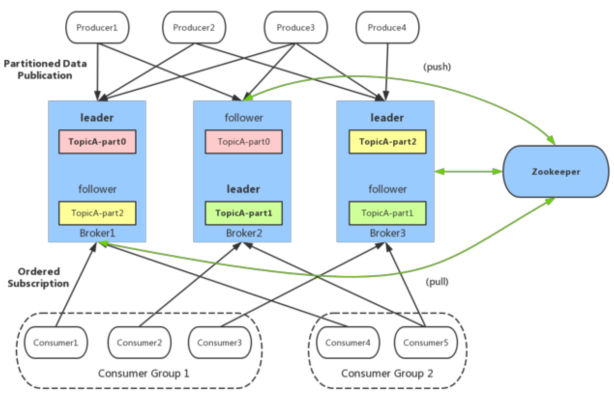

### 1. kafka介绍

Kafka 是一种高吞吐量、分布式、基于发布/订阅的消息系统。
最初由 LinkedIn 公司开发，使用Scala 语言编写，目前是Apache 的开源项目。
它提供了类似于JMS的特性，但是在设计实现上完全不同，此外它并不是JMS规范的实现。
kafka对消息保存时根据Topic进行归类，发送消息者成为Producer,消息接受者成为Consumer,此外kafka集群有多个kafka实例组成，每个实例(server)成为broker。
无论是kafka集群，还是producer和consumer都依赖于zookeeper来保证系统可用性集群保存一些meta信息。详细信息请参见见[官网](http://kafka.apache.org/)

### 2. Kafka 概念
    
    1. broker:Kafka 服务器，负责消息存储和转发
    2. topic:消息类别，Kafka 按照 topic 来分类消息
    3. partition:topic 的分区，一个 topic 可以包含多个 partition，topic 消息保存在各个
    partition 上
    4. offset:消息在日志中的位置，可以理解是消息在 partition 上的偏移量，也是代表该消息的
    唯一序号
    5. Producer:消息生产者
    6. Consumer:消息消费者
    7. Consumer Group:消费者分组，每个 Consumer 必须属于一个 group
    8. Zookeeper:保存着集群 broker、topic、partition 等 meta 数据;
        另外，还负责broker故障发现，partition leader 选举，负载均衡等功能
    9.副本：分为leader、flower
 组网结构图
 
### 3. kafka适用场景
* 业务削峰
* 服务解耦
* 日志收集
* 流处理
### 4. kafka数据存储设计
#### 4.1. partition的数据文件(offset，MessageSize，data)
partition 中的每条 Message 包含了以下三个属性:offset，MessageSize，data，
其中 offset 表 示 Message 在这个 partition 中的偏移量，
offset 不是该 Message 在 partition 数据文件中的实际存储位置，而是逻辑上一个值，
它唯一确定了 partition 中的一条 Message，可以认为 offset 是 partition 中 Message 的 id
MessageSize 表示消息内容 data 的大小;data 为 Message 的具 体内容。

#### 4.2. 数据文件分段segment(顺序读写、分段命令、二分查找)
partition 物理上由多个 segment 文件组成，每个 segment 大小相等，顺序读写。每个 segment 数据文件以该段中最小的 offset 命名，文件扩展名为.log。这样在查找指定 offset 的 Message 的 时候，用二分查找就可以定位到该 Message 在哪个 segment 数据文件中。

#### 4.3. 数据文件索引(分段索引、稀疏存储)
Kafka 为每个分段后的数据文件建立了索引文件，文件名与数据文件的名字是一样的，只是文件扩 展名为.index。index 文件中并没有为数据文件中的每条 Message 建立索引，而是采用了稀疏存 储的方式，每隔一定字节的数据建立一条索引。这样避免了索引文件占用过多的空间，从而可以 将索引文件保留在内存中。

### kafka系统拓扑

        
### kafka高并发性解析
        

### kafka可靠性解析

#### kafka多副本机制

参考：
https://www.cnblogs.com/likehua/p/3999538.html