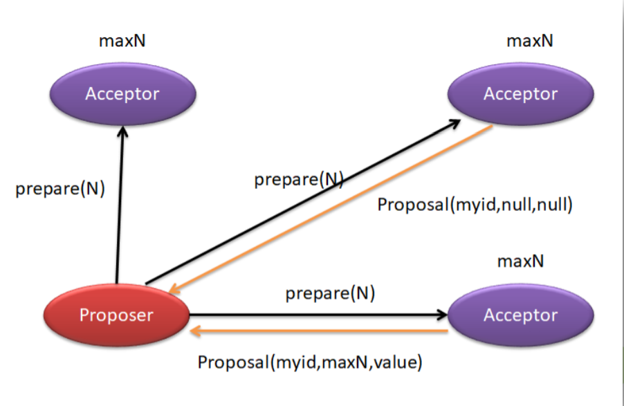
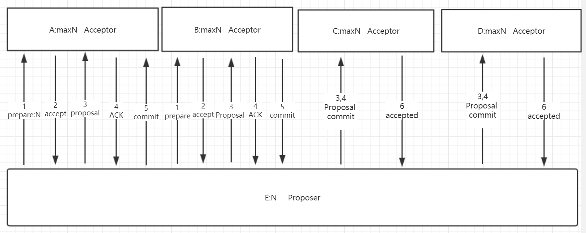
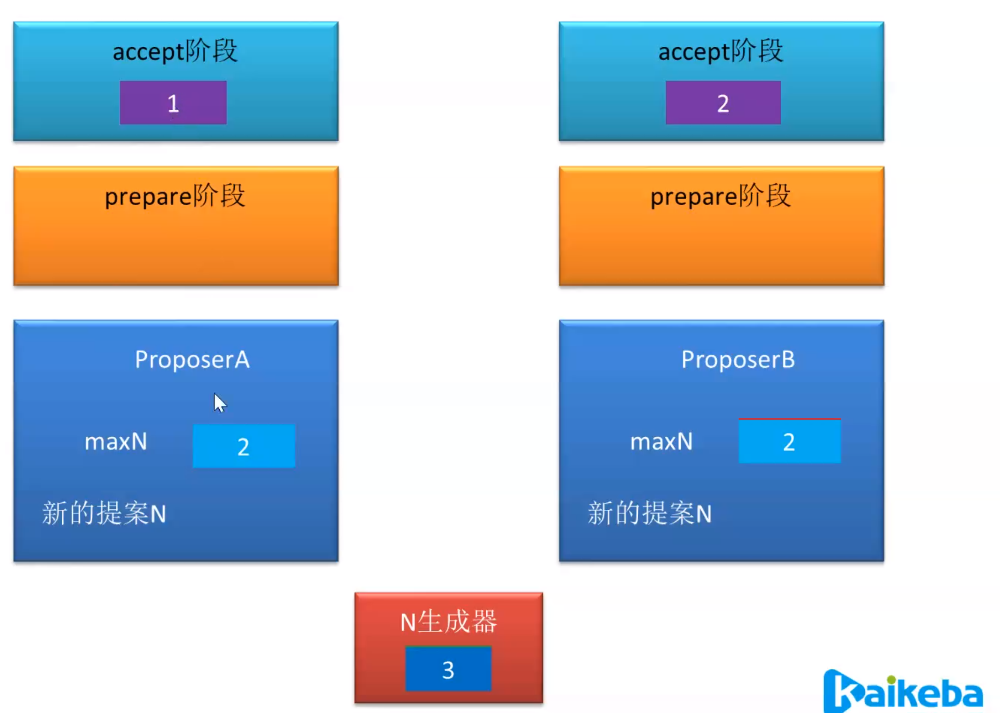
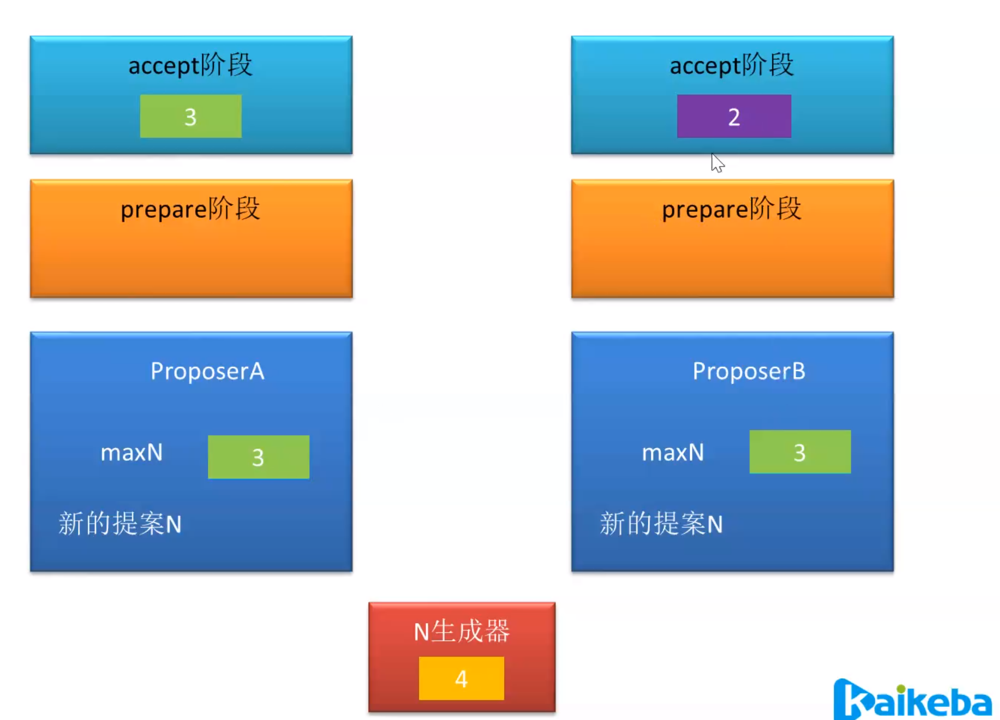
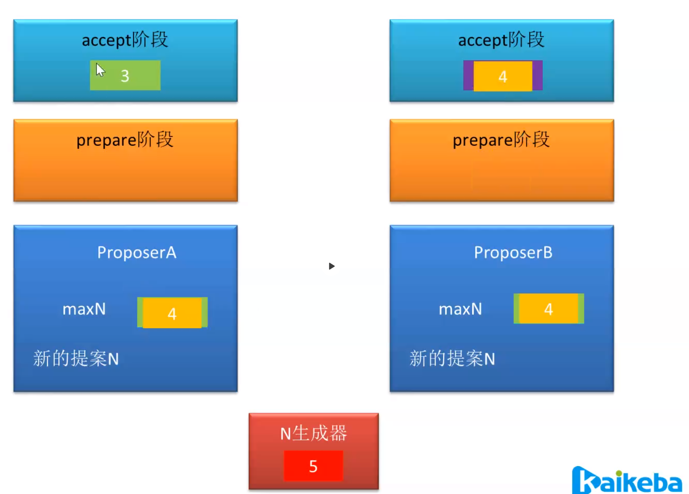

Zookeeper

ZooKeeper 由雅虎研究院开发，后来捐赠给了 Apache。ZooKeeper 是一个开源的分布式 应用程序协调服务器，其为分布式系统提供一致性服务。其一致性是通过基于 Paxos 算法的ZAB 协议完成的。

其主要功能包括：配置维护、域名服务、分布式同步、集群管理等。

## 一致性

> zk 是如何保证分布式系统的一致性的呢？是因为 zk 具有以下几方面的特点：

### 顺序一致性

从同一个客户端发起的多个事务请求（写操作请求），最终会被严格按照发起的顺序记录到 zk 中。

### 原子性

所有事务请求（写操作请求）的结果在集群中所有主机上(Znode)的应用结果都是一致的。要么都应用成功，要么都失败.一次操作不能再分割.

### 单一视图

无论 Client 连接的是 zk 集群中的哪台主机，其看到的数据模型都是一致的。

### 可靠性

一旦 zk 主机成功应用了某个事务，则其所引发的服务器状态变化会被一直保留下来， 直到另一个事务将其改变。

就是持久性,不会因为宕机等原因,导致信息丢失.

### 最终一致性

一旦一个事务被成功应用，zk 可以保证在一段很短的时间后，客户端最终可以从任意 的 zk 主机上读取到最新的数据。但不能保证实时读到,因为是最终 的一致性,很短的时间内是不一致的

## Paxos 算法

Paxos 算法是莱斯利·兰伯特(Leslie Lamport)1990 年提出的一种基于消息传递的、具有高 容错性的一致性算法。Google Chubby 的作者 Mike Burrows 说过，世上只有一种一致性算法， 那就是 Paxos，所有其他一致性算法都是 Paxos 算法的不完整版。Paxos 算法是一种公认的晦 涩难懂的算法，并且工程实现上也具有很大难度。较有名的Paxos工程实现有Google Chubby、ZAB、微信的 PhxPaxos 等。

Paxos 算法是用于解决什么问题的呢？Paxos 算法要解决的问题是，在分布式系统中如何 **就某个决议达成一致**。

## Paxos 与拜占庭将军问题

拜占庭将军问题是由 Paxos 算法作者莱斯利·兰伯特提出的点对点通信中的基本问题。该问题要说明的含义是，在不可靠信道上试图通过消息传递的方式达到一致性是不可能的。所 以，Paxos 算法的前提是不存在拜占庭将军问题，即信道是安全的、可靠的，集群节点间传递的消息是不会**被篡改**的。 

一般情况下，分布式系统中各个节点间采用两种通讯模型：

共享内存（Shared Memory）: 消息都传递到一个地方. 各个将军把消息传递到首府,
消息传递（Messages Passing）: 去中心化,将军之间互传,没有中心首府.

而 Paxos 是基于消息传递通讯模型的。

## 算法描述

三种角色

在 Paxos 算法中有三种角色，分别具有三种不同的行为。

但很多时候，一个进程可能同 时充当着多种角色。     

​                  

> 提议、提案英文翻译 : Proposal 

Proposer：提案者 

Acceptor：表决者

Learner：学习者（同步者）

在Paxos小岛中,议员数量是固定不变的.每个议员在任何时候都能提出提案, 一个议员提出提案,其他议员参与表决 .

有可能会有多种情况:  

一个提出后,另一个紧接着提出.

同时提出提案.

## Paxos 算法的一致性

Paxos 算法的一致性主要体现在以下几点：

- 每个提案者在提出提案时都会首先获取到一个具有全局唯一性的、递增的提案编号 N， 即在整个集群中是唯一的编号N，然后将该编号赋予其要提出的提案。
- 每个表决者在 accept 某提案后，会将该提案的编号N 记录在本地，同时在每个表决者中 已经被 accept 的并保存的提案中会存在一个编号最大的提案，其编号假设为maxN。每个表决者仅会 accept 编号大于自己本地maxN的提案。相等也不接受提案.
- 在众多提案中最终只能有一个提案被选定。半数通过
- 一旦一个提案被选定，则其它服务器会主动同步(Learn)该提案到本地。
- 没有提案被提出则不会有提案被选定。

算法过程描述

Paxos 算法的执行过程划分为两个阶段：准备阶段 prepare 与接受阶段 accept。

## prepare 阶段

提案者(Proposer)准备提交一个编号为 N的提议，于是其首先向所有表决者(Acceptor)发 送 prepare(N)请求，用于**试探**集群是否支持该编号的提议。

每个表决者(Acceptor)中都保存着自己曾经 accept 过的提议中的最大编号maxN。

当一个表决者接收到其它主机发送来的 prepare(N)请求时，其会比较N 与maxN 的值。有以下几种情况：

- 若 N小于maxN，则说明该提议已过时，当前表决者采取不回应或回应 Error 的方 式来拒绝该 prepare 请求；
- 若N**大于**maxN，则说明该提议是可以接受的，当前表决者会首先将该N记录下来， 并将其曾经已经保存 accept 的编号最大的提案 Proposal(myid,maxN,value)反馈给提案者， 以向提案者展示自己支持的提案意愿。
  - 第一个参数 myid 表示表决者 Acceptor 的标识 id
  - 第二个参数表示其曾接受的提案的最大编号maxN
  - 第三个参数表示该 提案的真正提案内容 value,需要达成共识的内容。当然，若当前表决者还未曾 accept 过任何提议，则会将Proposal(myid,null,null)反馈给提案者。
- 在prepare 阶段N不可能等于maxN。这是由N的生成机制决定的。要获得N的值， 其必定会在原来数值的基础上采用同步锁方式增一。

超过半数的Acceptor(包含自己的选票,自己提案,自己肯定同意)返回给Proposer接受提案的响应,就不需要向其他Acceptor发送prepare 的阶段.直接发送accpet阶段.

## accept 阶段

当提案者(Proposer)发出 prepare(N)后，若收到了超过半数的表决者(Accepter)的反馈， 那么该提案者就会将其真正的提案 Proposal(myid,N,value)发送给所有的表决者。

当表决者(Acceptor)接收到提案者发送的 Proposal(myid,N,value)提案后，会再次拿出自己曾经 accept 过的提议中的最大编号maxN，或曾经记录下(其他人的提案或者上次)某次提案的 prepare 阶段的最大编号，让N与它们进行比较，若 N**大于等于**这两个编号，则当前表决者 accept 该提案，并反馈给提案者。若N小于这两个编号，则表决者采取不回应或回应Error 的方式来拒绝该提议。

为什么是N大于等于两个编号?

prepare 阶段结束以后,如果Acceptor接受提案,必定返回结果,Acceptor的本地最大编号肯定是和Proposer的编号是相同的,所以要比较.

当超过半数的Acceptor返回Proposer结果了,其他的Acceptor就不必再次发送prepare阶段,直接发送Accept阶段,这是编号肯定是不同,所以要比较大于.

若提案者没有接收到超过半数的表决者的 accept 反馈，则有两种可能的结果产生。一 是放弃该提案，不再提出；二是重新进入 prepare 阶段，递增提案号，重新提出 prepare请求。

若提案者接收到的反馈数量超过了半数，则其会向外广播两类信息： 

a) 向曾 accept 其提案的表决者发送“可执行数据同步信号”，即让它们执行其曾接收 到的提案；

b) 向未曾向其发送 accept 反馈的表决者发送“提案 + 可执行数据同步信号”，即让它们接受到该提案后马上执行。

Accept为什么要再次进行比较?

在prepare以后,别的节点可能还会作为Proposer提出提案.其他Proposer会导致Acceptor的maxN大于N.说明你的提案不是最新.

如果没有prepare阶段，直接发proposal,可不可以?

在zk中的ZAB是可以的

有没有会在commit之前，事务N重新提案了，由于第三次commit不会比较，从而导致出现问题？

是有这样的情况，解决的办法是状态机，角色转变后，leaning状态不接受提案。

Paxos 算法的活锁问题

前面所述的Paxos算法在实际工程应用过程中，根据不同的实际需求存在诸多不便之处， 所以也就出现了很多对于基本 Paxos 算法的优化算法，以对 Paxos 算法进行改进，例如，Multi Paxos、Fast Paxos、EPaxos。 例如，Paxos 算法存在“活锁问题”，Fast Paxos 算法对 Paxos 算法进行了改进：只允许一个进程提交提案，即该进程具有对 N的唯一操作权。该方式解决了“活锁”问题。

在a未提交commit前，b又提了

在b未提交commit前，a又提了

在a未提交commit前，b又提了

无限循环

