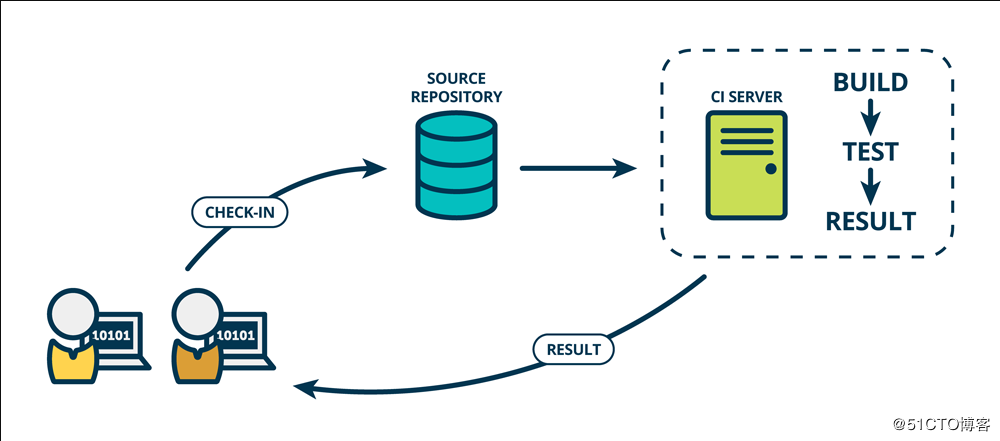

##### 自动化部署之jenkins及简介
###### 一、什么是持续集成？

####### （1）Continuous integration（CI）

    持续集成是一种软件开发实践，即团队开发成员经常集成他们的工作，通常每个成员至少集成一次，也就意味着每天可能会发生多次集成。每次集成都通过自动化的构建（包括编译，发布，自动化测试）来验证，从而尽快地发现集成错误。许多团队发现这个过程可以大大减少集成的问题，让团队能够更快的开发内聚的软件。

####### （2）没有持续集成

    项目做模块集成的时候，发现很多借口都不通==>浪费大量时间
    
    需要手动去编译打包最新的代码==>构建过程不透明
    
    发布代码，上线，基本靠手工==>脚本乱飞

 

####### （3）持续集成最佳实践：

    维护一个单一的代码库
    
    使构建自动化
    
    执行测试是构建的一部分
    
    集成日志及历史记录
    
    使用统一的依赖包管理库
    
    每天至少集成一次

 

####### （4）jenkins介绍

    Jenkins只是一个平台，真正运作的都是插件。这就是jenkins流行的原因，因为jenkins什么插件都有 
    Hudson是Jenkins的前身，是基于Java开发的一种持续集成工具，用于监控程序重复的工作，Hudson后来被收购，成为商业版。后来创始人又写了一个jenkins，jenkins在功能上远远超过hudson
    
    Jenkins官网：https://jenkins.io/
    
    Jenkins下载：http://updates.jenkins-ci.org/
    
     jenkins的全部镜像：http://mirrors.jenkins-ci.org/status.html

 

####### （5）部署代码上线流程：

    1.代码获取（直接了拉取）
    
    2.编译      （可选）
    
    3.配置文件放进去
    
    4.打包
    
    5.scp到目标服务器
    
    6.将目标服务器移除集群
    
    7.解压并放置到Webroot
    
    8.Scp 差异文件
    
    9.重启      （可选）
    
    10.测试
    
    11.加入集群

 

###### 二、jenkins部署

####### 1.安装JDK 

    [root@7mini-node2 ~]# yum install -y java-1.8.0-openjdk java-1.8.0-openjdk-devel
####### 2.安装jenkins

    [root@7mini-node2 contos]# rpm -ivh jenkins-2.32.3-1.1.noarch.rpm
####### 3.启动

    [root@7mini-node2 contos]# service jenkins start
    Starting jenkins (via systemctl): [ OK ]
     
    [root@7mini-node2 contos]# netstat -tunlp |grep :8080
    tcp6 0 0 :::8080 :::* LISTEN 2259/java
####### 4  输入初始化密码

    [root@7mini-node2 contos]# cat /var/lib/jenkins/secrets/initialAdminPassword
    a93553a4865b45198ae28f77877efe19        #登陆界面有提示输入密码，初始密码文件为/var/lib/jenkins/secrets/initialAdminPassword
　

    安装插件完成，设置用户名:jenkins，密码:jenkins

###### 三、jenkins的插件以及配置

    jenkins系统管理比较重要的就是插件管理了 ，因为jenkins的工作全部是由插件来完成。
    
    在插件管理中，有可更新、可选插件、已安装，日常的插件安装都是在这个界面上完成的。比如为了和gitlab协同，我们需要安装gitlab的插件。

 

    当插件安装不上的时候，可以直接去网上瞎子啊，进行安装
    
    下载地址
    http://updates.jenkins-ci.org/
     
    解压备份plugin.tar.gz
    mv plugins /var/lib/jenkins/
    chown -R jenkins.jenkins plugins/
    service jenkins restart
　　

    image.png
    
    image.png

    在高级选项中，我们可以在jenkins官网下载插件，然后上传插件 ，如图：
    
    
    
    因为很多插件需要×××才可以继续下载，jenkins还提供了代理的设置
    还是在服务器目录下进行上传插件
    目录路径= /var/lib/jenkins/plugins/
    这个目录下是我们安装所有的插件
    
    jenkins的目录介绍：
    
    
    [root@7mini-node2 contos]# rpm -ql jenkins
    /etc/init.d/jenkins                #jenkins的启动文件
    /etc/logrotate.d/jenkins
    /etc/sysconfig/jenkins             #jenkins的配置文件（可以写改默认端口）
    /usr/lib/jenkins                  
    /usr/lib/jenkins/jenkins.war       #jenkins的程序war包
    /usr/sbin/rcjenkins                #jenkins的为二进制文件
    /var/cache/jenkins                 #jenkins的程序文件，运行程序解压出来的
    /var/lib/jenkins                   #jenkins的主目录
    /var/log/jenkins                   #jenkins的日志文件
    
    jenkins的升级，只需要将war包解压到/var/lib/jenkins目录下，重启jenkins即可。  友情提示： 卡启动问题 jenkins在第一次安装启动时会向官网回传信息，如果网络离线可以正常安装。 当网络在线，但是 还有可能是内存不足  备份： tar zcvf jenkins.tar.gz /var/lib/jenkins，写一个定时任务的脚本，保留15天的备份，通过增量备份。
    在测试环境中改成root用户来进行配置
    
    
    vim /etc/sysconfig/jenkins
    将用户修改为root，可以调用root工具
     29 JENKINS_USER="root"
     
    修改启动端口85行，$JENKINS_PORT
    service jenkins restart
    　　
    
    系统管理-->系统配置
    
    执行者数量：配置并发数量，一般设置为5，不超过10
    
    用法：如果是主server，可以不选，如果是从级别必须选择“尽可能的使用这个节点”
    
    生成前等待时间：配置该时间10s，避免错误操作，有时间返回
    
参考:

    https://www.cnblogs.com/jimmy-xuli/p/9020825.html

 