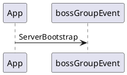

###

### 参考
* [netty系列之（三）——EventLoop和EventLoopGroup](https://www.jianshu.com/p/f94f7005c2cd)
* [Netty精粹之基于EventLoop机制的高效线程模型](https://www.cnblogs.com/heavenhome/articles/6554262.html)
* [EpollEventLoopGroup 与 NioEventLoopGroup](https://blog.csdn.net/alex_xfboy/article/details/89643638)
