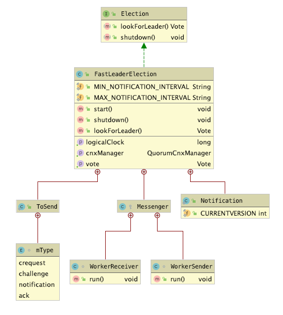

### 【Zookeeper】源码分析之Leader选举之FastLeaderElection
### 一、前言

上篇[Zookeeper之Leader选举概述](Zookeeper之Leader选举概述.md),讲述了Leader选举基本流程，
接着来学习Zookeeper中默认的选举策略，FastLeaderElection。

### 二、FastLeaderElection源码分析

#### 2.1 类结构概述　
* FastLeaderElection实现了Election接口，其需要实现接口中定义的lookForLeader方法和shutdown方法。

* 其是标准的Fast Paxos算法的实现，各服务器之间基于TCP协议进行选举。

* FastLeaderElection 有三个较为重要的内部类，分别为
    * Notification
    * ToSend
    * Messenger
详细请参照



#### 2.3 源码分析
创建流程
```plantuml
QuorumPeer -> FastLeaderElection:createElectionAlgorithm(3)
FastLeaderElection -> FastLeaderElection: [sendqueue/recvqueue WorkerSender/WorkerReceiver]
FastLeaderElection -> FastLeaderElection: start[WorkerSender.run/ WorkerReceiver.run]
QuorumPeer -> QuorumPeer++:stats=locking
QuorumPeer -> FastLeaderElection: lookForLeader

```
##### createElectionAlgorithm
每台服务器在启动的过程中，会启动一个 QuorumPeerManager，负责各台服务器之间的底层 Leader 选举过程中的网络通信。
createElectionAlgorithm负责创建Election对象, 3.6版本已移除，其他算法【LeaderElection/AuthFastLeaderElection】
详细如下：
```
protected Election createElectionAlgorithm(int electionAlgorithm) {
    Election le = null;

    switch (electionAlgorithm) {
    case 1:
        throw new UnsupportedOperationException("Election Algorithm 1 is not supported.");
    case 2:
        throw new UnsupportedOperationException("Election Algorithm 2 is not supported.");
    case 3:
        QuorumCnxManager qcm = createCnxnManager();
        QuorumCnxManager oldQcm = qcmRef.getAndSet(qcm);
        if (oldQcm != null) {
            LOG.warn("Clobbering already-set QuorumCnxManager (restarting leader election?)");
            oldQcm.halt();
        }
        QuorumCnxManager.Listener listener = qcm.listener;
        if (listener != null) {
            listener.start();
            FastLeaderElection fle = new FastLeaderElection(this, qcm);
            fle.start();
            le = fle;
        } else {
            LOG.error("Null listener when initializing cnx manager");
        }
        break;
    default:
        assert false;
    }
    return le;
}
```

##### 创建FastLeaderElection对象

* 创建FastLeaderElection对象
    * 设置stop状态为false
    * 传递QuorumCnxManager对象
    * 初始化FastLeaderElection

```
public FastLeaderElection(QuorumPeer self, QuorumCnxManager manager) {
    this.stop = false;
    this.manager = manager;
    starter(self, manager);
}
```

* 初始化FastLeaderElection
    * 设置初始状态
    * 初始化发送方阻塞队列，用于发送投票
    * 初始化接收方阻塞队列，用于接受投票
    * 初始化消息中间人用于发送消息
```
private void starter(QuorumPeer self, QuorumCnxManager manager) {
    this.self = self;
    proposedLeader = -1;
    proposedZxid = -1;

    sendqueue = new LinkedBlockingQueue<ToSend>();
    recvqueue = new LinkedBlockingQueue<Notification>();
    this.messenger = new Messenger(manager);
}
```
* Messenger创建
    * WorkerSender创建
    * WorkerReceiver创建
```
Messenger(QuorumCnxManager manager) {

    this.ws = new WorkerSender(manager);

    this.wsThread = new Thread(this.ws, "WorkerSender[myid=" + self.getId() + "]");
    this.wsThread.setDaemon(true);

    this.wr = new WorkerReceiver(manager);

    this.wrThread = new Thread(this.wr, "WorkerReceiver[myid=" + self.getId() + "]");
    this.wrThread.setDaemon(true);
}
```

```
class WorkerSender extends ZooKeeperThread {

    WorkerSender(QuorumCnxManager manager) {
        super("WorkerSender");
        this.stop = false;
        this.manager = manager;
    }
}
```

```
class WorkerReceiver extends ZooKeeperThread {

    volatile boolean stop;
    QuorumCnxManager manager;

    WorkerReceiver(QuorumCnxManager manager) {
        super("WorkerReceiver");
        this.stop = false;
        this.manager = manager;
    }
}
```
##### 启动FastLeaderElection
* createElectionAlgorithm调用FastLeaderElection.start方法
```
 FastLeaderElection fle = new FastLeaderElection(this, qcm);
 fle.start();
```
* 启动消息中间人
```
/**
 * This method starts the sender and receiver threads.
 */
public void start() {
    this.messenger.start();
}
```

* 启动消息中间人消息发送者和接受者

```
/**
 * Starts instances of WorkerSender and WorkerReceiver
 */
void start() {
    this.wsThread.start();
    this.wrThread.start();
}
```

##### 接受投票
WorkerReceiver通过QuorumCnxManager接受外部投票消息

```
public void run() {

    Message response;
    while (!stop) {
        // Sleeps on receive
        try {
            response = manager.pollRecvQueue(3000, TimeUnit.MILLISECONDS);
            if (response == null) {
                continue;
            }

            // The current protocol and two previous generations all send at least 28 bytes
            if (response.buffer.capacity() < 28) {
                LOG.error("Got a short response: {}", response.buffer.capacity());
                continue;
            }

            // this is the backwardCompatibility mode in place before ZK-107
            // It is for a version of the protocol in which we didn't send peer epoch
            // With peer epoch and version the message became 40 bytes
            boolean backCompatibility28 = (response.buffer.capacity() == 28);

            // this is the backwardCompatibility mode for no version information
            boolean backCompatibility40 = (response.buffer.capacity() == 40);

            response.buffer.clear();

            // Instantiate Notification and set its attributes
            Notification n = new Notification();

            int rstate = response.buffer.getInt();
            long rleader = response.buffer.getLong();
            long rzxid = response.buffer.getLong();
            long relectionEpoch = response.buffer.getLong();
            long rpeerepoch;

            int version = 0x0;
            if (!backCompatibility28) {
                rpeerepoch = response.buffer.getLong();
                if (!backCompatibility40) {
                    /*
                     * Version added in 3.4.6
                     */

                    version = response.buffer.getInt();
                } else {
                    LOG.info("Backward compatibility mode (36 bits), server id: {}", response.sid);
                }
            } else {
                LOG.info("Backward compatibility mode (28 bits), server id: {}", response.sid);
                rpeerepoch = ZxidUtils.getEpochFromZxid(rzxid);
            }

            QuorumVerifier rqv = null;

            // check if we have a version that includes config. If so extract config info from message.
            if (version > 0x1) {
                int configLength = response.buffer.getInt();
                byte[] b = new byte[configLength];

                response.buffer.get(b);

                synchronized (self) {
                    try {
                        rqv = self.configFromString(new String(b));
                        QuorumVerifier curQV = self.getQuorumVerifier();
                        if (rqv.getVersion() > curQV.getVersion()) {
                            LOG.info("{} Received version: {} my version: {}",
                                     self.getId(),
                                     Long.toHexString(rqv.getVersion()),
                                     Long.toHexString(self.getQuorumVerifier().getVersion()));
                            if (self.getPeerState() == ServerState.LOOKING) {
                                LOG.debug("Invoking processReconfig(), state: {}", self.getServerState());
                                self.processReconfig(rqv, null, null, false);
                                if (!rqv.equals(curQV)) {
                                    LOG.info("restarting leader election");
                                    self.shuttingDownLE = true;
                                    self.getElectionAlg().shutdown();

                                    break;
                                }
                            } else {
                                LOG.debug("Skip processReconfig(), state: {}", self.getServerState());
                            }
                        }
                    } catch (IOException e) {
                        LOG.error("Something went wrong while processing config received from {}", response.sid);
                    } catch (ConfigException e) {
                        LOG.error("Something went wrong while processing config received from {}", response.sid);
                    }
                }
            } else {
                LOG.info("Backward compatibility mode (before reconfig), server id: {}", response.sid);
            }

            /*
             * If it is from a non-voting server (such as an observer or
             * a non-voting follower), respond right away.
             */
            if (!validVoter(response.sid)) {
                Vote current = self.getCurrentVote();
                QuorumVerifier qv = self.getQuorumVerifier();
                ToSend notmsg = new ToSend(
                    ToSend.mType.notification,
                    current.getId(),
                    current.getZxid(),
                    logicalclock.get(),
                    self.getPeerState(),
                    response.sid,
                    current.getPeerEpoch(),
                    qv.toString().getBytes());

                sendqueue.offer(notmsg);
            } else {
                // Receive new message
                LOG.debug("Receive new notification message. My id = {}", self.getId());

                // State of peer that sent this message
                QuorumPeer.ServerState ackstate = QuorumPeer.ServerState.LOOKING;
                switch (rstate) {
                case 0:
                    ackstate = QuorumPeer.ServerState.LOOKING;
                    break;
                case 1:
                    ackstate = QuorumPeer.ServerState.FOLLOWING;
                    break;
                case 2:
                    ackstate = QuorumPeer.ServerState.LEADING;
                    break;
                case 3:
                    ackstate = QuorumPeer.ServerState.OBSERVING;
                    break;
                default:
                    continue;
                }

                n.leader = rleader;
                n.zxid = rzxid;
                n.electionEpoch = relectionEpoch;
                n.state = ackstate;
                n.sid = response.sid;
                n.peerEpoch = rpeerepoch;
                n.version = version;
                n.qv = rqv;
                /*
                 * Print notification info
                 */
                LOG.info(
                    "Notification: my state:{}; n.sid:{}, n.state:{}, n.leader:{}, n.round:0x{}, "
                        + "n.peerEpoch:0x{}, n.zxid:0x{}, message format version:0x{}, n.config version:0x{}",
                    self.getPeerState(),
                    n.sid,
                    n.state,
                    n.leader,
                    Long.toHexString(n.electionEpoch),
                    Long.toHexString(n.peerEpoch),
                    Long.toHexString(n.zxid),
                    Long.toHexString(n.version),
                    (n.qv != null ? (Long.toHexString(n.qv.getVersion())) : "0"));

                /*
                 * If this server is looking, then send proposed leader
                 */

                if (self.getPeerState() == QuorumPeer.ServerState.LOOKING) {
                    recvqueue.offer(n);

                    /*
                     * Send a notification back if the peer that sent this
                     * message is also looking and its logical clock is
                     * lagging behind.
                     */
                    if ((ackstate == QuorumPeer.ServerState.LOOKING)
                        && (n.electionEpoch < logicalclock.get())) {
                        Vote v = getVote();
                        QuorumVerifier qv = self.getQuorumVerifier();
                        ToSend notmsg = new ToSend(
                            ToSend.mType.notification,
                            v.getId(),
                            v.getZxid(),
                            logicalclock.get(),
                            self.getPeerState(),
                            response.sid,
                            v.getPeerEpoch(),
                            qv.toString().getBytes());
                        sendqueue.offer(notmsg);
                    }
                } else {
                    /*
                     * If this server is not looking, but the one that sent the ack
                     * is looking, then send back what it believes to be the leader.
                     */
                    Vote current = self.getCurrentVote();
                    if (ackstate == QuorumPeer.ServerState.LOOKING) {
                        if (self.leader != null) {
                            if (leadingVoteSet != null) {
                                self.leader.setLeadingVoteSet(leadingVoteSet);
                                leadingVoteSet = null;
                            }
                            self.leader.reportLookingSid(response.sid);
                        }


                        LOG.debug(
                            "Sending new notification. My id ={} recipient={} zxid=0x{} leader={} config version = {}",
                            self.getId(),
                            response.sid,
                            Long.toHexString(current.getZxid()),
                            current.getId(),
                            Long.toHexString(self.getQuorumVerifier().getVersion()));

                        QuorumVerifier qv = self.getQuorumVerifier();
                        ToSend notmsg = new ToSend(
                            ToSend.mType.notification,
                            current.getId(),
                            current.getZxid(),
                            current.getElectionEpoch(),
                            self.getPeerState(),
                            response.sid,
                            current.getPeerEpoch(),
                            qv.toString().getBytes());
                        sendqueue.offer(notmsg);
                    }
                }
            }
        } catch (InterruptedException e) {
            LOG.warn("Interrupted Exception while waiting for new message", e);
        }
    }
    LOG.info("WorkerReceiver is down");
}
```
##### 发送投票
WorkerSender通过sendqueue获取消息，通过QuorumCnxManager发送投票消息

```
public void run() {
    while (!stop) {
        try {
            ToSend m = sendqueue.poll(3000, TimeUnit.MILLISECONDS);
            if (m == null) {
                continue;
            }

            process(m);
        } catch (InterruptedException e) {
            break;
        }
    }
    LOG.info("WorkerSender is down");
}
```


##### lookForLeader
```
/**
 * Starts a new round of leader election. Whenever our QuorumPeer
 * changes its state to LOOKING, this method is invoked, and it
 * sends notifications to all other peers.
 */
public Vote lookForLeader() throws InterruptedException {
    try {
        self.jmxLeaderElectionBean = new LeaderElectionBean();
        MBeanRegistry.getInstance().register(self.jmxLeaderElectionBean, self.jmxLocalPeerBean);
    } catch (Exception e) {
        LOG.warn("Failed to register with JMX", e);
        self.jmxLeaderElectionBean = null;
    }

    self.start_fle = Time.currentElapsedTime();
    try {
        /*
         * The votes from the current leader election are stored in recvset. In other words, a vote v is in recvset
         * if v.electionEpoch == logicalclock. The current participant uses recvset to deduce on whether a majority
         * of participants has voted for it.
         */
        Map<Long, Vote> recvset = new HashMap<Long, Vote>();

        /*
         * The votes from previous leader elections, as well as the votes from the current leader election are
         * stored in outofelection. Note that notifications in a LOOKING state are not stored in outofelection.
         * Only FOLLOWING or LEADING notifications are stored in outofelection. The current participant could use
         * outofelection to learn which participant is the leader if it arrives late (i.e., higher logicalclock than
         * the electionEpoch of the received notifications) in a leader election.
         */
        Map<Long, Vote> outofelection = new HashMap<Long, Vote>();

        int notTimeout = minNotificationInterval;

        synchronized (this) {
            logicalclock.incrementAndGet();
            updateProposal(getInitId(), getInitLastLoggedZxid(), getPeerEpoch());
        }

        LOG.info(
            "New election. My id = {}, proposed zxid=0x{}",
            self.getId(),
            Long.toHexString(proposedZxid));
        sendNotifications();

        SyncedLearnerTracker voteSet;

        /*
         * Loop in which we exchange notifications until we find a leader
         */

        while ((self.getPeerState() == ServerState.LOOKING) && (!stop)) {
            /*
             * Remove next notification from queue, times out after 2 times
             * the termination time
             */
            Notification n = recvqueue.poll(notTimeout, TimeUnit.MILLISECONDS);

            /*
             * Sends more notifications if haven't received enough.
             * Otherwise processes new notification.
             */
            if (n == null) {
                if (manager.haveDelivered()) {
                    sendNotifications();
                } else {
                    manager.connectAll();
                }

                /*
                 * Exponential backoff
                 */
                int tmpTimeOut = notTimeout * 2;
                notTimeout = Math.min(tmpTimeOut, maxNotificationInterval);
                LOG.info("Notification time out: {}", notTimeout);
            } else if (validVoter(n.sid) && validVoter(n.leader)) {
                /*
                 * Only proceed if the vote comes from a replica in the current or next
                 * voting view for a replica in the current or next voting view.
                 */
                switch (n.state) {
                case LOOKING:
                    if (getInitLastLoggedZxid() == -1) {
                        LOG.debug("Ignoring notification as our zxid is -1");
                        break;
                    }
                    if (n.zxid == -1) {
                        LOG.debug("Ignoring notification from member with -1 zxid {}", n.sid);
                        break;
                    }
                    // If notification > current, replace and send messages out
                    if (n.electionEpoch > logicalclock.get()) {
                        logicalclock.set(n.electionEpoch);
                        recvset.clear();
                        if (totalOrderPredicate(n.leader, n.zxid, n.peerEpoch, getInitId(), getInitLastLoggedZxid(), getPeerEpoch())) {
                            updateProposal(n.leader, n.zxid, n.peerEpoch);
                        } else {
                            updateProposal(getInitId(), getInitLastLoggedZxid(), getPeerEpoch());
                        }
                        sendNotifications();
                    } else if (n.electionEpoch < logicalclock.get()) {
                            LOG.debug(
                                "Notification election epoch is smaller than logicalclock. n.electionEpoch = 0x{}, logicalclock=0x{}",
                                Long.toHexString(n.electionEpoch),
                                Long.toHexString(logicalclock.get()));
                        break;
                    } else if (totalOrderPredicate(n.leader, n.zxid, n.peerEpoch, proposedLeader, proposedZxid, proposedEpoch)) {
                        updateProposal(n.leader, n.zxid, n.peerEpoch);
                        sendNotifications();
                    }

                    LOG.debug(
                        "Adding vote: from={}, proposed leader={}, proposed zxid=0x{}, proposed election epoch=0x{}",
                        n.sid,
                        n.leader,
                        Long.toHexString(n.zxid),
                        Long.toHexString(n.electionEpoch));

                    // don't care about the version if it's in LOOKING state
                    recvset.put(n.sid, new Vote(n.leader, n.zxid, n.electionEpoch, n.peerEpoch));

                    voteSet = getVoteTracker(recvset, new Vote(proposedLeader, proposedZxid, logicalclock.get(), proposedEpoch));

                    if (voteSet.hasAllQuorums()) {

                        // Verify if there is any change in the proposed leader
                        while ((n = recvqueue.poll(finalizeWait, TimeUnit.MILLISECONDS)) != null) {
                            if (totalOrderPredicate(n.leader, n.zxid, n.peerEpoch, proposedLeader, proposedZxid, proposedEpoch)) {
                                recvqueue.put(n);
                                break;
                            }
                        }

                        /*
                         * This predicate is true once we don't read any new
                         * relevant message from the reception queue
                         */
                        if (n == null) {
                            setPeerState(proposedLeader, voteSet);
                            Vote endVote = new Vote(proposedLeader, proposedZxid, logicalclock.get(), proposedEpoch);
                            leaveInstance(endVote);
                            return endVote;
                        }
                    }
                    break;
                case OBSERVING:
                    LOG.debug("Notification from observer: {}", n.sid);
                    break;
                case FOLLOWING:
                case LEADING:
                    /*
                     * Consider all notifications from the same epoch
                     * together.
                     */
                    if (n.electionEpoch == logicalclock.get()) {
                        recvset.put(n.sid, new Vote(n.leader, n.zxid, n.electionEpoch, n.peerEpoch, n.state));
                        voteSet = getVoteTracker(recvset, new Vote(n.version, n.leader, n.zxid, n.electionEpoch, n.peerEpoch, n.state));
                        if (voteSet.hasAllQuorums() && checkLeader(recvset, n.leader, n.electionEpoch)) {
                            setPeerState(n.leader, voteSet);
                            Vote endVote = new Vote(n.leader, n.zxid, n.electionEpoch, n.peerEpoch);
                            leaveInstance(endVote);
                            return endVote;
                        }
                    }

                    /*
                     * Before joining an established ensemble, verify that
                     * a majority are following the same leader.
                     *
                     * Note that the outofelection map also stores votes from the current leader election.
                     * See ZOOKEEPER-1732 for more information.
                     */
                    outofelection.put(n.sid, new Vote(n.version, n.leader, n.zxid, n.electionEpoch, n.peerEpoch, n.state));
                    voteSet = getVoteTracker(outofelection, new Vote(n.version, n.leader, n.zxid, n.electionEpoch, n.peerEpoch, n.state));

                    if (voteSet.hasAllQuorums() && checkLeader(outofelection, n.leader, n.electionEpoch)) {
                        synchronized (this) {
                            logicalclock.set(n.electionEpoch);
                            setPeerState(n.leader, voteSet);
                        }
                        Vote endVote = new Vote(n.leader, n.zxid, n.electionEpoch, n.peerEpoch);
                        leaveInstance(endVote);
                        return endVote;
                    }
                    break;
                default:
                    LOG.warn("Notification state unrecoginized: {} (n.state), {}(n.sid)", n.state, n.sid);
                    break;
                }
            } else {
                if (!validVoter(n.leader)) {
                    LOG.warn("Ignoring notification for non-cluster member sid {} from sid {}", n.leader, n.sid);
                }
                if (!validVoter(n.sid)) {
                    LOG.warn("Ignoring notification for sid {} from non-quorum member sid {}", n.leader, n.sid);
                }
            }
        }
        return null;
    } finally {
        try {
            if (self.jmxLeaderElectionBean != null) {
                MBeanRegistry.getInstance().unregister(self.jmxLeaderElectionBean);
            }
        } catch (Exception e) {
            LOG.warn("Failed to unregister with JMX", e);
        }
        self.jmxLeaderElectionBean = null;
        LOG.debug("Number of connection processing threads: {}", manager.getConnectionThreadCount());
    }
}
```
Leader 选举有两个函数需要重点关注一下，totalOrderPredicate() 对两张选票进行 PK，termPredicate() 判断投票是否可以结束了。
##### totalOrderPredicate(PK 选票)
```
/**
 * Check if a pair (server id, zxid) succeeds our
 * current vote.
 *
 */
protected boolean totalOrderPredicate(long newId, long newZxid, long newEpoch, long curId, long curZxid, long curEpoch) {
    LOG.debug(
        "id: {}, proposed id: {}, zxid: 0x{}, proposed zxid: 0x{}",
        newId,
        curId,
        Long.toHexString(newZxid),
        Long.toHexString(curZxid));

    if (self.getQuorumVerifier().getWeight(newId) == 0) {
        return false;
    }

    /*
     * We return true if one of the following three cases hold:
     * 1- New epoch is higher
     * 2- New epoch is the same as current epoch, but new zxid is higher
     * 3- New epoch is the same as current epoch, new zxid is the same
     *  as current zxid, but server id is higher.
     */

    return ((newEpoch > curEpoch)
            || ((newEpoch == curEpoch)
                && ((newZxid > curZxid)
                    || ((newZxid == curZxid)
                        && (newId > curId)))));
}
```
##### getVoteTracker(结束投票)
```
/**
 * Given a set of votes, return the SyncedLearnerTracker which is used to
 * determines if have sufficient to declare the end of the election round.
 *
 * @param votes
 *            Set of votes
 * @param vote
 *            Identifier of the vote received last
 * @return the SyncedLearnerTracker with vote details
 */
protected SyncedLearnerTracker getVoteTracker(Map<Long, Vote> votes, Vote vote) {
    SyncedLearnerTracker voteSet = new SyncedLearnerTracker();
    voteSet.addQuorumVerifier(self.getQuorumVerifier());
    if (self.getLastSeenQuorumVerifier() != null
        && self.getLastSeenQuorumVerifier().getVersion() > self.getQuorumVerifier().getVersion()) {
        voteSet.addQuorumVerifier(self.getLastSeenQuorumVerifier());
    }

    /*
     * First make the views consistent. Sometimes peers will have different
     * zxids for a server depending on timing.
     */
    for (Map.Entry<Long, Vote> entry : votes.entrySet()) {
        if (vote.equals(entry.getValue())) {
            voteSet.addAck(entry.getKey());
        }
    }

    return voteSet;
}

```
#### 三、参考

https://www.cnblogs.com/leesf456/p/6508185.html
https://www.jianshu.com/p/2268bebd4e3a