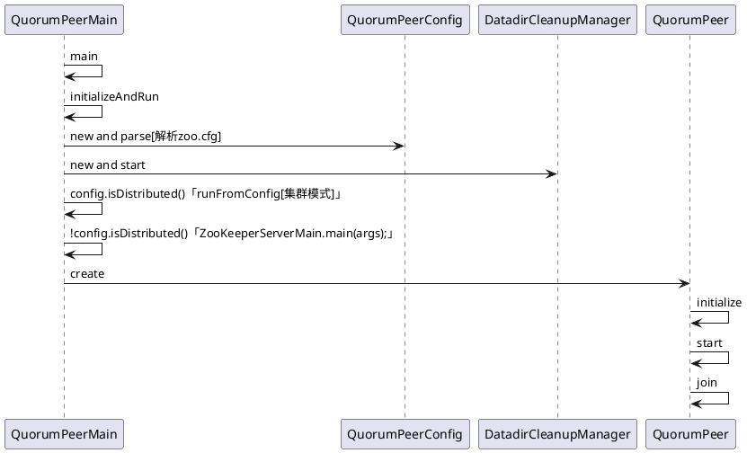

### 【分布式】Zookeeper服务端启动
### 一、前言

　　前面已经了解了Zookeeper会话相关知识点，接着来学习Zookeeper服务端相关细节。

### 二、服务端

服务端整体架构如下

Zookeeper服务器的启动，大致可以分为以下五个步骤:
　　1. 配置文件解析。

　　2. 初始化数据管理器。

　　3. 初始化网络I/O管理器。

　　4. 数据恢复。

　　5. 对外服务。

#### 2.1 单机版服务器启动

　　单机版服务器的启动其流程图如下


　　上图的过程可以分为预启动和初始化过程。

　　1. 预启动

　　　　1. 统一由QuorumPeerMain作为启动类。无论单机或集群，在zkServer.cmd和zkServer.sh中都配置了QuorumPeerMain作为启动入口类。

　　　　2. 解析配置文件zoo.cfg。zoo.cfg配置运行时的基本参数，如tickTime、dataDir、clientPort等参数。

　　　　3. 创建并启动历史文件清理器DatadirCleanupManager。对事务日志和快照数据文件进行定时清理。

　　　　4. 判断当前是集群模式还是单机模式启动。若是单机模式，则委托给ZooKeeperServerMain进行启动。

　　　　5. 再次进行配置文件zoo.cfg的解析。

　　　　6. 创建服务器实例ZooKeeperServer。Zookeeper服务器首先会进行服务器实例的创建，然后对该服务器实例进行初始化，包括连接器、内存数据库、请求处理器等组件的初始化。

　　2. 初始化

　　　　1. 创建服务器统计器ServerStats。ServerStats是Zookeeper服务器运行时的统计器。

　　　　2. 创建Zookeeper数据管理器FileTxnSnapLog。FileTxnSnapLog是Zookeeper上层服务器和底层数据存储之间的对接层，提供了一系列操作数据文件的接口，如事务日志文件和快照数据文件。Zookeeper根据zoo.cfg文件中解析出的快照数据目录dataDir和事务日志目录dataLogDir来创建FileTxnSnapLog。

　　　　3. 设置服务器tickTime和会话超时时间限制。

　　　　4. 创建ServerCnxnFactory。通过配置系统属性zookeper.serverCnxnFactory来指定使用Zookeeper自己实现的NIO还是使用Netty框架作为Zookeeper服务端网络连接工厂。

　　　　5. 初始化ServerCnxnFactory。Zookeeper会初始化Thread作为ServerCnxnFactory的主线程，然后再初始化NIO服务器。

　　　　6. 启动ServerCnxnFactory主线程。进入Thread的run方法，此时服务端还不能处理客户端请求。

　　　　7. 恢复本地数据。启动时，需要从本地快照数据文件和事务日志文件进行数据恢复。

　　　　8. 创建并启动会话管理器。Zookeeper会创建会话管理器SessionTracker进行会话管理。

　　　　9. 初始化Zookeeper的请求处理链。Zookeeper请求处理方式为责任链模式的实现。会有多个请求处理器依次处理一个客户端请求，在服务器启动时，会将这些请求处理器串联成一个请求处理链。

　　　　10. 注册JMX服务。Zookeeper会将服务器运行时的一些信息以JMX的方式暴露给外部。

　　　　11. 注册Zookeeper服务器实例。将Zookeeper服务器实例注册给ServerCnxnFactory，之后Zookeeper就可以对外提供服务。

　　至此，单机版的Zookeeper服务器启动完毕。

#### 2.2 集群服务器启动

　　单机和集群服务器的启动在很多地方是一致的，其流程图如下


　　上图的过程可以分为预启动、初始化、Leader选举、Leader与Follower启动期交互过程、Leader与Follower启动等过程。

##### 1. 预启动

　　　　1. 统一由QuorumPeerMain作为启动类。

　　　　2. 解析配置文件zoo.cfg。

　　　　3. 创建并启动历史文件清理器DatadirCleanupFactory。

　　　　4. 判断当前是集群模式还是单机模式的启动。在集群模式中，在zoo.cfg文件中配置了多个服务器地址，可以选择集群启动。

##### 2. 初始化

　　　　1. 创建ServerCnxnFactory。

　　　　2. 初始化ServerCnxnFactory。

　　　　3. 创建Zookeeper数据管理器FileTxnSnapLog。

　　　　4. 创建QuorumPeer实例。Quorum是集群模式下特有的对象，是Zookeeper服务器实例（ZooKeeperServer）的托管者，QuorumPeer代表了集群中的一台机器，在运行期间，QuorumPeer会不断检测当前服务器实例的运行状态，同时根据情况发起Leader选举。

　　　　5. 创建内存数据库ZKDatabase。ZKDatabase负责管理ZooKeeper的所有会话记录以及DataTree和事务日志的存储。

　　　　6. 初始化QuorumPeer。将核心组件如FileTxnSnapLog、ServerCnxnFactory、ZKDatabase注册到QuorumPeer中，同时配置QuorumPeer的参数，如服务器列表地址、Leader选举算法和会话超时时间限制等。

　　　　7. 恢复本地数据。

　　　　8. 启动ServerCnxnFactory主线程。

##### 3. Leader选举

　　　　1. 初始化Leader选举。集群模式特有，Zookeeper首先会根据自身的服务器ID（SID）、最新的ZXID（lastLoggedZxid）和当前的服务器epoch（currentEpoch）来生成一个初始化投票，在初始化过程中，每个服务器都会给自己投票。然后，根据zoo.cfg的配置，创建相应Leader选举算法实现，Zookeeper提供了三种默认算法（LeaderElection、AuthFastLeaderElection、FastLeaderElection），可通过zoo.cfg中的electionAlg属性来指定，但现只支持FastLeaderElection选举算法。在初始化阶段，Zookeeper会创建Leader选举所需的网络I/O层QuorumCnxManager，同时启动对Leader选举端口的监听，等待集群中其他服务器创建连接。

　　　　2. 注册JMX服务。

　　　　3. 检测当前服务器状态。运行期间，QuorumPeer会不断检测当前服务器状态。在正常情况下，Zookeeper服务器的状态在LOOKING、LEADING、FOLLOWING/OBSERVING之间进行切换。在启动阶段，QuorumPeer的初始状态是LOOKING，因此开始进行Leader选举。

　　　　4. Leader选举。通过投票确定Leader，其余机器称为Follower和Observer。具体算法在后面会给出。

##### 4. Leader和Follower启动期交互过程

　　　　1. 创建Leader服务器和Follower服务器。完成Leader选举后，每个服务器会根据自己服务器的角色创建相应的服务器实例，并进入各自角色的主流程。

　　　　2. Leader服务器启动Follower接收器LearnerCnxAcceptor。运行期间，Leader服务器需要和所有其余的服务器（统称为Learner）保持连接以确集群的机器存活情况，LearnerCnxAcceptor负责接收所有非Leader服务器的连接请求。

　　　　3. Leader服务器开始和Leader建立连接。所有Learner会找到Leader服务器，并与其建立连接。

　　　　4. Leader服务器创建LearnerHandler。Leader接收到来自其他机器连接创建请求后，会创建一个LearnerHandler实例，每个LearnerHandler实例都对应一个Leader与Learner服务器之间的连接，其负责Leader和Learner服务器之间几乎所有的消息通信和数据同步。

　　　　5. 向Leader注册。Learner完成和Leader的连接后，会向Leader进行注册，即将Learner服务器的基本信息（LearnerInfo），包括SID和ZXID，发送给Leader服务器。

　　　　6. Leader解析Learner信息，计算新的epoch。Leader接收到Learner服务器基本信息后，会解析出该Learner的SID和ZXID，然后根据ZXID解析出对应的epoch_of_learner，并和当前Leader服务器的epoch_of_leader进行比较，如果该Learner的epoch_of_learner更大，则更新Leader的epoch_of_leader = epoch_of_learner + 1。然后LearnHandler进行等待，直到过半Learner已经向Leader进行了注册，同时更新了epoch_of_leader后，Leader就可以确定当前集群的epoch了。

　　　　7. 发送Leader状态。计算出新的epoch后，Leader会将该信息以一个LEADERINFO消息的形式发送给Learner，并等待Learner的响应。

　　　　8. Learner发送ACK消息。Learner接收到LEADERINFO后，会解析出epoch和ZXID，然后向Leader反馈一个ACKEPOCH响应。

　　　　9. 数据同步。Leader收到Learner的ACKEPOCH后，即可进行数据同步。

　　　　10. 启动Leader和Learner服务器。当有过半Learner已经完成了数据同步，那么Leader和Learner服务器实例就可以启动了。

##### 5. Leader和Follower启动

　　　　1. 创建启动会话管理器。

　　　　2. 初始化Zookeeper请求处理链，集群模式的每个处理器也会在启动阶段串联请求处理链。

　　　　3. 注册JMX服务。

　　至此，集群版的Zookeeper服务器启动完毕。
### 三、源码参考

#### QuorumPeerMain
```
public class QuorumPeerMain {

    private static final Logger LOG = LoggerFactory.getLogger(QuorumPeerMain.class);

    private static final String USAGE = "Usage: QuorumPeerMain configfile";

    protected QuorumPeer quorumPeer;

    /**
     * To start the replicated server specify the configuration file name on
     * the command line.
     * @param args path to the configfile
     */
    public static void main(String[] args) {
        QuorumPeerMain main = new QuorumPeerMain();
        try {
            main.initializeAndRun(args);
        } catch (Exception e) {
            LOG.error("Unexpected exception, exiting abnormally", e);
            ZKAuditProvider.addServerStartFailureAuditLog();
            ServiceUtils.requestSystemExit(ExitCode.UNEXPECTED_ERROR.getValue());
        }
        LOG.info("Exiting normally");
        ServiceUtils.requestSystemExit(ExitCode.EXECUTION_FINISHED.getValue());
    }

    protected void initializeAndRun(String[] args) throws ConfigException, IOException, AdminServerException {
        QuorumPeerConfig config = new QuorumPeerConfig();

        // Start and schedule the the purge task
        DatadirCleanupManager purgeMgr = new DatadirCleanupManager(
            config.getDataDir(),
            config.getDataLogDir(),
            config.getSnapRetainCount(),
            config.getPurgeInterval());
        purgeMgr.start();

        if (args.length == 1 && config.isDistributed()) {
            //集群模式
            runFromConfig(config);
        } else {
            //单机模式
            LOG.warn("Either no config or no quorum defined in config, running in standalone mode");
            // there is only server in the quorum -- run as standalone
            ZooKeeperServerMain.main(args);
        }
    }

    public void runFromConfig(QuorumPeerConfig config) throws IOException, AdminServerException {
        try {
            ManagedUtil.registerLog4jMBeans();
        } catch (JMException e) {
            LOG.warn("Unable to register log4j JMX control", e);
        }

        LOG.info("Starting quorum peer");
        MetricsProvider metricsProvider;
        try {
            metricsProvider = MetricsProviderBootstrap.startMetricsProvider(
                config.getMetricsProviderClassName(),
                config.getMetricsProviderConfiguration());
        } catch (MetricsProviderLifeCycleException error) {
            throw new IOException("Cannot boot MetricsProvider " + config.getMetricsProviderClassName(), error);
        }
        try {
            ServerMetrics.metricsProviderInitialized(metricsProvider);
            ServerCnxnFactory cnxnFactory = null;
            ServerCnxnFactory secureCnxnFactory = null;

            if (config.getClientPortAddress() != null) {
                cnxnFactory = ServerCnxnFactory.createFactory();
                cnxnFactory.configure(config.getClientPortAddress(), config.getMaxClientCnxns(), config.getClientPortListenBacklog(), false);
            }

            if (config.getSecureClientPortAddress() != null) {
                secureCnxnFactory = ServerCnxnFactory.createFactory();
                secureCnxnFactory.configure(config.getSecureClientPortAddress(), config.getMaxClientCnxns(), config.getClientPortListenBacklog(), true);
            }

            quorumPeer = getQuorumPeer();
            quorumPeer.setTxnFactory(new FileTxnSnapLog(config.getDataLogDir(), config.getDataDir()));
            //...set from QuorumPeerConfig[zoo.conf]
            quorumPeer.setQuorumCnxnThreadsSize(config.quorumCnxnThreadsSize);
            quorumPeer.initialize();

            if (config.jvmPauseMonitorToRun) {
                quorumPeer.setJvmPauseMonitor(new JvmPauseMonitor(config));
            }

            quorumPeer.start();
            ZKAuditProvider.addZKStartStopAuditLog();
            quorumPeer.join();
        } catch (InterruptedException e) {
            // warn, but generally this is ok
            LOG.warn("Quorum Peer interrupted", e);
        } finally {
            if (metricsProvider != null) {
                try {
                    metricsProvider.stop();
                } catch (Throwable error) {
                    LOG.warn("Error while stopping metrics", error);
                }
            }
        }
    }

    protected QuorumPeer getQuorumPeer() throws SaslException {
        return new QuorumPeer();
    }

}
```
#### QuorumPeer
* QuorumPeer
```
public QuorumPeer() throws SaslException {
    super("QuorumPeer");
    quorumStats = new QuorumStats(this);
    jmxRemotePeerBean = new HashMap<Long, RemotePeerBean>();
    adminServer = AdminServerFactory.createAdminServer();
    x509Util = createX509Util();
    initialize();
}

```

* initialize
```
public void initialize() throws SaslException {
    // init quorum auth server & learner
    if (isQuorumSaslAuthEnabled()) {
        Set<String> authzHosts = new HashSet<String>();
        for (QuorumServer qs : getView().values()) {
            authzHosts.add(qs.hostname);
        }
        authServer = new SaslQuorumAuthServer(isQuorumServerSaslAuthRequired(), quorumServerLoginContext, authzHosts);
        authLearner = new SaslQuorumAuthLearner(isQuorumLearnerSaslAuthRequired(), quorumServicePrincipal, quorumLearnerLoginContext);
    } else {
        authServer = new NullQuorumAuthServer();
        authLearner = new NullQuorumAuthLearner();
    }
}

```
* start
```
public synchronized void start() {
    if (!getView().containsKey(myid)) {
        throw new RuntimeException("My id " + myid + " not in the peer list");
    }
    loadDataBase();
    startServerCnxnFactory();
    try {
        adminServer.start();
    } catch (AdminServerException e) {
        LOG.warn("Problem starting AdminServer", e);
        System.out.println(e);
    }
    startLeaderElection();
    startJvmPauseMonitor();
    super.start();
}

```

### 四、总结

　　本篇博文分析了Zookeeper服务端的启动的详细细节，之后会给出具体的代码分析。也谢谢各位园友的观看~

### 五、参考
https://www.cnblogs.com/leesf456/p/6105276.html