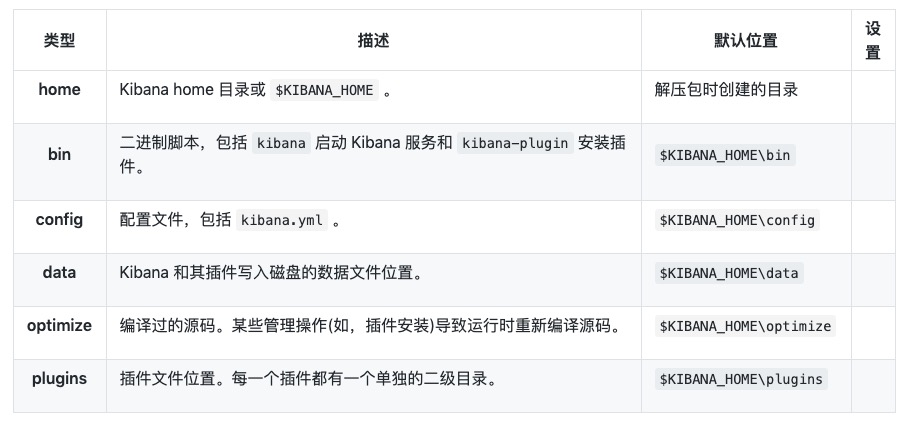

#### 1.Kibana安装
    使用 .tar.gz 安装 Kibana
    Kibana 为 Linux 和 Darwin 平台提供了 .tar.gz 安装包。这些类型的包非常容易使用。
    
    Kibana 的最新稳定版本可以在 Kibana 下载页找到。其它版本可以在 已发布版本中查看。
    
#### 2.2下载安装 Linux 64 位包
    Kibana v6.0.0 的 Linux 文件可以按照如下方式下载和安装：
    
    wget https://artifacts.elastic.co/downloads/kibana/kibana-6.0.0-linux-x86_64.tar.gz
    sha1sum kibana-6.0.0-linux-x86_64.tar.gz 
    tar -xzf kibana-6.0.0-linux-x86_64.tar.gz
    cd kibana/ 

#### 2.2下载安装 Darwin 包
    Kibana v6.0.0 的 Darwin 文件可以按照如下方式下载和安装：
    
    wget https://artifacts.elastic.co/downloads/kibana/kibana-6.0.0-darwin-x86_64.tar.gz
    shasum kibana-6.0.0-darwin-x86_64.tar.gz 
    tar -xzf kibana-6.0.0-darwin-x86_64.tar.gz
    cd kibana/ 

#### 3.从命令行启动 Kibana
    Kibana 可以从命令行启动，命令如下：
    
    ./bin/kibana
    默认 Kibana 在前台启动，打印日志到标准输出 (stdout)，可以通过 Ctrl-C 命令终止运行。
    
    通过配置文件配置 Kibana
    Kibana 默认情况下从 $KIBANA_HOME/config/kibana.yml 加载配置文件。该配置文件的格式在 配置 Kibana 中做了说明。
    
    .tar.gz 文件目录编辑
    .tar.gz 整个包是独立的。默认情况下，所有的文件和目录都在 $KIBANA_HOME — 解压包时创建的目录下。这样非常方便，因为您不需要创建任何目录来使用 Kibana，卸载 Kibana 就是简单地删除 $KIBANA_HOME 目录。但还是建议修改一下配置文件和数据目录，这样就不会删除重要数据。
    
#### 4.备注

