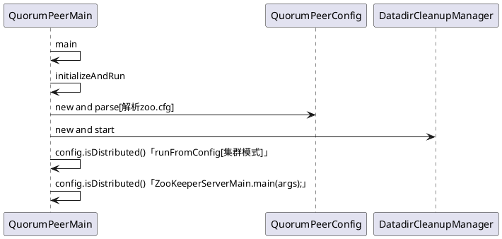

### Zookeeper源码启动流程分析

Zookeeper服务端启动入口是QuorumPeerMain的main方法。


```

```java

public class QuorumPeerMain {

    protected QuorumPeer quorumPeer;

    /**
     * To start the replicated server specify the configuration file name on the command line.
     * @param args path to the configfile
     */
    public static void main(String[] args) {
        QuorumPeerMain main = new QuorumPeerMain();
        try {
            //can throw IllegalArgumentException， ConfigException DatadirException，AdminServerException，Exception
            main.initializeAndRun(args);
        } catch (Exception e) {
            //.... Exception
        }
        System.exit(0);
    }

    protected void initializeAndRun(String[] args)
        throws ConfigException, IOException, AdminServerException{
        //解析zoo.cfg
        QuorumPeerConfig config = new QuorumPeerConfig();
        // Start and schedule the the purge task
        DatadirCleanupManager purgeMgr = new DatadirCleanupManager(config
                .getDataDir(), config.getDataLogDir(), config
                .getSnapRetainCount(), config.getPurgeInterval());
        purgeMgr.start();
        if (args.length == 1 && config.isDistributed()) {
            //集群模式
            runFromConfig(config);
        } else {
            LOG.warn("Either no config or no quorum defined in config, running "
                    + " in standalone mode");
            //单机模式【there is only server in the quorum -- run as standalone】
            ZooKeeperServerMain.main(args);
        }
    }

    public void runFromConfig(QuorumPeerConfig config)
            throws IOException, AdminServerException{
      try {
          ManagedUtil.registerLog4jMBeans();
      } catch (JMException e) {
          LOG.warn("Unable to register log4j JMX control", e);
      }

      LOG.info("Starting quorum peer");
      try {
          ServerCnxnFactory cnxnFactory = null;
          ServerCnxnFactory secureCnxnFactory = null;

          if (config.getClientPortAddress() != null) {
              cnxnFactory = ServerCnxnFactory.createFactory();
              cnxnFactory.configure(config.getClientPortAddress(),
                      config.getMaxClientCnxns(),
                      false);
          }

          if (config.getSecureClientPortAddress() != null) {
              secureCnxnFactory = ServerCnxnFactory.createFactory();
              secureCnxnFactory.configure(config.getSecureClientPortAddress(),
                      config.getMaxClientCnxns(),
                      true);
          }

          quorumPeer = getQuorumPeer();
          quorumPeer.setTxnFactory(new FileTxnSnapLog(
                      config.getDataLogDir(),
                      config.getDataDir()));
          quorumPeer.enableLocalSessions(config.areLocalSessionsEnabled());
          quorumPeer.enableLocalSessionsUpgrading(
              config.isLocalSessionsUpgradingEnabled());
          //quorumPeer.setQuorumPeers(config.getAllMembers());
          quorumPeer.setElectionType(config.getElectionAlg());
          quorumPeer.setMyid(config.getServerId());
          quorumPeer.setTickTime(config.getTickTime());
          quorumPeer.setMinSessionTimeout(config.getMinSessionTimeout());
          quorumPeer.setMaxSessionTimeout(config.getMaxSessionTimeout());
          quorumPeer.setInitLimit(config.getInitLimit());
          quorumPeer.setSyncLimit(config.getSyncLimit());
          quorumPeer.setConfigFileName(config.getConfigFilename());
          quorumPeer.setZKDatabase(new ZKDatabase(quorumPeer.getTxnFactory()));
          quorumPeer.setQuorumVerifier(config.getQuorumVerifier(), false);
          if (config.getLastSeenQuorumVerifier()!=null) {
              quorumPeer.setLastSeenQuorumVerifier(config.getLastSeenQuorumVerifier(), false);
          }
          quorumPeer.initConfigInZKDatabase();
          quorumPeer.setCnxnFactory(cnxnFactory);
          quorumPeer.setSecureCnxnFactory(secureCnxnFactory);
          quorumPeer.setSslQuorum(config.isSslQuorum());
          quorumPeer.setUsePortUnification(config.shouldUsePortUnification());
          quorumPeer.setLearnerType(config.getPeerType());
          quorumPeer.setSyncEnabled(config.getSyncEnabled());
          quorumPeer.setQuorumListenOnAllIPs(config.getQuorumListenOnAllIPs());
          if (config.sslQuorumReloadCertFiles) {
              quorumPeer.getX509Util().enableCertFileReloading();
          }

          // sets quorum sasl authentication configurations
          quorumPeer.setQuorumSaslEnabled(config.quorumEnableSasl);
          if(quorumPeer.isQuorumSaslAuthEnabled()){
              quorumPeer.setQuorumServerSaslRequired(config.quorumServerRequireSasl);
              quorumPeer.setQuorumLearnerSaslRequired(config.quorumLearnerRequireSasl);
              quorumPeer.setQuorumServicePrincipal(config.quorumServicePrincipal);
              quorumPeer.setQuorumServerLoginContext(config.quorumServerLoginContext);
              quorumPeer.setQuorumLearnerLoginContext(config.quorumLearnerLoginContext);
          }
          quorumPeer.setQuorumCnxnThreadsSize(config.quorumCnxnThreadsSize);
          quorumPeer.initialize();
          
          quorumPeer.start();
          quorumPeer.join();
      } catch (InterruptedException e) {
          // warn, but generally this is ok
          LOG.warn("Quorum Peer interrupted", e);
      }
    }

    // @VisibleForTesting
    protected QuorumPeer getQuorumPeer() throws SaslException {
        return new QuorumPeer();
    }
}

```