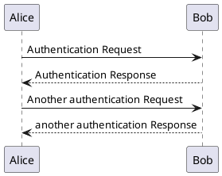
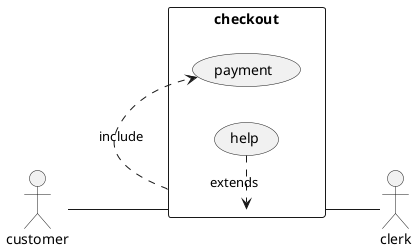
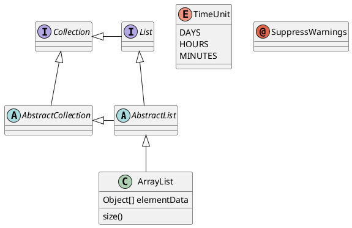
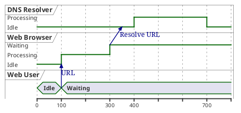
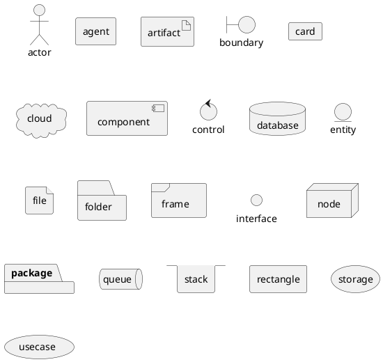
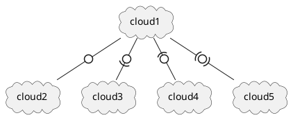

### 使用文档
[官网文档](https://plantuml.com/zh/)
### 时序图

```plantuml

@startuml
Alice -> Bob: Authentication Request
Bob --> Alice: Authentication Response

Alice -> Bob: Another authentication Request
Alice <-- Bob: another authentication Response
@enduml

```

### 用例图

```plantuml

@startuml
left to right direction
skinparam packageStyle rectangle
actor customer
actor clerk
rectangle checkout {
  customer -- (checkout)
  (checkout) .> (payment) : include
  (help) .> (checkout) : extends
  (checkout) -- clerk
}
@enduml
```

### 类图

```plantuml
@startuml

abstract class AbstractList
abstract AbstractCollection
interface List
interface Collection

List <|-- AbstractList
Collection <|-- AbstractCollection

Collection <|- List
AbstractCollection <|- AbstractList
AbstractList <|-- ArrayList

class ArrayList {
  Object[] elementData
  size()
}

enum TimeUnit {
  DAYS
  HOURS
  MINUTES
}

annotation SuppressWarnings

@enduml
```

```plantuml
@startuml
robust "DNS Resolver" as DNS
robust "Web Browser" as WB
concise "Web User" as WU

@0
WU is Idle
WB is Idle
DNS is Idle

@+100
WU -> WB : URL
WU is Waiting
WB is Processing

@+200
WB is Waiting
WB -> DNS@+50 : Resolve URL

@+100
DNS is Processing

@+300
DNS is Idle
@enduml
```

### 部署图

```plantuml
@startuml
actor actor
agent agent
artifact artifact
boundary boundary
card card
cloud cloud
component component
control control
database database
entity entity
file file
folder folder
frame frame
interface  interface
node node
package package
queue queue
stack stack
rectangle rectangle
storage storage
usecase usecase
@enduml
```

### 部署图

```plantuml
@startuml

cloud cloud1
cloud cloud2
cloud cloud3
cloud cloud4
cloud cloud5
cloud1 -0- cloud2
cloud1 -0)- cloud3
cloud1 -(0- cloud4
cloud1 -(0)- cloud5

@enduml
```