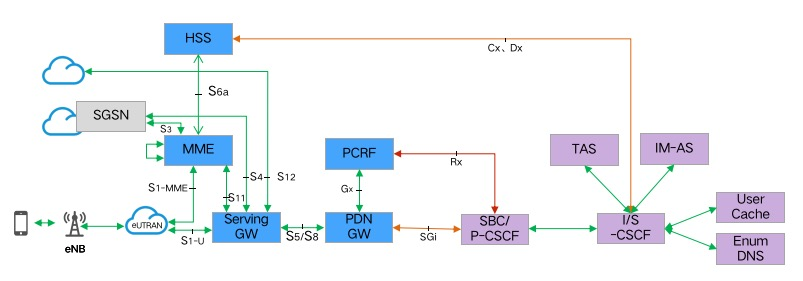
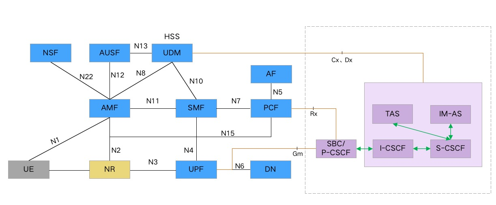

### 1.ims介绍

* 4G对接方案


* 5G对接方案


* 流程图
  * 包含消息通话流程
  * 参见：[流程图](flow)

#### 1.1.服务介绍

* 数据中间件: zk/mysql/redis/hbase
* 业务服务需部署: sbc/cscf/im/tas/enum
* 详细参考下文

#### 1.2.接口列表

```
用户：
	SIP REG1	初始注册
	Cx接口	用户初始注册（UAR）
	Cx接口	注册鉴权  (MAR)
	SIP REG2	重注册
	Cx接口	用户初始注册（UAR）
	Cx接口	用户重注册（SAR）
	SIP UREG	注销
	Cx接口	已注册用户注销
	Cx接口	用户发起的注销
	Cx接口	HSS 发起注销
	Cx接口	更新已注册用户信息
	Cx接口	更新未注册用户信息
	Dx接口	用户归属 HSS 查询
消息：	
	SIP MESSAGE	PAGE MODE
	    0 0	SC → MS	SMS-DELIVER
        0 1	MS → SC	SMS-SUBMIT
        0 0	MS → SC	SMS-DELIVER-REPORT
        0 1	SC → MS	SMS-SUBMIT-REPORT
        1 0	SC → MS	SMS-STATUS-REPORT
        1 0	MS → SC	SMS-COMMAND
	SIP FILE(INTITE)	LARGE MODE
	    X
	SIP SESSION(INVITE)	SESSION MODE
	    X
	MSRP媒体传输
音视频：
	SIP INVITE	呼叫发起

	SIP REINVITE	重呼叫

	SIP 183	振铃
        Rx接口	AAR
        Rx接口	AAA
    SIP 200 
        Rx接口	AAR
        Rx接口	AAA
	SIP BYE	挂断
        Rx接口	STR
        Rx接口	STA

```

### 2.ims环境搭建


#### 2.1 docker安装&配置

```
docker ubuntu安装配置

1.  sudo apt-get update

2.  sudo apt-get install docker

3.  docker ps

4.  sudo apt install docker.io

5.  sudo apt install docker.io

6.  sudo groupadd docker

7.  sudo usermod -aG docker $USER

8.  sudo vi /etc/docker/daemon.json 
	root@user1-virtual-machine:~# cat /etc/docker/daemon.json 

	{
	    "storage-driver":"overlay",
	 "insecure-registries": ["10.10.208.193:5000"]
	}
9.  sudo service docker restart

```
    
[docker安装配置，详细参考](docker安装配置.md)

    
    
#### 2.2 中间件安装配置

##### mysql

```
拉取镜像
docker pull mysql:5.6.40

docker stop mysql.5.6.40

docker rm mysql.5.6.40

docker run --name mysql.5.6.40 --privileged=true -p 3306:3306 -e MYSQL_ROOT_PASSWORD=urcs@2018 -d mysql:5.6.40 

进入容器

docker exec -it mysql.5.6.40 bash
           
```


##### redis

```
//docker redis 安装
docker pull redis:3.2
启动redis

docker stop redis-6379
docker rm redis-6379
docker run -d -p 6379:6379  --name redis-6379  --privileged=true redis:3.2 redis-server --port 6379


在当前目录配置文件
vim sentinel.conf 
sentinel monitor mymaster 10.10.220.120 6379 1


启动sentinel
docker stop redis-sentinel-26379 
docker rm redis-sentinel-26379 
docker run -d -p 26379:26379 -v /home/user1/sentinel.conf:/usr/local/bin/redis-conf/sentinel.conf --name redis-sentinel-26379  redis:3.2 redis-sentinel /usr/local/bin/redis-conf/sentinel.conf --port 26379

docker logs -f redis-sentinel-26379 
```


##### hbase

```
拉取镜像
docker pull harisekhon/hbase:1.2
运行镜像
docker stop hbase1.2
docker rm hbase1.2
docker run -d -h fusion_hb --privileged=true -p 2181:2181 -p 18080:8080 -p 18085:8085 -p 19090:9090 -p 19095:9095 -p 16000:16000 -p 16010:16010 -p 16201:16201 -p 16301:16301 --name hbase1.2 harisekhon/hbase:1.2
  
docker exec -it xxxx bash         
```

##### fastdfs

```
docker run -d --privileged=true -p 22122:22122 --name trakcer --net=host 10.10.208.193:5000/urcs/fastdfs_tracker:4.08 tracker

docker run -d --privileged=true -p 23000:23000 -p 8888:8888 --name storage --net=host --env TRACKER_SERVER=10.10.220.120:22122 10.10.208.193:5000/urcs/fastdfs_storage:4.08 storage
```


##### zk

```
docker pull zookeeper:3.5
docker run --name zookeeper3.5 -p 7998:2181 -d zookeeper:3.5 
docker stop zookeeper
docker rm zookeeper
docker run --privileged=true -d --name zookeeper --publish 7998:2181  -d zookeeper:3.5 
           
```

[中间件安装配置](中间件安装配置.md)


#### 2.3服务安装


