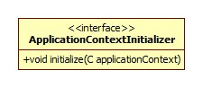
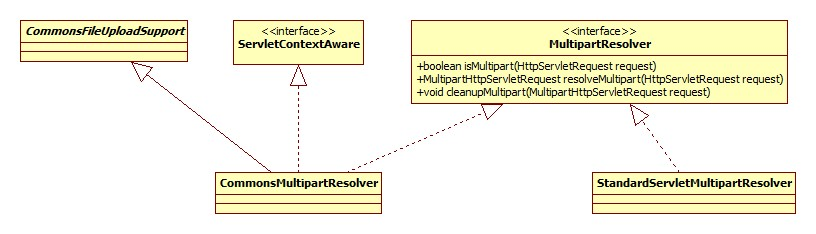
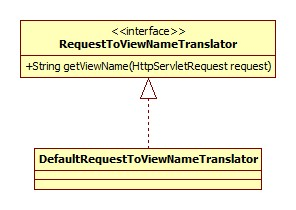
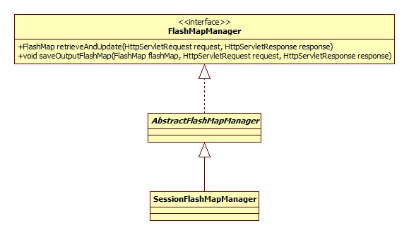
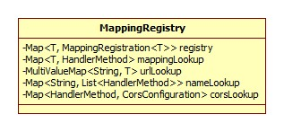
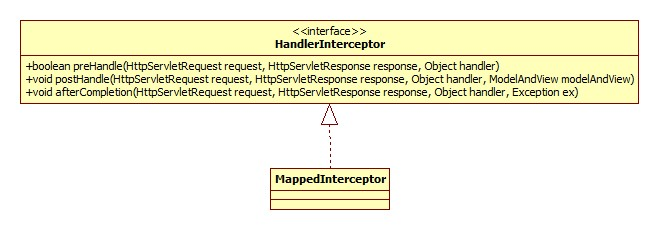
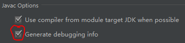
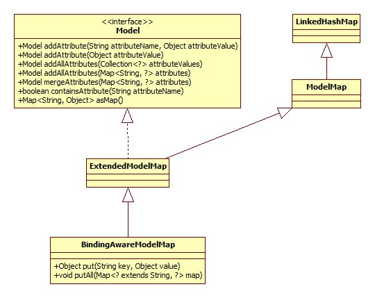
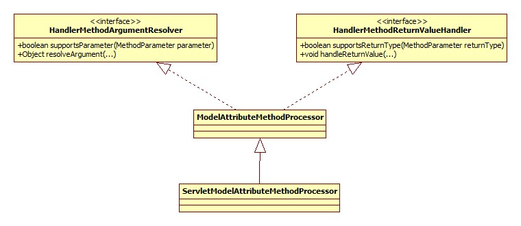

<!-- START doctoc generated TOC please keep comment here to allow auto update -->
<!-- DON'T EDIT THIS SECTION, INSTEAD RE-RUN doctoc TO UPDATE -->

**Table of Contents** _generated with [DocToc](https://github.com/thlorenz/doctoc)_

- [初始化](#%E5%88%9D%E5%A7%8B%E5%8C%96)
  - [容器初始化](#%E5%AE%B9%E5%99%A8%E5%88%9D%E5%A7%8B%E5%8C%96)
    - [根容器查找](#%E6%A0%B9%E5%AE%B9%E5%99%A8%E6%9F%A5%E6%89%BE)
    - [容器创建](#%E5%AE%B9%E5%99%A8%E5%88%9B%E5%BB%BA)
      - [ApplicationContextInitializer](#applicationcontextinitializer)
      - [配置解析](#%E9%85%8D%E7%BD%AE%E8%A7%A3%E6%9E%90)
        - [注解驱动](#%E6%B3%A8%E8%A7%A3%E9%A9%B1%E5%8A%A8)
        - [静态资源处理](#%E9%9D%99%E6%80%81%E8%B5%84%E6%BA%90%E5%A4%84%E7%90%86)
        - [拦截器](#%E6%8B%A6%E6%88%AA%E5%99%A8)
        - [视图](#%E8%A7%86%E5%9B%BE)
      - [Scope/处理器注册](#scope%E5%A4%84%E7%90%86%E5%99%A8%E6%B3%A8%E5%86%8C)
  - [MVC 初始化](#mvc%E5%88%9D%E5%A7%8B%E5%8C%96)
    - [文件上传支持](#%E6%96%87%E4%BB%B6%E4%B8%8A%E4%BC%A0%E6%94%AF%E6%8C%81)
    - [地区解析器](#%E5%9C%B0%E5%8C%BA%E8%A7%A3%E6%9E%90%E5%99%A8)
    - [主题解析器](#%E4%B8%BB%E9%A2%98%E8%A7%A3%E6%9E%90%E5%99%A8)
    - [HandlerMapping 检查](#handlermapping%E6%A3%80%E6%9F%A5)
    - [HandlerAdapter 检查](#handleradapter%E6%A3%80%E6%9F%A5)
    - [HandlerExceptionResolver 检查](#handlerexceptionresolver%E6%A3%80%E6%9F%A5)
    - [RequestToViewNameTranslator](#requesttoviewnametranslator)
    - [ViewResolver 检查](#viewresolver%E6%A3%80%E6%9F%A5)
    - [FlashMapManager](#flashmapmanager)
  - [HandlerMapping 初始化](#handlermapping%E5%88%9D%E5%A7%8B%E5%8C%96)
    - [RequestMappingHandlerMapping](#requestmappinghandlermapping)
      - [跨域请求](#%E8%B7%A8%E5%9F%9F%E8%AF%B7%E6%B1%82)
      - [拦截器初始化](#%E6%8B%A6%E6%88%AA%E5%99%A8%E5%88%9D%E5%A7%8B%E5%8C%96)
  - [HandlerAdapter 初始化](#handleradapter%E5%88%9D%E5%A7%8B%E5%8C%96)
    - [@ControllerAdvice](#controlleradvice)
    - [参数解析器](#%E5%8F%82%E6%95%B0%E8%A7%A3%E6%9E%90%E5%99%A8)
    - [@InitBinder 支持](#initbinder%E6%94%AF%E6%8C%81)
    - [返回结果解析器](#%E8%BF%94%E5%9B%9E%E7%BB%93%E6%9E%9C%E8%A7%A3%E6%9E%90%E5%99%A8)
- [请求响应](#%E8%AF%B7%E6%B1%82%E5%93%8D%E5%BA%94)
  - [请求上下文](#%E8%AF%B7%E6%B1%82%E4%B8%8A%E4%B8%8B%E6%96%87)
  - [请求分发](#%E8%AF%B7%E6%B1%82%E5%88%86%E5%8F%91)
    - [处理器查找](#%E5%A4%84%E7%90%86%E5%99%A8%E6%9F%A5%E6%89%BE)
    - [适配器查找](#%E9%80%82%E9%85%8D%E5%99%A8%E6%9F%A5%E6%89%BE)
  - [请求处理](#%E8%AF%B7%E6%B1%82%E5%A4%84%E7%90%86)
    - [Session 同步](#session%E5%90%8C%E6%AD%A5)
    - [参数解析](#%E5%8F%82%E6%95%B0%E8%A7%A3%E6%9E%90)
      - [策略模式](#%E7%AD%96%E7%95%A5%E6%A8%A1%E5%BC%8F)
      - [自定义参数](#%E8%87%AA%E5%AE%9A%E4%B9%89%E5%8F%82%E6%95%B0)
        - [参数名是从哪里来的](#%E5%8F%82%E6%95%B0%E5%90%8D%E6%98%AF%E4%BB%8E%E5%93%AA%E9%87%8C%E6%9D%A5%E7%9A%84)
      - [Model](#model)
      - [总结](#%E6%80%BB%E7%BB%93)
    - [返回值解析](#%E8%BF%94%E5%9B%9E%E5%80%BC%E8%A7%A3%E6%9E%90)
    - [视图渲染](#%E8%A7%86%E5%9B%BE%E6%B8%B2%E6%9F%93)
      - [ModelAndView](#modelandview)
      - [渲染](#%E6%B8%B2%E6%9F%93)
        - [ViewResolver](#viewresolver)
        - [View](#view)
- [拾遗](#%E6%8B%BE%E9%81%97)
  - [@ResponseBody](#responsebody)
    - [HttpMessageConverter](#httpmessageconverter)
      - [自定义](#%E8%87%AA%E5%AE%9A%E4%B9%89)
      - [默认](#%E9%BB%98%E8%AE%A4)
    - [转换](#%E8%BD%AC%E6%8D%A2)
  - [参数解析 & 结果转换](#%E5%8F%82%E6%95%B0%E8%A7%A3%E6%9E%90--%E7%BB%93%E6%9E%9C%E8%BD%AC%E6%8D%A2)
  - ["纯"对象参数接收](#%E7%BA%AF%E5%AF%B9%E8%B1%A1%E5%8F%82%E6%95%B0%E6%8E%A5%E6%94%B6)
    - [参数对象构造](#%E5%8F%82%E6%95%B0%E5%AF%B9%E8%B1%A1%E6%9E%84%E9%80%A0)
    - [参数绑定](#%E5%8F%82%E6%95%B0%E7%BB%91%E5%AE%9A)
    - [参数校验](#%E5%8F%82%E6%95%B0%E6%A0%A1%E9%AA%8C)
      - [JSR 校验](#jsr%E6%A0%A1%E9%AA%8C)
      - [自定义校验器](#%E8%87%AA%E5%AE%9A%E4%B9%89%E6%A0%A1%E9%AA%8C%E5%99%A8)
      - [一个有意思的问题](#%E4%B8%80%E4%B8%AA%E6%9C%89%E6%84%8F%E6%80%9D%E7%9A%84%E9%97%AE%E9%A2%98)

<!-- END doctoc generated TOC please keep comment here to allow auto update -->

# 初始化

spring-mvc 的核心便是 DispatcherServlet，所以初始化也是围绕其展开的。类图:


Servlet 标准定义了 init 方法是其生命周期的初始化方法。

HttpServletBean.init:

```java
@Override
public final void init() throws ServletException {
    // Set bean properties from init parameters.
    PropertyValues pvs = new ServletConfigPropertyValues(getServletConfig(), this.requiredProperties);
    //包装DispatcherServlet，准备放入容器
    BeanWrapper bw = PropertyAccessorFactory.forBeanPropertyAccess(this);
    //用以加载spring-mvc配置文件
    ResourceLoader resourceLoader = new ServletContextResourceLoader(getServletContext());
    bw.registerCustomEditor(Resource.class, new ResourceEditor(resourceLoader, getEnvironment()));
    //没有子类实现此方法
    initBeanWrapper(bw);
    bw.setPropertyValues(pvs, true);
    // Let subclasses do whatever initialization they like.
    initServletBean();
}
```

主要逻辑一目了然。注意**setPropertyValues 方法会导致对 DispatcherServlet 相关 setter 方法的调用，所以当进行容器初始化时从 init-param 中读取的参数已被设置到 DispatcherServlet 的相关字段(Field)中**。

## 容器初始化

FrameworkServlet.initServletBean 简略版源码:

```java
@Override
protected final void initServletBean() {
    this.webApplicationContext = initWebApplicationContext();
    //空实现，且没有子类覆盖
    initFrameworkServlet()
}
```

FrameworkServlet.initWebApplicationContext:

```java
protected WebApplicationContext initWebApplicationContext() {
    //根容器查找
    WebApplicationContext rootContext =
            WebApplicationContextUtils.getWebApplicationContext(getServletContext());
    WebApplicationContext wac = null;
    if (this.webApplicationContext != null) {
        //有可能DispatcherServlet被作为Spring bean初始化，且webApplicationContext已被注入进来
        wac = this.webApplicationContext;
        if (wac instanceof ConfigurableWebApplicationContext) {
            ConfigurableWebApplicationContext cwac = (ConfigurableWebApplicationContext) wac;
            if (!cwac.isActive()) {
                if (cwac.getParent() == null) {
                    cwac.setParent(rootContext);
                }
                configureAndRefreshWebApplicationContext(cwac);
            }
        }
    }
    if (wac == null) {
        //是否已经存在于ServletContext中
        wac = findWebApplicationContext();
    }
    if (wac == null) {
        wac = createWebApplicationContext(rootContext);
    }
    if (!this.refreshEventReceived) {
        onRefresh(wac);
    }
    if (this.publishContext) {
        String attrName = getServletContextAttributeName();
        getServletContext().setAttribute(attrName, wac);
    }
    return wac;
}
```

下面分部分展开。

### 根容器查找

spring-mvc 支持 Spring 容器与 MVC 容器共存，此时，Spring 容器即根容器，mvc 容器将根容器视为父容器。

Spring 容器(根容器)以下列形式进行配置(web.xml):

```xml
<listener>
    <listener-class>org.springframework.web.context.ContextLoaderListener</listener-class>
</listener>
```

根据 Servlet 规范，各组件的加载 顺序如下:

listener -> filter -> servlet

WebApplicationContextUtils.getWebApplicationContext:

```java
String ROOT_WEB_APPLICATION_CONTEXT_ATTRIBUTE = WebApplicationContext.class.getName() + ".ROOT";
public static WebApplicationContext getWebApplicationContext(ServletContext sc) {
    return getWebApplicationContext(sc, WebApplicationContext.ROOT_WEB_APPLICATION_CONTEXT_ATTRIBUTE);
}
```

两参数方法:

```java
public static WebApplicationContext getWebApplicationContext(ServletContext sc, String attrName) {
    Object attr = sc.getAttribute(attrName);
    if (attr == null) {
        return null;
    }
    return (WebApplicationContext) attr;
}
```

可以得出结论:

**如果 Spring 根容器存在，那么它被保存在 ServletContext 中，其 key 为`WebApplicationContext.class.getName() + ".ROOT"`。**

### 容器创建

FrameworkServlet.createWebApplicationContext:

```java
protected WebApplicationContext createWebApplicationContext(ApplicationContext parent) {
    Class<?> contextClass = getContextClass();
    if (!ConfigurableWebApplicationContext.class.isAssignableFrom(contextClass)) {
        throw new ApplicationContextException();
    }
    ConfigurableWebApplicationContext wac =
            (ConfigurableWebApplicationContext) BeanUtils.instantiateClass(contextClass);
    wac.setEnvironment(getEnvironment());
    wac.setParent(parent);
    wac.setConfigLocation(getContextConfigLocation());
    configureAndRefreshWebApplicationContext(wac);
    return wac;
}
```

通过对 getContextClass 方法的调用，Spring 允许我们自定义容器的类型，即我们可以在 web.xml 中如下配置:

```xml
<servlet>
    <servlet-name>SpringMVC</servlet-name>
    <servlet-class>org.springframework.web.servlet.DispatcherServlet</servlet-class>
    <!-- 配置文件位置 -->
    <init-param>
        <param-name>contextConfigLocation</param-name>
        <param-value>classpath:spring-servlet.xml</param-value>
    </init-param>
    <!-- 容器类型 -->
    <init-param>
        <param-name>contextClass</param-name>
        <param-value>java.lang.Object</param-value>
    </init-param>
</servlet>
```

configureAndRefreshWebApplicationContext 核心源码:

```java
protected void configureAndRefreshWebApplicationContext(ConfigurableWebApplicationContext wac) {
    applyInitializers(wac);
    wac.refresh();
}
```

#### ApplicationContextInitializer

ApplicationContextInitializer 允许我们在 Spring(mvc)容器初始化之前干点坏事，可以通过 init-param 传入:

```xml
<init-param>
    <param-name>contextInitializerClasses</param-name>
    <param-value>坏事儿</param-value>
</init-param>
```

applyInitializers 方法正是要触发这些坏事儿。类图:



#### 配置解析

"配置"指的便是 spring-servlet.xml:

```xml
<context:component-scan base-package="controller"/>
<mvc:annotation-driven/>
<!-- 启用对静态资源使用默认servlet处理，非REST方式不需要 -->
<mvc:default-servlet-handler/>
<!-- 配置视图 -->
<bean class="org.springframework.web.servlet.view.UrlBasedViewResolver">
    <!-- viewClass属性必不可少 -->
    <property name="viewClass" value="org.springframework.web.servlet.view.JstlView"></property>
    <property name="prefix" value="/WEB-INF/"></property>
    <property name="suffix" value=".jsp"></property>
</bean>
```

而解析的入口便在于对 refresh 方法的调用，此方法位于 AbstractApplicationContext，这一点在 spring-core 时已经见过了，下面我们重点关注不同于 spring-core 的地方。

对于 spring-mvc 来说，其容器默认为 XmlWebApplicationContext，部分类图:


XmlWebApplicationContext 通过重写 loadBeanDefinitions 方法改变了 bean 加载行为，使其指向 spring-servlet.xml。

spring-servlet.xml 中不同于 spring-core 的地方便在于引入了 mvc 命名空间，正如 spring-core 中笔记中所说的那样，**Spring 用过 jar 包/META-INFO 中的.handlers 文件定义针对不同的命名空间所使用的解析器**。

mvc 命名空间的解析器为 MvcNamespaceHandler，部分源码:

```java
@Override
public void init() {
    registerBeanDefinitionParser("annotation-driven", new AnnotationDrivenBeanDefinitionParser());
    registerBeanDefinitionParser("default-servlet-handler",
                                 new DefaultServletHandlerBeanDefinitionParser());
    registerBeanDefinitionParser("interceptors", new IanterceptorsBeanDefinitionParser());
    registerBeanDefinitionParser("view-resolvers", new ViewResolversBeanDefinitionParser());
}
```

老样子，按部分展开。

##### 注解驱动

其 parse 方法负责向 Sprng 容器注册一些必要的组件，整理如下图:


##### 静态资源处理

即:

```xml
<mvc:default-servlet-handler/>
```

DefaultServletHandlerBeanDefinitionParser.parse 负责向容器注册以下三个组件:

- DefaultServletHttpRequestHandler
- SimpleUrlHandlerMapping
- HttpRequestHandlerAdapter

##### 拦截器

InterceptorsBeanDefinitionParser.parse 方法负责**将每一项`mvc:interceptor`配置解析为一个 MappedInterceptor bean 并注册到容器中**。

##### 视图

有两种方式向 Spring 容器注册视图:

- 以前采用较土的方式:

  ```xml
  <bean class="org.springframework.web.servlet.view.UrlBasedViewResolver">
    <!-- viewClass属性必不可少 -->
      <property name="viewClass" value="org.springframework.web.servlet.view.JstlView"></property>
      <property name="prefix" value="/WEB-INF/"></property>
      <property name="suffix" value=".jsp"></property>
  </bean>
  ```

- 通过特定的标签:

  ```xml
  <mvc:view-resolvers>
    <mvc:jsp view-class="" />
  </mvc:view-resolvers>
  ```

从这里可以推测出: 拦截器同样支持第一种方式，Spring 在查找时应该会查询某一接口的子类。

ViewResolversBeanDefinitionParser.parse 方法的作用便是将每一个视图解析为 ViewResolver 并注册到容器。

#### Scope/处理器注册

AbstractRefreshableWebApplicationContext.postProcessBeanFactory:

```java
@Override
protected void postProcessBeanFactory(ConfigurableListableBeanFactory beanFactory) {
    beanFactory.addBeanPostProcessor(
        new ServletContextAwareProcessor(this.servletContext, this.servletConfig));
    beanFactory.ignoreDependencyInterface(ServletContextAware.class);
    beanFactory.ignoreDependencyInterface(ServletConfigAware.class);
    WebApplicationContextUtils.registerWebApplicationScopes(beanFactory, this.servletContext);
    WebApplicationContextUtils.registerEnvironmentBeans(beanFactory,
        this.servletContext, this.servletConfig);
}
```

ServletContextAwareProcessor 用以向实现了 ServletContextAware 的 bean 注册 ServletContext。

registerWebApplicationScopes 用以注册"request", "session", "globalSession", "application"四种 scope，scope 是个什么东西以及如何自定义，在 spring-core 中已经进行过说明了。

registerEnvironmentBeans 用以将 servletContext、servletConfig 以及各种启动参数注册到 Spring 容器中。

## MVC 初始化

入口位于 DispatcherServlet 的 initStrategies 方法(经由 onRefresh 调用):

```java
protected void initStrategies(ApplicationContext context) {
    initMultipartResolver(context);
    initLocaleResolver(context);
    initThemeResolver(context);
    initHandlerMappings(context);
    initHandlerAdapters(context);
    initHandlerExceptionResolvers(context);
    initRequestToViewNameTranslator(context);
    initViewResolvers(context);
    initFlashMapManager(context);
}
```

显然，这里就是 spring-mvc 的核心了。

### 文件上传支持

initMultipartResolver 核心源码:

```java
private void initMultipartResolver(ApplicationContext context) {
    try {
        this.multipartResolver = context.getBean(MULTIPART_RESOLVER_BEAN_NAME, MultipartResolver.class);
    } catch (NoSuchBeanDefinitionException ex) {
        // Default is no multipart resolver.
        this.multipartResolver = null;
    }
}
```

MultipartResolver 用于开启 Spring MVC 文件上传功能，其类图:



也就是说，如果我们要使用文件上传功能，须在容器中注册一个 MultipartResolver bean。当然，默认是没有的。

### 地区解析器

LocaleResolver 接口定义了 Spring MVC 如何获取客户端(浏览器)的地区，initLocaleResolver 方法在容器中寻找此 bean，如果没有，注册 AcceptHeaderLocaleResolver，即根据 request 的请求头**Accept-Language**获取地区。

spring-mvc 采用了属性文件的方式配置默认策略(即 bean)，此文件位于 spring-mvc 的 jar 包的 org.springframework.web.servlet 下。

### 主题解析器

ThemeResolver 接口配合 Spring 标签库使用可以通过动态决定使用的 css 以及图片的方式达到换肤的效果，其类图:


如果容器中不存在叫做 themeResolver 的 bean，initThemeResolver 方法将向容器中注册 FixedThemeResolver，此 bean 只能提供一套默认的主题，名为 theme。

### HandlerMapping 检查

initHandlerMappings 方法用于确保容器中**至少含有一个 HandlerMapping 对象**。从前面配置解析-注解驱动一节中可以看出，注解驱动导致已经注册了两个此对象。

如果没有开启注解驱动，那么将会使用默认的 HandlerMapping，相关源码:

```java
if (this.handlerMappings == null) {
    this.handlerMappings = getDefaultStrategies(context, HandlerMapping.class);
    if (logger.isDebugEnabled()) {
        logger.debug("No HandlerMappings found in servlet '" + getServletName() + "': using default");
    }
}
```

前面提到了，默认的策略由 DispatcherServlet.properties 决定，**目前是 BeanNameUrlHandlerMapping 和 DefaultAnnotationHandlerMapping**。

### HandlerAdapter 检查

套路和上面完全一样，默认使用 HttpRequestHandlerAdapter、SimpleControllerHandlerAdapter 和 AnnotationMethodHandlerAdapter。

### HandlerExceptionResolver 检查

套路和上面完全一样，默认使用 AnnotationMethodHandlerExceptionResolver、ResponseStatusExceptionResolver、DefaultHandlerExceptionResolver。

### RequestToViewNameTranslator

initRequestToViewNameTranslator 方法回向容器中注册一个 DefaultRequestToViewNameTranslator 对象，此接口用以完成从 HttpServletRequest 到视图名的解析，其使用场景是**给定的 URL 无法匹配任何控制器时**。

DefaultRequestToViewNameTranslator 的转换例子:

http://localhost:8080/gamecast/display.html -> display(视图)

其类图:



### ViewResolver 检查

熟悉的套路，默认使用 InternalResourceViewResolver。

### FlashMapManager

initFlashMapManager 方法会向容器注册 SessionFlashMapManager 对象，类图:



此接口和 FlashMap 搭配使用，用于在**请求重定向时保存/传递参数**。

## HandlerMapping 初始化

此接口用以根据请求的 URL 寻找合适的处理器。从前面配置解析一节可以看出，我们的容器中有三个 HandlerMapping 实现，下面以 RequestMappingHandlerMapping 位代表进行说明。

### RequestMappingHandlerMapping

此实现根据@Controller 和@RequestMapping 注解完成解析。类图(忽略部分接口):


初始化的入口位于 AbstractHandlerMethodMapping 的 afterPropertiesSet 方法和 AbstractHandlerMapping 的 initApplicationContext 方法，afterPropertiesSet 调用了 initHandlerMethods:

```java
protected void initHandlerMethods() {
    //获取容器中所有的bean
    String[] beanNames = (this.detectHandlerMethodsInAncestorContexts ?
            BeanFactoryUtils.beanNamesForTypeIncludingAncestors(getApplicationContext(), Object.class)             :getApplicationContext().getBeanNamesForType(Object.class));
    for (String beanName : beanNames) {
        if (!beanName.startsWith(SCOPED_TARGET_NAME_PREFIX)) {
            Class<?> beanType = null;
            beanType = getApplicationContext().getType(beanName);
             //isHandler方法的原理:
             //判断类上有没有@Controller注解或者是@RequestMapping注解
            if (beanType != null && isHandler(beanType)) {
                detectHandlerMethods(beanName);
            }
        }
    }
    //空实现
    handlerMethodsInitialized(getHandlerMethods());
}
```

detectHandlerMethods 方法将反射遍历类中所有的 public 方法，如果方法上含有@RequestMapping 注解，那么将方法上的路径与类上的基础路径(如果有)进行合并，之后将映射(匹配关系)注册到 MappingRegistry 中。

注意，**类上的@RequestMapping 注解只能作为基路径存在，也就是说，如果类里面没有任何的方法级@RequestMapping 注解，那么类上的注解是没有意义的**。这一点可以从实验和源码上得到证实。

下面我们关注一下映射关系是如何保存(注册)的。

内部类 AbstractHandlerMethodMapping.MappingRegistry 是映射的载体，类图:



其 register 方法简略版源码:

```java
public void register(T mapping, Object handler, Method method) {
    //包装bean和方法
    HandlerMethod handlerMethod = createHandlerMethod(handler, method);
    this.mappingLookup.put(mapping, handlerMethod);
    List<String> directUrls = getDirectUrls(mapping);
    for (String url : directUrls) {
        this.urlLookup.add(url, mapping);
    }
    String name = null;
    if (getNamingStrategy() != null) {
        name = getNamingStrategy().getName(handlerMethod, mapping);
        addMappingName(name, handlerMethod);
    }
    CorsConfiguration corsConfig = initCorsConfiguration(handler, method, mapping);
    if (corsConfig != null) {
        this.corsLookup.put(handlerMethod, corsConfig);
    }
    this.registry.put(mapping, new MappingRegistration<T>(mapping, handlerMethod, directUrls, name));
}
```

mapping 其实是一个 RequestMappingInfo 对象，可以将其看做是**@RequestMapping 注解各种属性的一个封装**。最终由 RequestMappingInfo.createRequestMappingInfo 方法创建，源码:

```java
protected RequestMappingInfo createRequestMappingInfo(
        RequestMapping requestMapping, RequestCondition<?> customCondition) {
    return RequestMappingInfo
            .paths(resolveEmbeddedValuesInPatterns(requestMapping.path()))
            .methods(requestMapping.method())
            .params(requestMapping.params())
            .headers(requestMapping.headers())
            .consumes(requestMapping.consumes())
            .produces(requestMapping.produces())
            .mappingName(requestMapping.name())
            .customCondition(customCondition)
            .options(this.config)
            .build();
}
```

这就很明显了，具体每种属性什么意义可以参考@RequestMapping 源码。

register 方法中 urlLookup 其实就是将 paths 属性中的每个 path 都与处理器做映射。

getNamingStrategy 方法得到的是一个 HandlerMethodMappingNamingStrategy 接口的实例，此接口用以根据 HandlerMethod 得到一个名字，类图:


比如对于我们的控制器,SimpleController.echo 方法，最终得到的名字将是 SC#echo。

#### 跨域请求

spring-mvc 自 4.2 开启加入了跨域请求 Cors 的支持，主要有两种配置方式:

- xml:

  ```xml
  <mvc:cors>
    <mvc:mapping path=""/>
  </mvc:cors>
  ```

- @CrossOrigin 注解。

Cors 的原理可以参考:

[探讨跨域请求资源的几种方式](http://www.cnblogs.com/dojo-lzz/p/4265637.html)

而 initCorsConfiguration 方法的作用便是将@CrossOrigin 注解的各种属性封装在 CorsConfiguration 中。

#### 拦截器初始化

AbstractHandlerMapping.initApplicationContext:

```java
@Override
protected void initApplicationContext() throws BeansException {
    detectMappedInterceptors(this.adaptedInterceptors);
}
```

作用就是从容器中获取所有 MappedInterceptor bean 并放到 adaptedInterceptors 中，前面提到过了，我们使用 mvc:interceptor 定义的拦截器其实就是 MappedInterceptor 对象。类图:



## HandlerAdapter 初始化

同样，我们以 RequestMappingHandlerAdapter 为例进行说明，类图:


显然，入口在 afterPropertiesSet 方法:

```java
@Override
public void afterPropertiesSet() {
    // Do this first, it may add ResponseBody advice beans
    initControllerAdviceCache();
    if (this.argumentResolvers == null) {
        List<HandlerMethodArgumentResolver> resolvers = getDefaultArgumentResolvers();
        this.argumentResolvers = new HandlerMethodArgumentResolverComposite()
            .addResolvers(resolvers);
    }
    if (this.initBinderArgumentResolvers == null) {
        List<HandlerMethodArgumentResolver> resolvers = getDefaultInitBinderArgumentResolvers();
        this.initBinderArgumentResolvers = new HandlerMethodArgumentResolverComposite()
            .addResolvers(resolvers);
    }
    if (this.returnValueHandlers == null) {
        List<HandlerMethodReturnValueHandler> handlers = getDefaultReturnValueHandlers();
        this.returnValueHandlers = new HandlerMethodReturnValueHandlerComposite()
            .addHandlers(handlers);
    }
}
```

### @ControllerAdvice

initControllerAdviceCache 方法用以解析并存储标注了@ControllerAdvice 的 bean，这东西是干什么的参考：

[Spring3.2 新注解@ControllerAdvice](http://jinnianshilongnian.iteye.com/blog/1866350)

### 参数解析器

HandlerMethodArgumentResolver 即参数解析器，负责从 request 中解析、得到 Controller 方法所需的参数。afterPropertiesSet 方法设置了一组默认的解析器。具体是哪些参考 getDefaultArgumentResolvers 方法。类图:


### @InitBinder 支持

此注解定义的其实是自定义类型转换器。使用方法参考:

[springMVC @initBinder 使用](http://blog.csdn.net/songzaiblog/article/details/49757253)

getDefaultInitBinderArgumentResolvers 返回了一组默认使用的转换器，不过其实这里的转换器和上面的参数解析器其实是一个类型的，这里留个坑。

### 返回结果解析器

HandlerMethodReturnValueHandler 接口用以处理方法调用(Controller 方法)的返回值，类图:


getDefaultReturnValueHandlers 方法便返回了一坨这东西。

# 请求响应

我们先来看一下入口在哪。众所周知，Servlet 标准定义了所有请求先由 service 方法处理，如果是 get 或 post 方法，那么再交由 doGet 或是 doPost 方法处理。

FrameworkServlet 覆盖了 service 方法:

```java
@Override
protected void service(HttpServletRequest request, HttpServletResponse response) {
    HttpMethod httpMethod = HttpMethod.resolve(request.getMethod());
    if (HttpMethod.PATCH == httpMethod || httpMethod == null) {
        processRequest(request, response);
    } else {
        super.service(request, response);
    }
}
```

Spring 要覆盖此方法的目的在于拦截 PATCH 请求，PATCH 请求与 PUT 类似，不同在于 PATCH 是局部更新，而后者是全部更新。可以参考:

[PATCH 和 PUT 方法的区别？](https://segmentfault.com/q/1010000005685904)

FrameworkServlet 同样也覆盖了 doGet 和 doPost 方法，两者只是调用 processRequest 方法。

## 请求上下文

Spring MVC 会在请求分发之前进行上下文的准备工作，含两部分:

1. 将地区(Locale)和请求属性以 ThreadLocal 的方法与当前线程进行关联，分别可以通过 LocaleContextHolder 和 RequestContextHolder 进行获取。
2. 将 WebApplicationContext、FlashMap 等组件放入到 Request 属性中。

## 请求分发

DispatcherServlet.doDispatch 简略版源码:

```java
protected void doDispatch(HttpServletRequest request, HttpServletResponse response) {
    HandlerExecutionChain mappedHandler = getHandler(processedRequest);
    HandlerAdapter ha = getHandlerAdapter(mappedHandler.getHandler());
    mv = ha.handle(processedRequest, response, mappedHandler.getHandler());
    applyDefaultViewName(processedRequest, mv);
    mappedHandler.applyPostHandle(processedRequest, response, mv);
    processDispatchResult(processedRequest, response, mappedHandler, mv, dispatchException);
}
```

### 处理器查找

即为请求寻找合适的 Controller 的过程。DispatcherServlet.getHandler:

```java
protected HandlerExecutionChain getHandler(HttpServletRequest request) {
    for (HandlerMapping hm : this.handlerMappings) {
        HandlerExecutionChain handler = hm.getHandler(request);
        if (handler != null) {
            return handler;
        }
    }
    return null;
}
```

从这里可以看出，寻找处理器实际上委托给 HandlerMapping 实现，寻找的过程便是遍历所有的 HandlerMapping 进行查找，**一旦找到，那么不再继续进行遍历**。也就是说 HandlerMapping 之间有优先级的概念，而根据 AnnotationDrivenBeanDefinitionParser 的注释，RequestMappingHandlerMapping 其实有最高的优先级。

AbstractHandlerMapping.getHandler:

```java
@Override
public final HandlerExecutionChain getHandler(HttpServletRequest request) throws Exception {
    Object handler = getHandlerInternal(request);
    HandlerExecutionChain executionChain = getHandlerExecutionChain(handler, request);
    //判断请求头中是否有ORIGIN字段
    if (CorsUtils.isCorsRequest(request)) {
        CorsConfiguration globalConfig = this.corsConfigSource.getCorsConfiguration(request);
        CorsConfiguration handlerConfig = getCorsConfiguration(handler, request);
        CorsConfiguration config = (globalConfig != null ?
            globalConfig.combine(handlerConfig) : handlerConfig);
        executionChain = getCorsHandlerExecutionChain(request, executionChain, config);
    }
    return executionChain;
}
```

getHandlerInternal 方法便是根据 url 进行查找的过程，可以参见 MVC 初始化-HandlerMapping 初始化一节。下面重点是执行链的生成。

getHandlerExecutionChain 方法的原理就是从 adaptedInterceptors 中获得所有可以适配当前请求 URL 的 MappedInterceptor 并将其添加到 HandlerExecutionChain 的拦截器列表中。拦截器的顺序其实就是我们定义/注册的顺序。

从 getCorsHandlerExecutionChain 的源码中可以看出，对于跨域请求其实是向调用链插入了一个 CorsInterceptor。

### 适配器查找

DispatcherServlet.getHandlerAdapter:

```java
protected HandlerAdapter getHandlerAdapter(Object handler) {
    for (HandlerAdapter ha : this.handlerAdapters) {
        if (ha.supports(handler)) {
            return ha;
        }
    }
}
```

从前面配置解析-注解驱动可以看出，第一个适配器是 RequestMappingHandlerAdapter，而其 support 方法直接返回 true，这就导致了使用的适配器总是这一个。

## 请求处理

RequestMappingHandlerAdapter.handleInternal:

```java
@Override
protected ModelAndView handleInternal(HttpServletRequest request,
        HttpServletResponse response, HandlerMethod handlerMethod){
    ModelAndView mav;
    // Execute invokeHandlerMethod in synchronized block if required.
    if (this.synchronizeOnSession) {
        HttpSession session = request.getSession(false);
        if (session != null) {
            Object mutex = WebUtils.getSessionMutex(session);
            synchronized (mutex) {
                mav = invokeHandlerMethod(request, response, handlerMethod);
            }
        } else {
            // No HttpSession available -> no mutex necessary
            mav = invokeHandlerMethod(request, response, handlerMethod);
        }
    } else {
        // No synchronization on session demanded at all...
        mav = invokeHandlerMethod(request, response, handlerMethod);
    }
    if (!response.containsHeader(HEADER_CACHE_CONTROL)) {
        if (getSessionAttributesHandler(handlerMethod).hasSessionAttributes()) {
            applyCacheSeconds(response, this.cacheSecondsForSessionAttributeHandlers);
        }
        else {
            prepareResponse(response);
        }
    }
    return mav;
}
```

### Session 同步

可以看出，如果开启了 synchronizeOnSession，那么**同一个 session 的请求将会串行执行**，这一选项默认是关闭的，当然我们可以通过注入的方式进行改变。

### 参数解析

#### 策略模式

正如前面 HandlerAdapter 初始化-参数解析器一节提到的，HandlerAdapter 内部含有一组解析器负责对各类型的参数进行解析。下面我们就常用的自定义参数和 Model 为例进行说明。

#### 自定义参数

解析由 RequestParamMethodArgumentResolver 完成。

supportsParameter 方法决定了一个解析器可以解析的参数类型，该解析器支持@RequestParam 标准的参数或是**简单类型**的参数，具体参见其注释。为什么此解析器可以同时解析@RequestParam 注解和普通参数呢?玄机在于 RequestMappingHandlerAdapter 方法在初始化参数解析器时其实初始化了**两个 RequestMappingHandlerAdapter 对象**，getDefaultArgumentResolvers 方法相关源码:

```java
private List<HandlerMethodArgumentResolver> getDefaultArgumentResolvers() {
    resolvers.add(new RequestPartMethodArgumentResolver(getMessageConverters(), this.requestResponseBodyAdvice));
    // Catch-all
    resolvers.add(new RequestParamMethodArgumentResolver(getBeanFactory(), true));
}
```

useDefaultResolution 参数用于启动对常规类型参数的解析，这里的常规类型指的又是什么呢?

实际上由 BeanUtils.isSimpleProperty 方法决定:

```java
public static boolean isSimpleProperty(Class<?> clazz) {
    Assert.notNull(clazz, "Class must not be null");
    return isSimpleValueType(clazz) || (clazz.isArray() && isSimpleValueType(clazz.getComponentType()));
}

public static boolean isSimpleValueType(Class<?> clazz) {
    return (ClassUtils.isPrimitiveOrWrapper(clazz) || clazz.isEnum() ||
            CharSequence.class.isAssignableFrom(clazz) ||
            Number.class.isAssignableFrom(clazz) ||
            Date.class.isAssignableFrom(clazz) ||
            URI.class == clazz || URL.class == clazz ||
            Locale.class == clazz || Class.class == clazz);
}
```

忽略复杂的调用关系，最核心的实现位于 resolveName 方法，部分源码:

```java
@Override
protected Object resolveName(String name, MethodParameter parameter, NativeWebRequest request) {
    if (arg == null) {
        String[] paramValues = request.getParameterValues(name);
        if (paramValues != null) {
            arg = (paramValues.length == 1 ? paramValues[0] : paramValues);
        }
    }
    return arg;
}
```

name 就是方法的参数名，可以看出，参数解析**就是根据参数名去 request 查找对应属性的过程**，在这里参数类型并没有起什么作用。

###### 参数名是从哪里来的

方法名获取的入口位于 RequestParamMethodArgumentResolver 的 resolveArgument 方法:

```java
@Override
public final Object resolveArgument(MethodParameter parameter, ModelAndViewContainer mavContainer,
    NativeWebRequest webRequest, WebDataBinderFactory binderFactory) throws Exception {
    NamedValueInfo namedValueInfo = getNamedValueInfo(parameter);
}
```

getNamedValueInfo 方法最终完成对 MethodParameter 的 getParameterName 方法的调用:

```java
public String getParameterName() {
    ParameterNameDiscoverer discoverer = this.parameterNameDiscoverer;
    if (discoverer != null) {
        String[] parameterNames = (this.method != null ?
                discoverer.getParameterNames(this.method) : discoverer.getParameterNames(this.constructor));
        if (parameterNames != null) {
            this.parameterName = parameterNames[this.parameterIndex];
        }
        this.parameterNameDiscoverer = null;
    }
    return this.parameterName;
}
```

显然，参数名的获取由接口 ParameterNameDiscoverer 完成:


默认采用 DefaultParameterNameDiscoverer，但此类其实相当于 StandardReflectionParameterNameDiscoverer 和 LocalVariableTableParameterNameDiscoverer 的组合，且前者先于后者进行解析。

StandardReflectionParameterNameDiscoverer.getParameterNames:

```java
@Override
public String[] getParameterNames(Method method) {
    Parameter[] parameters = method.getParameters();
    String[] parameterNames = new String[parameters.length];
    for (int i = 0; i < parameters.length; i++) {
        Parameter param = parameters[i];
        if (!param.isNamePresent()) {
            return null;
        }
        parameterNames[i] = param.getName();
    }
    return parameterNames;
}
```

此类被注解 UsesJava8 标注，其原理就是利用的 jdk8 的-parameters 编译参数，只有在加上此选项的情况下才能用反射的方法获得真实的参数名，所以一般情况下 StandardReflectionParameterNameDiscoverer 是无法成功获取参数名的。

LocalVariableTableParameterNameDiscoverer 利用了 ASM 直接访问 class 文件中的本地变量表来得到变量名，下面是使用`javap -verbose`命令得到的本地变量表示例:


但是默认情况下 javac compiler 是不生成本地变量表这种调试信息的，需要加`-g`参数才可以，那为什么在我们的测试 Controller 中却可以获得呢，玄机就在于 idea 的下列设置:



取消这项设置的勾选再次运行程序便出问题了:


#### Model

解析由 ModelMethodProcessor 完成。

supportsParameter 方法很简单:

```java
@Override
public boolean supportsParameter(MethodParameter parameter) {
    return Model.class.isAssignableFrom(parameter.getParameterType());
}
```

很直白了。

resolveArgument：

```java
@Override
public Object resolveArgument(MethodParameter parameter, ModelAndViewContainer mavContainer,
    NativeWebRequest webRequest, WebDataBinderFactory binderFactory) throws Exception {
    return mavContainer.getModel();
}
```

忽略各种调用关系，**Model 其实是一个 BindingAwareModelMap 对象，且每次请求(需要注入 Model 的前提下)都有一个新的该对象生成**。类图:



#### 总结

- 我们可以通过实现 HandlerMethodArgumentResolver 接口并将其注册容器的方式实现自定义参数类型的解析。
- 为了防止出现参数名获取不到的问题，应优先使用@RequestParam 注解直接声明需要的参数名称。

### 返回值解析

套路和上面是一样的，通常情况，我们返回的其实是 view 名，负责处理的是 ViewNameMethodReturnValueHandler，

supportsReturnType 方法:

```java
@Override
public boolean supportsReturnType(MethodParameter returnType) {
    Class<?> paramType = returnType.getParameterType();
    return (void.class == paramType || CharSequence.class.isAssignableFrom(paramType));
}
```

handleReturnValue:

```java
@Override
public void handleReturnValue(Object returnValue, MethodParameter returnType,
        ModelAndViewContainer mavContainer, NativeWebRequest webRequest) {
    if (returnValue instanceof CharSequence) {
        String viewName = returnValue.toString();
        mavContainer.setViewName(viewName);
         // 判断的依据: 是否以redirect:开头
        if (isRedirectViewName(viewName)) {
            mavContainer.setRedirectModelScenario(true);
        }
    }
}
```

可见这里并没有进行实际的处理，只是解析得到了最终的视图名称。

### 视图渲染

由 DispatcherServlet 的 processDispatchResult 方法完成，源码:

```java
private void processDispatchResult(HttpServletRequest request, HttpServletResponse response,
        HandlerExecutionChain mappedHandler, ModelAndView mv, Exception exception) {
    boolean errorView = false;
    if (exception != null) {
         //一般不会到这个分支
        if (exception instanceof ModelAndViewDefiningException) {
            mv = ((ModelAndViewDefiningException) exception).getModelAndView();
        } else {
            Object handler = (mappedHandler != null ? mappedHandler.getHandler() : null);
            mv = processHandlerException(request, response, handler, exception);
            errorView = (mv != null);
        }
    }
    // Did the handler return a view to render?
    if (mv != null && !mv.wasCleared()) {
        render(mv, request, response);
        if (errorView) {
            WebUtils.clearErrorRequestAttributes(request);
        }
    }
}
```

可以看出，处理**根据是否抛出异常分为了两种情况**。

如果抛出了异常，那么 processHandlerException 方法将会遍历所有的 HandlerExceptionResolver 实例，默认有哪些参考 MVC 初始化-HandlerExceptionResolver 检查一节。默认的处理器用于改变响应状态码、调用标注了@ExceptionHandler 的 bean 进行处理，如果没有@ExceptionHandler 的 bean 或是不能处理此类异常，那么就会导致 ModelAndView 始终为 null，最终 Spring MVC 将异常向上抛给 Tomcat，然后 Tomcat 就会把堆栈打印出来。

如果我们想将其定向到指定的错误页面，可以这样配置:

```xml
<bean class="org.springframework.web.servlet.handler.SimpleMappingExceptionResolver">
    <property name="defaultErrorView" value="error"></property>
</bean>
```

此处理器会返回一个非空的 ModelAndView。

#### ModelAndView

回过头来看一下这到底是个什么东西。类图:


很直白。

怎么生成的。RequestMappingHandlerAdapter.getModelAndView 相关源码:

```java
ModelMap model = mavContainer.getModel();
ModelAndView mav = new ModelAndView(mavContainer.getViewName(), model, mavContainer.getStatus());
```

#### 渲染

DispatcherServlet.render 简略版源码:

```java
protected void render(ModelAndView mv, HttpServletRequest request, HttpServletResponse response) {
    Locale locale = this.localeResolver.resolveLocale(request);
    response.setLocale(locale);
    View view;
    //判断依据: 是否是String类型
    if (mv.isReference()) {
        // We need to resolve the view name.
        view = resolveViewName(mv.getViewName(), mv.getModelInternal(), locale, request);
    } else {
        // No need to lookup: the ModelAndView object contains the actual View object.
        view = mv.getView();
    }
    if (mv.getStatus() != null) {
        response.setStatus(mv.getStatus().value());
    }
    view.render(mv.getModelInternal(), request, response);
}
```

resolveViewName 方法将会遍历所有的 ViewResolver bean，只要有一个解析的结果(View)不为空，即停止遍历。根据 MVC 初始化-ViewResolver 检查一节和我们的配置文件可知，容器中有两个 ViewResolver ，分别是: InternalResourceViewResolver 和 UrlBasedViewResolver。

##### ViewResolver

类图(忽略实现类):


resolveViewName 方法的源码不再贴出，其实只做了一件事: 用反射创建并初始化我们指定的 View，根据我们的配置，就是 JstlView。

##### View

类图:


渲染的核心逻辑位于 InternalResourceView.renderMergedOutputModel，简略版源码:

```java
@Override
protected void renderMergedOutputModel(
        Map<String, Object> model, HttpServletRequest request, HttpServletResponse response) {
    // 将Model中的属性设置的request中
    exposeModelAsRequestAttributes(model, request);
    // 获取资源(jsp)路径
    String dispatcherPath = prepareForRendering(request, response);
    // Obtain a RequestDispatcher for the target resource (typically a JSP).
    RequestDispatcher rd = getRequestDispatcher(request, dispatcherPath);
    // If already included or response already committed, perform include, else forward.
    if (useInclude(request, response)) {
        response.setContentType(getContentType());
        rd.include(request, response);
    } else {
        // Note: The forwarded resource is supposed to determine the content type itself.
        rd.forward(request, response);
    }
}
```

可以看出，对 jsp 来说，所谓的渲染其实就是**将 Model 中的属性设置到 Request，再利用原生 Servlet RequestDispatcher API 进行转发的过程**。

# 拾遗

## @ResponseBody

通常我们可以在 Controller 或方法上标注@ResponseBody 注解以表示需要将对象转为 JSON 并返回给前端，那么 Spring MVC 是如何自动完成这一过程的呢?

从前面初始化-容器初始化-容器创建-配置解析一节可以看出，Spring MVC 采用 org.springframework.web.servlet.config.AnnotationDrivenBeanDefinitionParser 进行配置的解析，核心的 parse 方法中完成了对 HttpMessageConverter 的初始化。

### HttpMessageConverter

Spring 的 HttpMessageConverter 接口负责 HTTP 请求-Java 对象与 Java 对象-响应之间的转换。我们以 Spring 默认使用的 Jackson 转换器为例，类图:


HttpMessageConverter 实现的初始化由 AnnotationDrivenBeanDefinitionParser 的 getMessageConverters 方法完成，HttpMessageConverter 的来源分为自定义和默认。

示例配置:

```xml
<mvc:annotation-driven>
  <mvc:message-converters register-defaults="true">
    <bean class="test.Converter" />
  </mvc:message-converters>
</mvc:annotation-driven>
```

#### 自定义

Spring 允许我们通过 XML 配置文件的 message-converters 元素来进行自定义。

#### 默认

当**检测到没有配置 message-converters 元素或者 register-defaults="true"时 Spring 便会注册默认转换器**。这其中便包括 MappingJacksonHttpMessageConverter，相关源码:

```java
else if (jacksonPresent) {
    messageConverters.add(createConverterDefinition(
        org.springframework.http.converter.json.MappingJacksonHttpMessageConverter.class, source));
}
```

jacksonPresent 声明:

```java
private static final boolean jacksonPresent =
    ClassUtils.isPresent("org.codehaus.jackson.map.ObjectMapper", AnnotationDrivenBeanDefinitionParser.class.getClassLoader()) &&
    ClassUtils.isPresent("org.codehaus.jackson.JsonGenerator", AnnotationDrivenBeanDefinitionParser.class.getClassLoader());
```

### 转换

入口位于 ServletInvocableHandlerMethod 的 invokeAndHandle 方法对于响应的处理:

```java
this.returnValueHandlers.handleReturnValue(returnValue, getReturnValueType(returnValue), mavContainer, webRequest);
```

returnValueHandlers 其实就是 RequestMappingHandlerAdapter 内部的 returnValueHandlers，后者由 RequestMappingHandlerAdapter 的 afterPropertiesSet 方法初始化，关键在于:

```java
handlers.add(new RequestResponseBodyMethodProcessor(getMessageConverters(), this.contentNegotiationManager));
```

对象到 JSON 的转换正是由 RequestResponseBodyMethodProcessor 完成，ServletInvocableHandlerMethod 通过 supportsReturnType 方法决定 HandlerMethodReturnValueHandler 是否可以处理当前返回类型或返回方法，RequestResponseBodyMethodProcessor 的实现:

```java
@Override
public boolean supportsReturnType(MethodParameter returnType) {
    return ((AnnotationUtils.findAnnotation(returnType.getContainingClass(), ResponseBody.class) != null) ||
        (returnType.getMethodAnnotation(ResponseBody.class) != null));
}
```

核心的 handleReturnValue 方法:

```java
@Override
public void handleReturnValue(Object returnValue, MethodParameter returnType,
    ModelAndViewContainer mavContainer, NativeWebRequest webRequest) {
    mavContainer.setRequestHandled(true);
    if (returnValue != null) {
        writeWithMessageConverters(returnValue, returnType, webRequest);
    }
}
```

这里其实是通过 HttpMessageConverter 的 canRead 或 canWrite 方法来判断给定的转换器是否合适，canWrite 方法实现:

```java
@Override
public boolean canWrite(Class<?> clazz, MediaType mediaType) {
    return (this.objectMapper.canSerialize(clazz) && canWrite(mediaType));
}
```

这里剩下的便是 Jackson 的事情了，注意 MappingJacksonHttpMessageConverter 中的 objectMapper 被所有的线程所共享，因为其是线程安全的，但是这样是否有性能问题?

## 参数解析 & 结果转换

Spring MVC 中参数到各种类型的转换由 HandlerMethodArgumentResolver 接口完成，而 Controller 返回值到真正的响应的转换由 HandlerMethodReturnValueHandler 接口完成。两者分别负责 Spring MVC 中数据的输入与输出，可用下图表示:


HandlerMethodArgumentResolver 接口及其主要实现类如下图:


HandlerMethodReturnValueHandler 接口以及主要实现类如下:


其实有很多类同时实现了两个接口，比如 RequestResponseBodyMethodProcessor，这样的类一般以 Processor 结尾。

两种转换器的初始化由 HandlerAdapter 完成，这也很好的体现了 HandlerAdapter 接口的功能。以喜闻乐见的 RequestMappingHandlerAdapter 为例，其初始化的 HandlerMethodReturnValueHandler 列表如下:

- ModelAndViewMethodReturnValueHandler
- ModelMethodProcessor
- HttpEntityMethodProcessor
- HttpHeadersReturnValueHandler
- CallableMethodReturnValueHandler
- DeferredResultMethodReturnValueHandler
- AsyncTaskMethodReturnValueHandler
- ListenableFutureReturnValueHandler
- ModelAttributeMethodProcessor
- RequestResponseBodyMethodProcessor
- ViewNameMethodReturnValueHandler
- MapMethodProcessor
- ModelAndViewResolverMethodReturnValueHandler

从中也可以推测出我们可以把哪些类型的值(对象)直接"丢给"Spring。

对于 HandlerMethodArgumentResolver 和 HandlerMethodReturnValueHandler 来说，HttpMessageConverter 像是两者手中用来实现功能的武器。

## "纯"对象参数接收

假设有如下这样的 Controller:

```java
@RequestMapping("/echoAgain")
public String echo(SimpleModel simpleModel, Model model) {
    model.addAttribute("echo", "hello " + simpleModel.getName() + ", your age is " + simpleModel.getAge() + ".");
    return "echo";
}
```

经过测试可以发现，SimpleModel 参数既可以接收 get 请求，也可以接收 post 请求。那么在这种情况下请求参数是被哪个参数解析器解析的呢，debug 发现: ServletModelAttributeMethodProcessor：



核心的 supportsParameter 方法由父类 ModelAttributeMethodProcessor 实现:

```java
@Override
public boolean supportsParameter(MethodParameter parameter) {
    return (parameter.hasParameterAnnotation(ModelAttribute.class) ||
        (this.annotationNotRequired && !BeanUtils.isSimpleProperty(parameter.getParameterType())));
}
```

可以看出，这里支持带有 ModelAttribute 注解或者是非基本类型的参数解析，同时 annotationNotRequired 必须设为 false，即 ModelAttribute 注解不必存在，这里是在 ServletModelAttributeMethodProcessor 的构造器中进行控制的，
RequestMappingHandlerAdapter.getDefaultArgumentResolvers 部分源码:

```java
resolvers.add(new ServletModelAttributeMethodProcessor(false));
```

此类的作用是对@ModelAttribute 注解标注的参数进行解析，假设我们将 Controller 方法改写成:

```java
@RequestMapping("/echoAgain")
public String echo(@ModelAttribute SimpleModel simpleModel, Model model) {
    model.addAttribute("echo", "hello " + simpleModel.getName() + ", your age is " + simpleModel.getAge() + ".");
    System.out.println(model.asMap().get("simpleModel"));
    return "echo";
}
```

首先，Spring 会首先反射生成一个 SimpleModel 对象，之后将从 request 中获取的参数尝试设置到 SimpleModel 对象中去，最后将此对象放置到 Model 中(本质上就是一个 Map)，key 就是 simpleModel.下面我们来看一下具体的解析过程，整个过程可以分为
以下三部分:

### 参数对象构造

因为 SimpleModel 是一个对象类型，所以要想将参数注入到其中，第一步必然是先创建一个对象，创建的入口位于 ModelAttributeMethodProcessor 的 resolveArgument 方法，相关源码:

```java
//name在这里便是simpleModel
String name = ModelFactory.getNameForParameter(parameter);
Object attribute = (mavContainer.containsAttribute(name) ? mavContainer.getModel().get(name) :
                    createAttribute(name, parameter, binderFactory, webRequest));//反射实例化
```

ModelAndViewContainer 是个什么东西呢，从名字就可以看出就，它是 Spring MVC 里两个重要概念 Model 和 View 的组合体，用来记录在请求响应过程中 Model 和 View 的变化，在这里可以简单理解为去 Model 中检查有没有叫 simpleModel 的属性已经存在。

### 参数绑定

这里使用到了 DataBinder 接口，按照注释的说明，此接口用以**向执行的对象中设置属性值**，就是这么简单，其继承体系如下图:


WebDataBinderFactory 接口用以创建 WebDataBinder 对象，其继承体系如下图:


默认使用的是 ServletRequestDataBinderFactory，创建了一个 ExtendedServletRequestDataBinder 对象:

```java
@Override
protected ServletRequestDataBinder createBinderInstance(Object target, String objectName, NativeWebRequest request) {
    return new ExtendedServletRequestDataBinder(target, objectName);
}
```

参数绑定的入口位于 ModelAttributeMethodProcessor.resolveArgument 方法，相关源码:

```java
if (!mavContainer.isBindingDisabled(name)) {
    bindRequestParameters(binder, webRequest);
}
```

接下来由 ServletRequestDataBinder 的 bind 方法完成，核心源码:

```java
public void bind(ServletRequest request) {
    MutablePropertyValues mpvs = new ServletRequestParameterPropertyValues(request);
    doBind(mpvs);
}
```

在 ServletRequestParameterPropertyValues 构造器中获取了 Request 中所有的属性对。doBind 方法便是调用前面初始化的目标对象的 setter 方法进行参数设置的过程，不再展开。

### 参数校验

将我们的 Controller 方法改写为下面这种形式便可以启动 Spring MVC 的参数校验:

```java
@RequestMapping("/echoAgain")
public String echo(@Validated SimpleModel simpleModel, Model model) {
    model.addAttribute("echo", "hello " + simpleModel.getName() + ", your age is " + simpleModel.getAge() + ".");
    System.out.println(model.asMap().get("simpleModel"));
    return "echo";
}
```

在这里@Validated 注解可以用@Valid(javax)替换，前者是 Spring 对 java 校验标准的扩充，增加了校验组的支持。
为什么参数校验要放到参数绑定后面进行说明呢，因为**@Validated 和@valid 注解不会影响 Spring MVC 参数解析的行为，被这两个注解标注的对象仍是由参数绑定一节提到的解析器进行解析。**

当参数校验绑定之后，Spring MVC 会尝试对参数进行校验，如果我们设置了校验注解。ModelAttributeMethodProcessor.resolveArgument 方法相关源码:

```java
validateIfApplicable(binder, parameter);

protected void validateIfApplicable(WebDataBinder binder, MethodParameter methodParam) {
    Annotation[] annotations = methodParam.getParameterAnnotations();
    for (Annotation ann : annotations) {
        Validated validatedAnn = AnnotationUtils.getAnnotation(ann, Validated.class);
        if (validatedAnn != null || ann.annotationType().getSimpleName().startsWith("Valid")) {
            Object hints = (validatedAnn != null ? validatedAnn.value() : AnnotationUtils.getValue(ann));
            Object[] validationHints = (hints instanceof Object[] ? (Object[]) hints : new Object[] {hints});
            binder.validate(validationHints);
            break;
        }
    }
}
```

DataBinder.validate:

```java
public void validate(Object... validationHints) {
    for (Validator validator : getValidators()) {
        if (!ObjectUtils.isEmpty(validationHints) && validator instanceof SmartValidator) {
            ((SmartValidator) validator).validate(getTarget(), getBindingResult(), validationHints);
        } else if (validator != null) {
            validator.validate(getTarget(), getBindingResult());
        }
    }
}
```

可见，具体的校验交给了`org.springframework.validation.Validator`实现，类图:


getValidators 方法获取的实际上是 DataBinder 内部的 validators 字段:

```java
private final List<Validator> validators = new ArrayList<Validator>();
```

根据这里的校验器的来源可以分为以下两种情况。

#### JSR 校验

需要引入 hibernate-validator 到 classpath 中，回顾最前面配置解析部分，配置:

```xml
<mvc:annotation-driven/>
```

会利用 AnnotationDrivenBeanDefinitionParser 进行相关的解析、初始化工作，正是在其 parse 方法完成了对 JSR 校验的支持。相关源码:

```java
@Override
public BeanDefinition parse(Element element, ParserContext parserContext) {
    RuntimeBeanReference validator = getValidator(element, source, parserContext);
}

private RuntimeBeanReference getValidator(Element element, Object source, ParserContext parserContext) {
    //mvc:annotation-driven配置支持validator属性
    if (element.hasAttribute("validator")) {
        return new RuntimeBeanReference(element.getAttribute("validator"));
    } else if (javaxValidationPresent) {
        RootBeanDefinition validatorDef = new RootBeanDefinition(
                "org.springframework.validation.beanvalidation.OptionalValidatorFactoryBean");
        validatorDef.setSource(source);
        validatorDef.setRole(BeanDefinition.ROLE_INFRASTRUCTURE);
        String validatorName = parserContext.getReaderContext().registerWithGeneratedName(validatorDef);
        parserContext.registerComponent(new BeanComponentDefinition(validatorDef, validatorName));
        return new RuntimeBeanReference(validatorName);
    } else {
        return null;
    }
}
```

javaxValidationPresent 的定义:

```java
private static final boolean javaxValidationPresent =
    ClassUtils.isPresent("javax.validation.Validator", AnnotationDrivenBeanDefinitionParser.class.getClassLoader());
```

实现了 InitializingBean 接口，所以 afterPropertiesSet 方法是其初始化的入口，具体的校验过程不再展开。
除此之外还有一个有意思的问题，就是上面提到的校验器是如何进入到 DataBinder 中去的呢?答案是 WebDataBinderFactory 创建 DataBinder 对象时会利用 WebBindingInitializer 对 DataBinder 进行初始化，正是在这里
将容器中存在的校验器设置到 DataBinder 中，至于 WebBindingInitializer 又是从哪里来的，不再探究了，否则这细节实在是太麻烦了，意义不大。

#### 自定义校验器

我们可以实现 Spring 提供的 Validator 接口，然后在 Controller 里边这样设置我们要是用的校验器:

```java
@InitBinder
public void initBinder(DataBinder dataBinder) {
    dataBinder.setValidator(new SimpleModelValidator());
    //如果有多个可以使用addValidators方法
}
```

我们的 Controller 方法依然可以如此定义:

```java
@RequestMapping("/echoAgain")
public String echo(@Validated SimpleModel simpleModel, Model model) {
    return "echo";
}
```

如果有错误，会直接返回 400.

#### 一个有意思的问题

如果我们把 Controller 方法这样定义会怎样?

```java
@RequestMapping(value = "/echoAgain", method = RequestMethod.POST)
public String echo(@Validated @RequestBody SimpleModel simpleModel, Model model) {}
```

答案是@RequestBody 注解先于@Validated 注解起作用，这样既可以利用@RequestBody 注解向 Controller 传递 json 串，同时又能够达到校验的目的。从源码的角度来说，这在很大程度上是一个顺序的问题:
RequestMappingHandlerAdapter.getDefaultArgumentResolvers 相关源码:

```java
resolvers.add(new ServletModelAttributeMethodProcessor(false));
resolvers.add(new RequestResponseBodyMethodProcessor(getMessageConverters(), this.requestResponseBodyAdvice));
```

虽然 ServletModelAttributeMethodProcessor 位于 RequestResponseBodyMethodProcessor 之前，但构造器参数为 false 说明了此解析器必须要求参数被@ModelAttribute 注解标注，其实在最后还有一个不需要注解的解析器被添加:

```java
// Catch-all
resolvers.add(new ServletModelAttributeMethodProcessor(true));
```

至此，真相大白。
