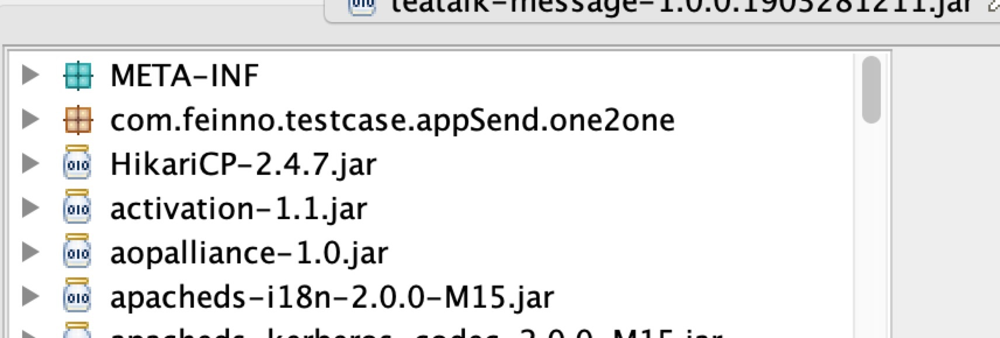
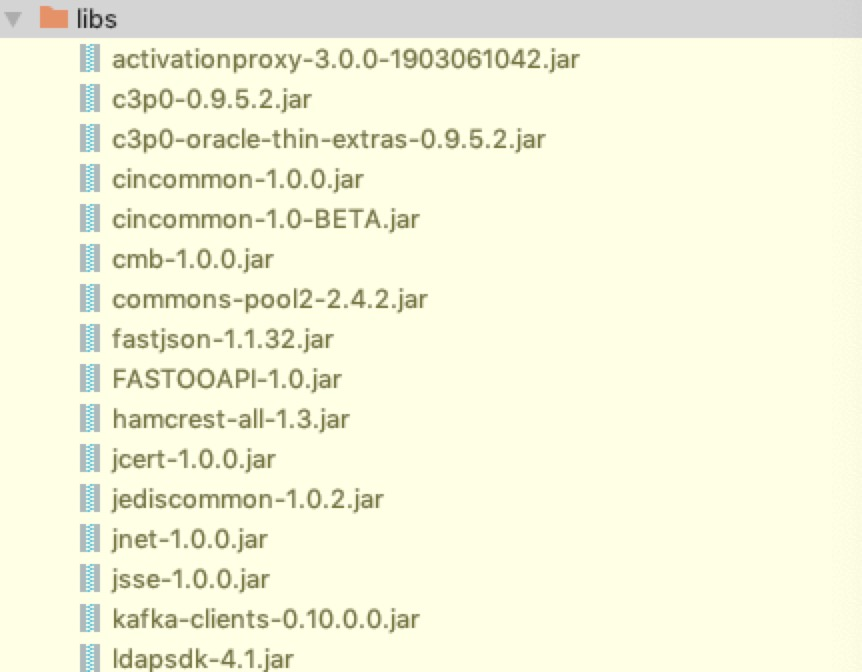

##### 包含 jar 及本项目类

###### gradle 打成一个 jar

```java
jar {
    String someString = ''
    into('') {
        from configurations.runtime
    }
    manifest {
        attributes 'Main-Class': 'com.feinno.testcase.appSend.one2one.AtpMessageLoad'
        attributes 'Class-Path': someString
    }

}
```

打包之后 jar 格式


###### gradle 打成一个多个 jar

```java
task buildMultiJar(type: Copy, dependsOn:  build) {
    from configurations.runtime
    from 'src/main/resources'
    into 'build/libs' // 目标位置
}
```

打包之后 jar 格式


###### 打包并执行 shell 命令

```java
//可运行jar
task buildMultiJar(type: Copy, dependsOn:  build) {
    from configurations.runtime
    from 'src/main/resources'
    into 'build/libs' // 目标位置
}
//
//多个jar合成一个
task buildSimpleJar(type: Exec, dependsOn: buildMultiJar) {
    String buildJarName = archivesBaseName + "-" + version + ".jar"
    println(buildJarName)
    commandLine "cd build/libs/"
    commandLine "zip", "-r", "$buildJarName", "build/libs/"
}
```

###### 打 docker 包

```java
jar {
    manifest {
    }
    enabled = true

}
//可运行jar
task buildRunJar(type:Copy, dependsOn: build) {
    from configurations.runtime
    from 'resources'
    into 'build/libs' // 目标位置
}
//构建docker镜像
task buildDocker(type: Docker, dependsOn: buildRunJar) {
    push = autoPush
    tag = imagesTag
    applicationName = jar.baseName
    dockerfile = file('docker/Dockerfile')
    doFirst {
        copy {
            from 'build/libs'
            into stageDir
        }
    }
}
```
