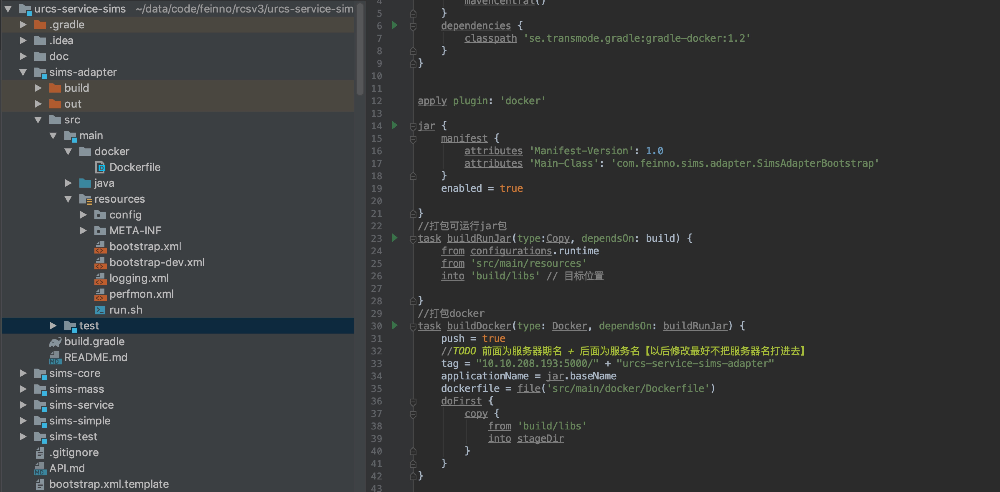
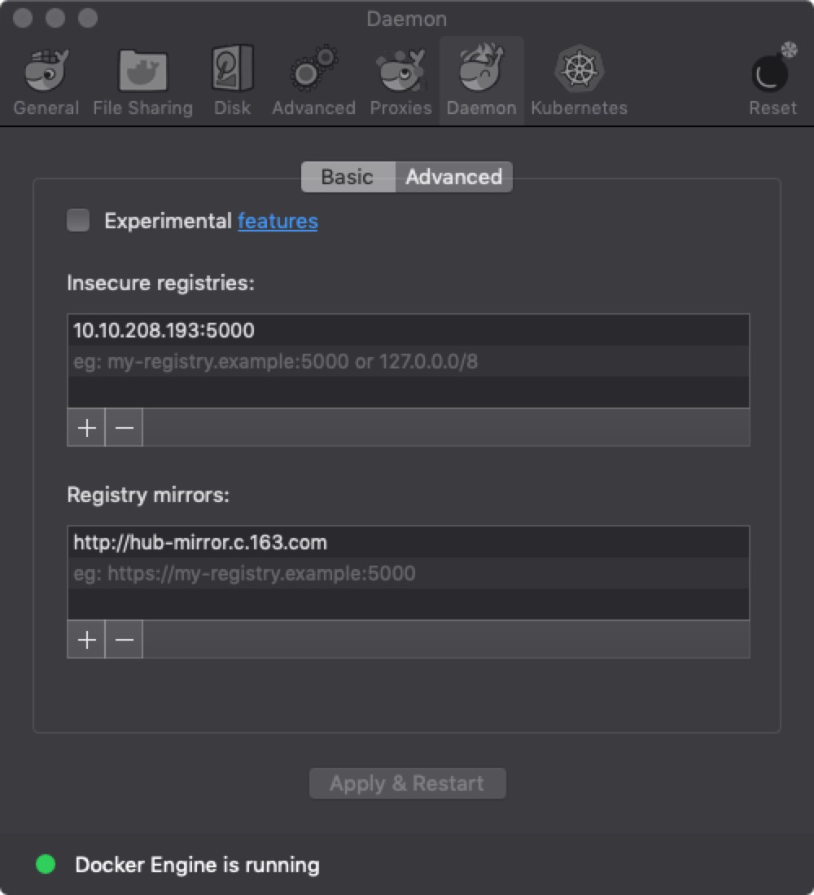

### docker 打包运行参照

#### 1. 目录结构



#### 2. 打包流程

##### 2.1. docker 本地打包规范

    参照docker常用套路,需具备以下基本条件
    1. docker基础环境
    1. Dockerfile：用于打包特定镜像
    2. run.sh：用于启动服务
    3. build.gradle (java服务必须)
    4. docker-clean-build.sh (快捷打包)
    5. docker-xxx-dev.sh （快捷运行）

##### 2.2. docker 基础环境

    2.2.1 安装（可自行搜索）
        yum install docker (centos7)
        apt-get install docker (ubuntu)
        下载安装包（windows 、mac）
    2.2.2.1 配置私服【linux】
        修改/etc/docker/daemon.json文件
        #vi /etc/docker/daemon.json
        { "insecure-registries": ["10.10.208.193:5000"] }
        重启docker
    2.2.2.2 配置私服【mac】



##### 2.3. Dockerfile

Dockerfile 示例 1

```
//官方基础镜像，打包之后目录未分开
#基础镜像
FROM java:8

VOLUME ["/tmp"]
ADD ./* /home/servicename/

#指定时区
RUN /bin/cp /usr/share/zoneinfo/Asia/Shanghai /etc/localtime && echo 'Asia/Shanghai' >/etc/timezone

ENTRYPOINT ["/home/servicename/run.sh"]
```

Dockerfile 示例 2

```
//基于官方镜像二次封装，包含基础工具，打包之后目录分开
#基础镜像
FROM 10.10.208.193:5000/urcs/java:8

#ARG是Docker1.9 版本才新加入的指令,如果不支持该命令则直接赋值
ARG appName=urcs-service-group

VOLUME ["/tmp"]
#ADD ./* /home/$appName/

#docker打包时配置文件分离/和helium目录结构保持一致
ADD config /home/$appName/config/

ADD *.jar /home/$appName/lib/

ADD ./*.xml /home/$appName/

ADD ./*.sh /home/$appName/

#指定时区
RUN /bin/cp /usr/share/zoneinfo/Asia/Shanghai /etc/localtime && echo 'Asia/Shanghai' >/etc/timezone
ENTRYPOINT ["/home/$appName/run.sh"]
```

##### 2.4 run.sh

启动脚本

```
#!/bin/bash

ulimit -c unlimited
ulimit -n 32768


basePath=$(cd "$(dirname "$0")";pwd)
SERVICE_HOME=$basePath

SERVICE_LIBS="$SERVICE_HOME/"

SERVICE_MAIN="mainClass"
declare -a JAVA_ARGS
JAVA_ARGS[0]="-Xmx256m"
JAVA_ARGS[1]="-Xms256m"

exec $JAVA_HOME/bin/java -Duser.dir=$SERVICE_HOME ${JAVA_ARGS[@]} -classpath $SERVICE_HOME:$SERVICE_LIBS/* $SERVICE_MAIN
```

##### 2.5 build.gradle

启动脚本

```
buildscript {
    repositories {
        mavenCentral()
    }
    dependencies {
        //添加依赖jar包
        classpath 'se.transmode.gradle:gradle-docker:1.2'
    }
}


apply plugin: 'docker'

//build构造jar文件
jar {
    manifest {
        attributes 'Manifest-Version': 1.0
        attributes 'Main-Class': 'mainClass'
    }
    enabled = true

}
//打包可运行jar包
task buildRunJar(type:Copy, dependsOn: build) {
    from configurations.runtime
    from 'src/main/resources'
    into 'build/libs' // 目标位置

}

//打包docker
task buildDocker(type: Docker, dependsOn: buildRunJar) {
    push = true
    //TODO 前面为服务器期名 + 后面为服务名【以后修改最好不把服务器名打进去】
    tag = "10.10.208.193:5000/" + "servicename"
    applicationName = jar.baseName
    dockerfile = file('src/main/docker/Dockerfile')
    doFirst {
        copy {
            from 'build/libs'
            into stageDir
        }
    }
}


dependencies {
   ....
}
```

##### 2.6. docker-clean-build.sh

```
docker rm `docker ps -a -q`
docker rmi --force `docker images | grep servicename | awk '{print $3}'`
gradle clean
gradle buildDocker -x test
```

##### 2.7. docker-run.sh

```
docker stop servicename

docker rm `docker ps -a -q`

docker run \
    --env PRIVATE_IP=0.0.0.0 \
    --env REG_IP=10.10.208.194 \
    --env ZK_HOSTS=10.10.208.194:7998 \
    --env HTTP_PORT=8011 \
    --env HTTP_DASH_PORT=8111 \
    --env RPC_PORT=6011 \
    --env RPC_STACK=rpc-stack \
    --env HTTP_STACK=http-stack \
    --env HTTP_DASH_STACK=http-dash-stack \
    --env KAFKA_HOST=10.10.208.194 \
    --privileged=true \
    -p 8011:8011 \
    -p 8111:8111 \
    -p 6011:6011 \
    -d --name servicename1.0 \
    10.10.208.193:5000/servicename1.0.0-1902151423
```

##### 3 常见问题

    1.docker容器时间与宿主机时间不一至,容器时间为UTC时间
    1.1.解决：Dockerfile增加
    #指定时区
    RUN /bin/cp /usr/share/zoneinfo/Asia/Shanghai /etc/localtime && echo 'Asia/Shanghai' >/etc/timezone

    2.docker基础镜像中安装常用功能,例如vim

##### 4 常用命令

        docker run -p 8888:8888 $name tag
        docker stop $name
        docker rm $name
        docker inspect $name
        docker ps -a | -l
        docker logs [-f] [-t] [-tail] $name
        -f –follows=true | false，默认是false，显示更新
        -t –timestamps=true | false，默认是false，显示时间戳
        –tail=“all” | 行数，显示最新行数的日志
