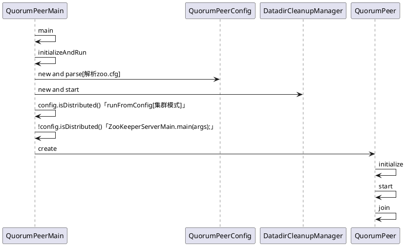

### 【分布式】Zookeeper 服务端启动

### 一、前言

前面已经了解了 Zookeeper 会话相关知识点，接着来学习 Zookeeper 服务端相关细节。

### 二、服务端

服务端整体架构如下

Zookeeper 服务器的启动，大致可以分为以下五个步骤:
　　 1. 配置文件解析。

2. 初始化数据管理器。

3. 初始化网络 I/O 管理器。

4. 数据恢复。

5. 对外服务。

#### 2.1 单机版服务器启动

单机版服务器的启动其流程图如下


上图的过程可以分为预启动和初始化过程。

1. 预启动

1. 统一由 QuorumPeerMain 作为启动类。无论单机或集群，在 zkServer.cmd 和 zkServer.sh 中都配置了 QuorumPeerMain 作为启动入口类。

1. 解析配置文件 zoo.cfg。zoo.cfg 配置运行时的基本参数，如 tickTime、dataDir、clientPort 等参数。

1. 创建并启动历史文件清理器 DatadirCleanupManager。对事务日志和快照数据文件进行定时清理。

1. 判断当前是集群模式还是单机模式启动。若是单机模式，则委托给 ZooKeeperServerMain 进行启动。

1. 再次进行配置文件 zoo.cfg 的解析。

1. 创建服务器实例 ZooKeeperServer。Zookeeper 服务器首先会进行服务器实例的创建，然后对该服务器实例进行初始化，包括连接器、内存数据库、请求处理器等组件的初始化。

1. 初始化

1. 创建服务器统计器 ServerStats。ServerStats 是 Zookeeper 服务器运行时的统计器。

1. 创建 Zookeeper 数据管理器 FileTxnSnapLog。FileTxnSnapLog 是 Zookeeper 上层服务器和底层数据存储之间的对接层，提供了一系列操作数据文件的接口，如事务日志文件和快照数据文件。Zookeeper 根据 zoo.cfg 文件中解析出的快照数据目录 dataDir 和事务日志目录 dataLogDir 来创建 FileTxnSnapLog。

1. 设置服务器 tickTime 和会话超时时间限制。

1. 创建 ServerCnxnFactory。通过配置系统属性 zookeper.serverCnxnFactory 来指定使用 Zookeeper 自己实现的 NIO 还是使用 Netty 框架作为 Zookeeper 服务端网络连接工厂。

1. 初始化 ServerCnxnFactory。Zookeeper 会初始化 Thread 作为 ServerCnxnFactory 的主线程，然后再初始化 NIO 服务器。

1. 启动 ServerCnxnFactory 主线程。进入 Thread 的 run 方法，此时服务端还不能处理客户端请求。

1. 恢复本地数据。启动时，需要从本地快照数据文件和事务日志文件进行数据恢复。

1. 创建并启动会话管理器。Zookeeper 会创建会话管理器 SessionTracker 进行会话管理。

1. 初始化 Zookeeper 的请求处理链。Zookeeper 请求处理方式为责任链模式的实现。会有多个请求处理器依次处理一个客户端请求，在服务器启动时，会将这些请求处理器串联成一个请求处理链。

1. 注册 JMX 服务。Zookeeper 会将服务器运行时的一些信息以 JMX 的方式暴露给外部。

1. 注册 Zookeeper 服务器实例。将 Zookeeper 服务器实例注册给 ServerCnxnFactory，之后 Zookeeper 就可以对外提供服务。

至此，单机版的 Zookeeper 服务器启动完毕。

#### 2.2 集群服务器启动

单机和集群服务器的启动在很多地方是一致的，其流程图如下


上图的过程可以分为预启动、初始化、Leader 选举、Leader 与 Follower 启动期交互过程、Leader 与 Follower 启动等过程。

##### 1. 预启动

1. 统一由 QuorumPeerMain 作为启动类。

2. 解析配置文件 zoo.cfg。

3. 创建并启动历史文件清理器 DatadirCleanupFactory。

4. 判断当前是集群模式还是单机模式的启动。在集群模式中，在 zoo.cfg 文件中配置了多个服务器地址，可以选择集群启动。

##### 2. 初始化

1. 创建 ServerCnxnFactory。

2. 初始化 ServerCnxnFactory。

3. 创建 Zookeeper 数据管理器 FileTxnSnapLog。

4. 创建 QuorumPeer 实例。Quorum 是集群模式下特有的对象，是 Zookeeper 服务器实例（ZooKeeperServer）的托管者，QuorumPeer 代表了集群中的一台机器，在运行期间，QuorumPeer 会不断检测当前服务器实例的运行状态，同时根据情况发起 Leader 选举。

5. 创建内存数据库 ZKDatabase。ZKDatabase 负责管理 ZooKeeper 的所有会话记录以及 DataTree 和事务日志的存储。

6. 初始化 QuorumPeer。将核心组件如 FileTxnSnapLog、ServerCnxnFactory、ZKDatabase 注册到 QuorumPeer 中，同时配置 QuorumPeer 的参数，如服务器列表地址、Leader 选举算法和会话超时时间限制等。

7. 恢复本地数据。

8. 启动 ServerCnxnFactory 主线程。

##### 3. Leader 选举

1. 初始化 Leader 选举。集群模式特有，Zookeeper 首先会根据自身的服务器 ID（SID）、最新的 ZXID（lastLoggedZxid）和当前的服务器 epoch（currentEpoch）来生成一个初始化投票，在初始化过程中，每个服务器都会给自己投票。然后，根据 zoo.cfg 的配置，创建相应 Leader 选举算法实现，Zookeeper 提供了三种默认算法（LeaderElection、AuthFastLeaderElection、FastLeaderElection），可通过 zoo.cfg 中的 electionAlg 属性来指定，但现只支持 FastLeaderElection 选举算法。在初始化阶段，Zookeeper 会创建 Leader 选举所需的网络 I/O 层 QuorumCnxManager，同时启动对 Leader 选举端口的监听，等待集群中其他服务器创建连接。

2. 注册 JMX 服务。

3. 检测当前服务器状态。运行期间，QuorumPeer 会不断检测当前服务器状态。在正常情况下，Zookeeper 服务器的状态在 LOOKING、LEADING、FOLLOWING/OBSERVING 之间进行切换。在启动阶段，QuorumPeer 的初始状态是 LOOKING，因此开始进行 Leader 选举。

4. Leader 选举。通过投票确定 Leader，其余机器称为 Follower 和 Observer。具体算法在后面会给出。

##### 4. Leader 和 Follower 启动期交互过程

1. 创建 Leader 服务器和 Follower 服务器。完成 Leader 选举后，每个服务器会根据自己服务器的角色创建相应的服务器实例，并进入各自角色的主流程。

2. Leader 服务器启动 Follower 接收器 LearnerCnxAcceptor。运行期间，Leader 服务器需要和所有其余的服务器（统称为 Learner）保持连接以确集群的机器存活情况，LearnerCnxAcceptor 负责接收所有非 Leader 服务器的连接请求。

3. Leader 服务器开始和 Leader 建立连接。所有 Learner 会找到 Leader 服务器，并与其建立连接。

4. Leader 服务器创建 LearnerHandler。Leader 接收到来自其他机器连接创建请求后，会创建一个 LearnerHandler 实例，每个 LearnerHandler 实例都对应一个 Leader 与 Learner 服务器之间的连接，其负责 Leader 和 Learner 服务器之间几乎所有的消息通信和数据同步。

5. 向 Leader 注册。Learner 完成和 Leader 的连接后，会向 Leader 进行注册，即将 Learner 服务器的基本信息（LearnerInfo），包括 SID 和 ZXID，发送给 Leader 服务器。

6. Leader 解析 Learner 信息，计算新的 epoch。Leader 接收到 Learner 服务器基本信息后，会解析出该 Learner 的 SID 和 ZXID，然后根据 ZXID 解析出对应的 epoch_of_learner，并和当前 Leader 服务器的 epoch_of_leader 进行比较，如果该 Learner 的 epoch_of_learner 更大，则更新 Leader 的 epoch_of_leader = epoch_of_learner + 1。然后 LearnHandler 进行等待，直到过半 Learner 已经向 Leader 进行了注册，同时更新了 epoch_of_leader 后，Leader 就可以确定当前集群的 epoch 了。

7. 发送 Leader 状态。计算出新的 epoch 后，Leader 会将该信息以一个 LEADERINFO 消息的形式发送给 Learner，并等待 Learner 的响应。

8. Learner 发送 ACK 消息。Learner 接收到 LEADERINFO 后，会解析出 epoch 和 ZXID，然后向 Leader 反馈一个 ACKEPOCH 响应。

9. 数据同步。Leader 收到 Learner 的 ACKEPOCH 后，即可进行数据同步。

10. 启动 Leader 和 Learner 服务器。当有过半 Learner 已经完成了数据同步，那么 Leader 和 Learner 服务器实例就可以启动了。

##### 5. Leader 和 Follower 启动

1. 创建启动会话管理器。

2. 初始化 Zookeeper 请求处理链，集群模式的每个处理器也会在启动阶段串联请求处理链。

3. 注册 JMX 服务。

至此，集群版的 Zookeeper 服务器启动完毕。

### 三、源码参考



#### QuorumPeerMain

```
public class QuorumPeerMain {

    private static final Logger LOG = LoggerFactory.getLogger(QuorumPeerMain.class);

    private static final String USAGE = "Usage: QuorumPeerMain configfile";

    protected QuorumPeer quorumPeer;

    /**
     * To start the replicated server specify the configuration file name on
     * the command line.
     * @param args path to the configfile
     */
    public static void main(String[] args) {
        QuorumPeerMain main = new QuorumPeerMain();
        try {
            main.initializeAndRun(args);
        } catch (Exception e) {
            LOG.error("Unexpected exception, exiting abnormally", e);
            ZKAuditProvider.addServerStartFailureAuditLog();
            ServiceUtils.requestSystemExit(ExitCode.UNEXPECTED_ERROR.getValue());
        }
        LOG.info("Exiting normally");
        ServiceUtils.requestSystemExit(ExitCode.EXECUTION_FINISHED.getValue());
    }

    protected void initializeAndRun(String[] args) throws ConfigException, IOException, AdminServerException {
        QuorumPeerConfig config = new QuorumPeerConfig();

        // Start and schedule the the purge task
        DatadirCleanupManager purgeMgr = new DatadirCleanupManager(
            config.getDataDir(),
            config.getDataLogDir(),
            config.getSnapRetainCount(),
            config.getPurgeInterval());
        purgeMgr.start();

        if (args.length == 1 && config.isDistributed()) {
            //集群模式
            runFromConfig(config);
        } else {
            //单机模式
            LOG.warn("Either no config or no quorum defined in config, running in standalone mode");
            // there is only server in the quorum -- run as standalone
            ZooKeeperServerMain.main(args);
        }
    }

    public void runFromConfig(QuorumPeerConfig config) throws IOException, AdminServerException {
        try {
            ManagedUtil.registerLog4jMBeans();
        } catch (JMException e) {
            LOG.warn("Unable to register log4j JMX control", e);
        }

        LOG.info("Starting quorum peer");
        MetricsProvider metricsProvider;
        try {
            metricsProvider = MetricsProviderBootstrap.startMetricsProvider(
                config.getMetricsProviderClassName(),
                config.getMetricsProviderConfiguration());
        } catch (MetricsProviderLifeCycleException error) {
            throw new IOException("Cannot boot MetricsProvider " + config.getMetricsProviderClassName(), error);
        }
        try {
            ServerMetrics.metricsProviderInitialized(metricsProvider);
            ServerCnxnFactory cnxnFactory = null;
            ServerCnxnFactory secureCnxnFactory = null;

            if (config.getClientPortAddress() != null) {
                cnxnFactory = ServerCnxnFactory.createFactory();
                cnxnFactory.configure(config.getClientPortAddress(), config.getMaxClientCnxns(), config.getClientPortListenBacklog(), false);
            }

            if (config.getSecureClientPortAddress() != null) {
                secureCnxnFactory = ServerCnxnFactory.createFactory();
                secureCnxnFactory.configure(config.getSecureClientPortAddress(), config.getMaxClientCnxns(), config.getClientPortListenBacklog(), true);
            }

            quorumPeer = getQuorumPeer();
            quorumPeer.setTxnFactory(new FileTxnSnapLog(config.getDataLogDir(), config.getDataDir()));
            //...set from QuorumPeerConfig[zoo.conf]
            quorumPeer.setQuorumCnxnThreadsSize(config.quorumCnxnThreadsSize);
            quorumPeer.initialize();

            if (config.jvmPauseMonitorToRun) {
                quorumPeer.setJvmPauseMonitor(new JvmPauseMonitor(config));
            }

            quorumPeer.start();
            ZKAuditProvider.addZKStartStopAuditLog();
            quorumPeer.join();
        } catch (InterruptedException e) {
            // warn, but generally this is ok
            LOG.warn("Quorum Peer interrupted", e);
        } finally {
            if (metricsProvider != null) {
                try {
                    metricsProvider.stop();
                } catch (Throwable error) {
                    LOG.warn("Error while stopping metrics", error);
                }
            }
        }
    }

    protected QuorumPeer getQuorumPeer() throws SaslException {
        return new QuorumPeer();
    }

}
```

#### QuorumPeer

- QuorumPeer

```
public QuorumPeer() throws SaslException {
    super("QuorumPeer");
    quorumStats = new QuorumStats(this);
    jmxRemotePeerBean = new HashMap<Long, RemotePeerBean>();
    adminServer = AdminServerFactory.createAdminServer();
    x509Util = createX509Util();
    initialize();
}
```

- initialize

```
public void initialize() throws SaslException {
    // init quorum auth server & learner
    if (isQuorumSaslAuthEnabled()) {
        Set<String> authzHosts = new HashSet<String>();
        for (QuorumServer qs : getView().values()) {
            authzHosts.add(qs.hostname);
        }
        authServer = new SaslQuorumAuthServer(isQuorumServerSaslAuthRequired(), quorumServerLoginContext, authzHosts);
        authLearner = new SaslQuorumAuthLearner(isQuorumLearnerSaslAuthRequired(), quorumServicePrincipal, quorumLearnerLoginContext);
    } else {
        authServer = new NullQuorumAuthServer();
        authLearner = new NullQuorumAuthLearner();
    }
}
```

- start

```
public synchronized void start() {
    if (!getView().containsKey(myid)) {
        throw new RuntimeException("My id " + myid + " not in the peer list");
    }
    loadDataBase();
    startServerCnxnFactory();
    try {
        adminServer.start();
    } catch (AdminServerException e) {
        LOG.warn("Problem starting AdminServer", e);
        System.out.println(e);
    }
    startLeaderElection();
    startJvmPauseMonitor();
    super.start();
}
```

### 四、总结

本篇博文分析了 Zookeeper 服务端的启动的详细细节，之后会给出具体的代码分析。也谢谢各位园友的观看~

### 五、参考

https://www.cnblogs.com/leesf456/p/6105276.html
