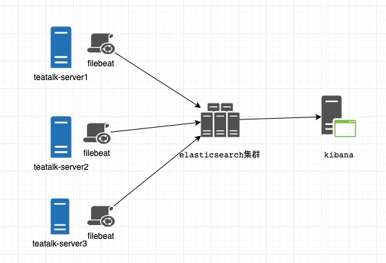
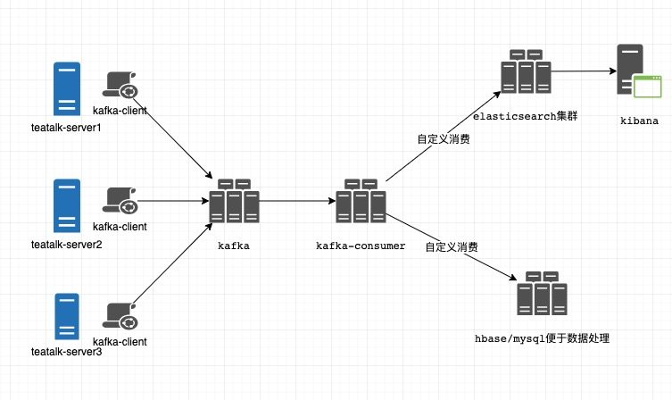

#### 1.日志中心解决方案

    业务处理时需要进行系统日志、业务日志存储于查询
        常用存储介质: mysql、hbase、elasticsearch
        常用展示工具: kibana
        常用日志收集工具: filebeat、logstash
        日志中转代理: kafka

##### 1.1.存储介质介绍

    mysql：结构化数据查询、数据量较少【可采用分库、分表处理大数据量】

    hbase：数据量较大、查询较为单一

    elasticsearch： 数据量可存储较大、复杂查询、配套体系完善

##### 1.2.日志展示及查询工具

    kibana 结合 elasticsearch、logstash：为elk解决方案
    kibana 结合 elasticsearch、filebeat：为efk解决方案

##### 1.3.日志收集工具

    logstash:
        Logstash 是一款强大的数据处理工具，它可以实现数据传输，格式处理，格式化输出，还有强大的插件功能，常用于日志处理。
            支持如下
            1) file：从文件系统上的文件读取，与UNIX命令非常相似 tail -0F
            2) syslog：在已知端口上侦听syslog消息进行解析
            3) redis：使用redis通道和redis列表从redis服务器读取。Redis通常用作集中式Logstash安装中的“代理”，
            4) beats：处理 Beats发送的事件,beats包括filebeat、packetbeat、winlogbeat。

    filebeat:
        Filebeat是一个日志文件托运工具，在你的服务器上安装客户端后，filebeat会监控日志目录或者指定的日志文件
        可以理解为轻量版的logstash

#### 2.组件介绍

[elasticsearch 介绍](elasticsearch)

[filebeat 介绍](filebeat)

[kibana 介绍](kibana)

[logstash 介绍](kibana)

#### 3.使用示例-efk 使用示例

系统结构图

#### 4.使用示例-java 对接使用示例

系统结构图

