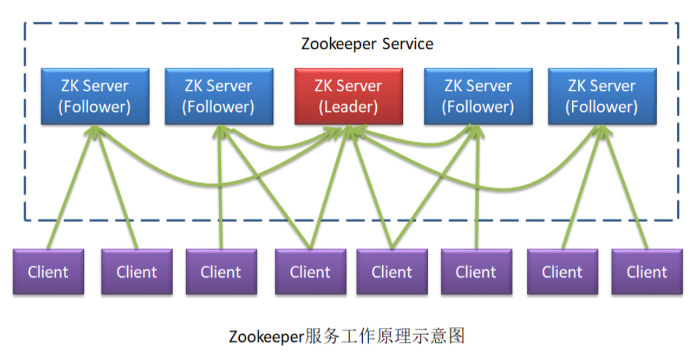
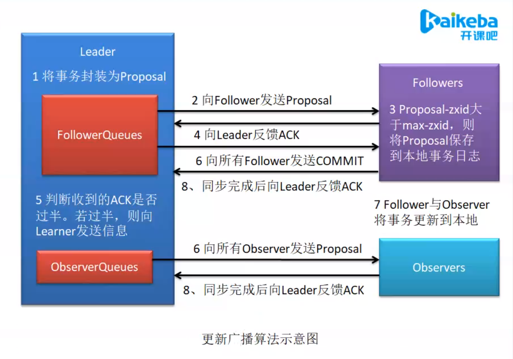
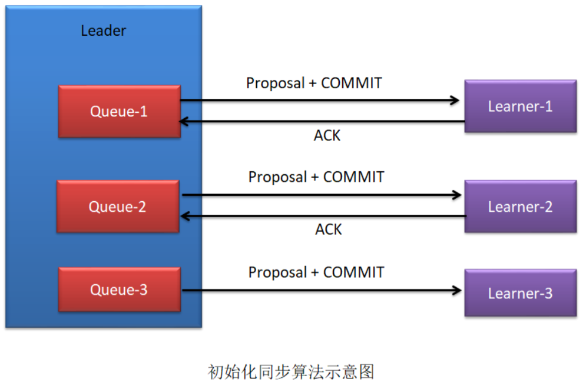
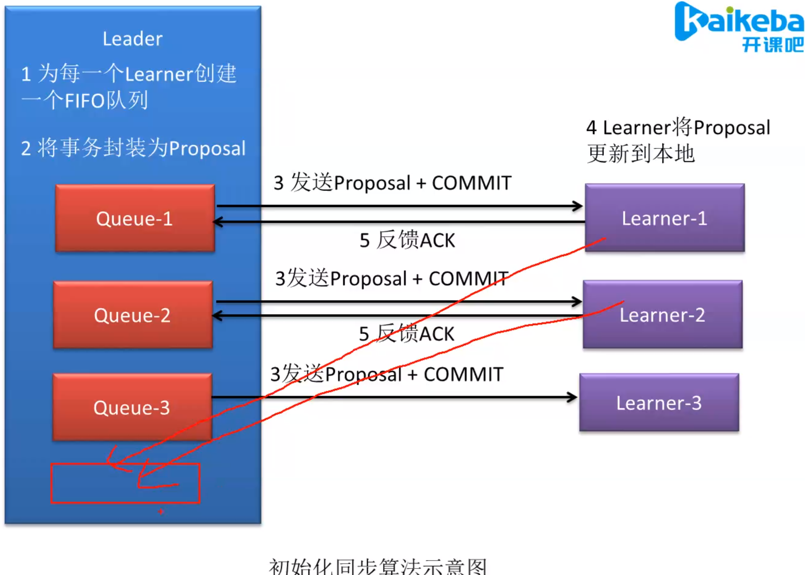
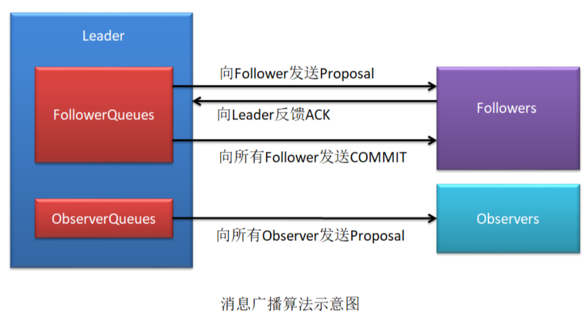
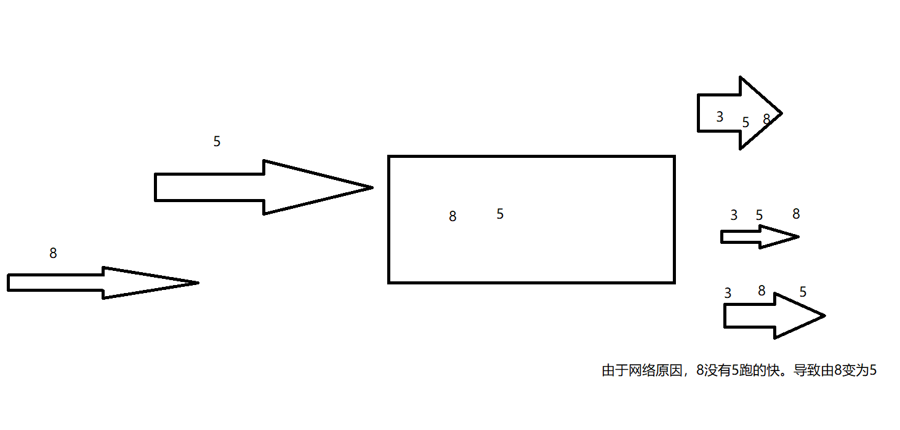
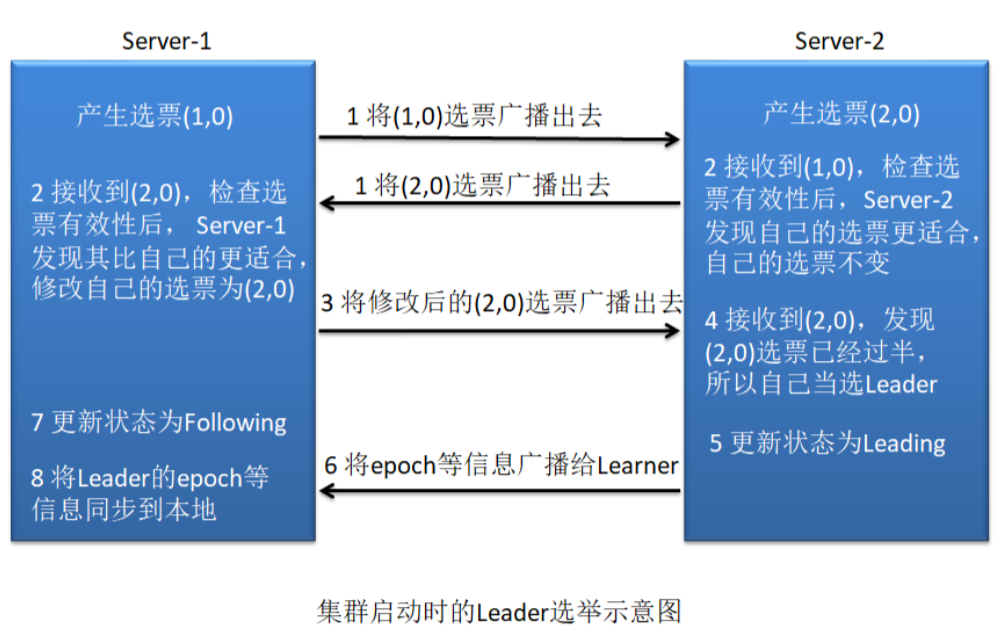
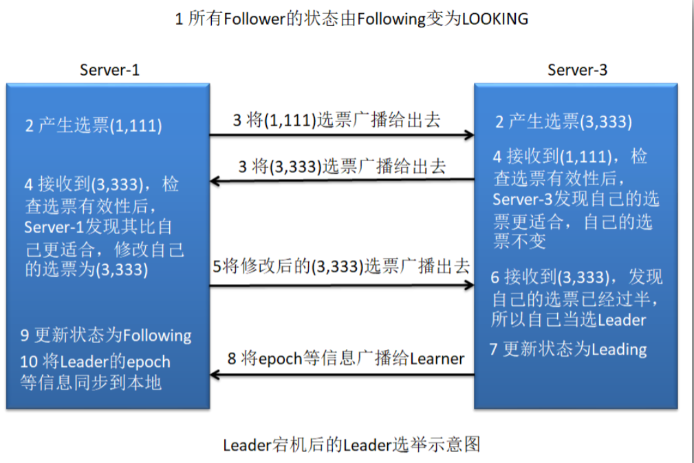
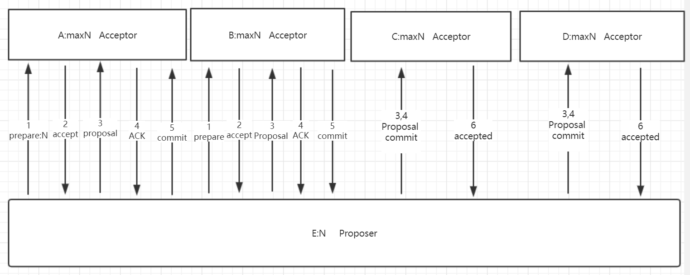

## ZAB 协议简介

ZAB ，Zookeeper Atomic Broadcast，zk 原子消息广播协议，是专为 ZooKeeper 设计的一 种支持崩溃恢复的原子广播协议，在 Zookeeper 中，主要依赖 ZAB 协议来实现分布式数据一致性。

Zookeeper 使用一个单一主进程来接收并处理客户端的所有事务请求，即写请求。当服务器数据的状态发生变更后，集群采用 ZAB 原子广播协议，以事务提案 Proposal 的形式广 播到所有的副本进程上。ZAB 协议能够保证一个全局的变更序列，即可以为每一个事务分配一个全局的递增编号 xid。

当 Zookeeper 客户端连接到 Zookeeper 集群的一个节点后，若客户端提交的是读请求， 那么当前节点就直接根据自己保存的数据对其进行响应；如果是写请求且当前节点不是 Leader，那么节点就会将该写请求转发给 Leader，Leader 会以提案的方式广播该写操作，只 要有超过半数节点同意该写操作，则该写操作请求就会被提交。然后 Leader 会再次广播给所有订阅者，即 Learner，通知它们同步数据。

## ZAB 与 Paxos 的关系

ZAB 协议是 Fast Paxos 算法的一种工业实现算法。但两者的设计目标不太一样。ZAB 协议主要用于构建一个高可用的分布式数据主从系统，即 Follower 是 Leader 的备用机，Leader 挂了，马上就可以选举出一个新的 Leader。

而 Fast Paxos 算法则是用于构建一个分布式一致性状态机系统，确保系统中各个节点的状态都是一致的。

另外，ZAB 还使用 Google 的 Chubby 算法作为分布式锁的实现，而 Google 的 Chubby 也
是 Paxos 算法的应用。

三类角色

为了避免 Zookeeper 的单点问题，zk 也是以集群的形式出现的。zk 集群中的角色主要有 以下三类：

Leader：接收和处理客户端的读请求；zk 集群中事务请求的唯一处理者，并负责发起决 议和投票，然后将通过的事务请求在本地进行处理后，将处理结果同步给集群中的其它
主机

Follower：接收和处理客户端的读请求; 将事务请求转给 Leader；同步 Leader 中的数据； 当 Leader 挂了，参与 Leader 的选举（具有选举权与被选举权）

Observer：就是没有选举权与被选举权，且没有投票权的 Follower（临时工）。若 zk 集 群中的读压力很大，则需要增加 Observer，最好不要增加 Follower。因为增加 Follower
将会增大投票与统计选票的压力，降低写操作效率，及 Leader 选举的效率。

## Observer 设置为多少合适？

设置多了会处理什么问题？

反馈的 ACK 数量？

向 fllower 发送的 commit 丢了怎么办？

Observer 数量一般与 Follower 数量相同。并不是 Observer 越多越好，因为 Observer 数量的增多虽不会增加事务操作压力，但其需要从 Leader 同步数据，Observer 同步数据的时 间是小于等于 Follower 同步数据的时间的。当 Follower 同步数据完成，Leader 的 Observer 列表中的 Observer 主机将结束同步。那些完成同步的 Observer 将会进入到另一个对外提供 服务的列表。那么，那些没有同步了数据无法提供服务的 Observer 主机就形成了资源浪费，其实也不是特别浪费，后期会通过心跳来和 leader 来同步，频繁与 leader 同步。

所以，对于事务操作发生频繁的系统，不建议使用过多的 Observer。

> LOOKING 选举状态
>
> FOLLOWING FOLLOW 的正常工作状态，从 leader 同步数据的状态
>
> OBSERVING OBSERVER 的正常工作状态，从 leader 同步数据的状态
>
> LEADING leader 的正常工作状态，leader 广播数据更新的状态

Leader 中对于 Observer 存在两个列表：all（包含所有 Observer 主机）、service（每发生 一次事务更新，service 列表就会发生一次变化）。

service <= all {all – service} 心跳

service 队列为 OBSERVING 状态的 observer，这些 observer 是能提供服务的 observer，{all – service} 的集合中 observer 无法提供服务，后期可以通过心跳链接，然后同步，变为 OBSERVING 状态，才能向外提供服务，

Leader 中对于 Follower 也存在两个列表：all（包含所有 Follower 主机）、service（每发 生一次事务更新，service 列表就会发生一次变化）。

若 service <= all/2 ，则说明同步失败，则 Leader 会重新广播，Follower 会 重新同步，不会回滚，直到 ACK 的反应过半

{all – service} 如果和 leader 脸上心跳，同步数据，然后放回 service 队列，向外提供服务。

这三类角色在不同的情况下又有一些不同的名称：

Learner = Follower + Observer

QuorumServer = Follower + Leader

## 三个数据

zxid：是一个 64 位长度的 Long 类型。其中高 32 位表示 epoch，低 32 表示 xid。

epoch：每个 Leader 都会具有一个不同的 epoch，用于区分不同的时期

xid：事务 id，是一个流水号

## 三种模式

ZAB 协议中对 zkServer 的状态描述有三种模式。这三种模式并没有十分明显的界线，它 们相互交织在一起。

恢复模式：当集群启动时，或当 Leader 挂了进，系统需要进入恢复模式，以恢复系统 对外提供服务的能力。其中包含两个很重要的阶段：Leader 的选举与初始化同步。

广播模式：分为两类，初始化广播与更新广播。

同步模式：分为两类，初始化同步与更新同步。

## 同步模式与广播模式

### 初始化同步

前面我们说过，恢复模式具有两个阶段：Leader 选举与初始化同步。当完成 Leader 选举后，此时的 Leader 还是一个准 Leader，其要经过初始化同步后才能变为真正的 Leader。

具体过程如下：

1)为了保证 Leader 向 Learner 发送提案的有序，Leader 会为每一个 Learner 服务器准备一 个队列

2. Leader 将那些没有被各个 Learner 同步的事务封装为 Proposal

3. Leader 将这些 Proposal 逐条发给各个 Learner，并在每一个 Proposal 后都紧跟一个 COMMIT 消息，表示该事务已经被提交，Learner 可以直接接收并执行。因为 leader 已经选出了，其他人直接同步。同步后他们的 epoch 都一样。初始化同步的时候，高 32 位，低 32 位都一样。就根据 myid 谁大来选。

4. Learner 接收来自于 Leader 的 Proposal，并将其更新到本地

5. 当 Learner 更新成功后，会向准 Leader 发送 ACK 信息

6. Leader 服务器在收到该来自 Learner 的 ACK 后就会将该 Learner 加入到真正可用的 Follower 列表或 Observer 列表。没有反馈 ACK，或反馈了但 Leader 没有收到的 Learner，Leader 不会将其加入到相应列表。

6 中列表是一个新队里队列，图里没有画，用于存取反馈了 ACK 的队列。谁反馈了 ACK，就把他放入这个队列。

后期还会想 leader 发送心跳，如果没有问题了，再次加入队列。

### 消息广播算法

当集群中的 Learner 完成了初始化状态同步，那么整个 zk 集群就进入到了正常工作模式 了。

**如果集群中的 Learner 节点收到客户端的事务（写操作）请求**，那么这些 Learner 会将请求转发给 Leader 服务器。然后再执行如下的具体过程：

1. Leader 接收到事务请求后，为事务赋予一个全局唯一的 64 位自增 id，即 zxid，通过 zxid 的大小比较即可实现事务的有序性管理，然后将事务封装为一个 Proposal。

2. Leader 根据 Follower 列表获取到所有 Follower，然后再将 Proposal 通过这些 Follower 的 队列将提案发送给各个 Follower。

3. 当 Follower 接收到提案后，会先将提案的 zxid 与本地记录的事务日志中的最大的 zxid 进行比较。若当前提案的 zxid 大于最大 zxid，则将当前提案记录到本地事务日志中，并 向 Leader 返回一个 ACK。

4. 当 Leader 接收到过半的 ACKs 后，Leader 就会向所有 Follower 的队列发送 COMMIT 消息，向所有 Observer 的队列发送 Proposal。

5. 当 Follower 收到 COMMIT 消息后，就会将日志中的事务正式更新到本地。当 Observer 收到 Proposal 后，会直接将事务更新到本地。

注意：Follower 和 Observer 发的信息不一样。

为什么图中 Follower 还要进行比较，Follower 难道不应该比 Leader 的事务小么，不是只有 Leader 可以提起事务么？

这样做是为了解决网络问题。ABA 问题 类似乐观锁

version aba

## 恢复模式的两个原则

当集群正在启动过程中，或者 Leader 与超过半数的主机断连后，集群就进入了恢复模式。 对于要恢复的数据状态需要遵循两个原则。

### 已被处理过的消息不能丢

当 Leader 收到超过半数 Follower 的 ACKs 后，就向各个 Follower 广播 COMMIT 消息， 批准各个 Server 执行该写操作事务。当各个 Server 在接收到 Leader 的 COMMIT 消息后就会 在本地执行该写操作，然后会向客户端响应写操作成功。 但是如果在非全部 Follower 收到 COMMIT 消息之前 Leader 就挂了，这将导致一种后果：部分 Server 已经执行了该事务，而部分 Server 尚未收到 COMMIT 消息，当新的 Leader 被选举出，集群经过恢复模式后需要保证所有 Server 上都执行了那些已经被部分 Server 执行过的事务。

如果在同步的过程中，leader 挂了，此时已经部分同步成功，那么会在已经提交的 leaner 中选 leader。如果都一样，就选 myid 大的。

### 被丢弃的消息不能再现

当在 Leader 新事务已经通过，其已经将该事务更新到了本地，但所有 Follower 还都没 有收到 COMMIT 之前，Leader 宕机了，此时，所有 Follower 根本就不知道该 Proposal 的存 在。当新的 Leader 选举出来，整个集群进入正常服务状态后，之前挂了的 Leader 主机重新 启动并注册成为了 Follower。若那个别人根本不知道的 Proposal 还保留在那个主机，那么其 数据就会比其它主机多出了内容，导致整个系统状态的不一致。所以，该 Proposa 应该被丢弃。类似这样应该被丢弃的事务，是不能再次出现在集群中的，应该被清除。

## Leader 选举

在集群启动过程中，或 Leader 宕机后，集群就进入了恢复模式。恢复模式中最重要的 阶段就是 Leader 选举。

### Leader 选举中的基本概念

myid

这是 zk 集群中服务器的唯一标识，称为 myid。例如，有三个 zk 服务器，那么编号分别 是 1,2,3。

逻辑时钟

逻辑时钟，Logicalclock，是一个整型数，该概念在选举时称为 logicalclock，而在选举结束后称为 epoch。即 epoch 与 logicalclock 是同一个值，在不同情况下的不同名称。

zk 状态

zk 集群中的每一台主机，在不同的阶段会处于不同的状态。每一台主机具有四种状态。

LOOKING 选举状态

FOLLOWING FOLLOW 的正常工作状态，从 leader 同步数据的状态

OBSERVING OBSERVER 的正常工作状态，从 leader 同步数据的状态

LEADING leader 的正常工作状态，leader 广播数据更新的状态

## Leader 选举算法

在集群启动过程中的 Leader 选举过程与 Leader 断连后的 Leader 选举过程稍微 有一些区别，基本相同。

### 集群启动中的 Leader 选举

若进行 Leader 选举，则至少需要两台主机，这里以三台主机组成的集群为例。

在集群初始化阶段，当第一台服务器 Server1 启动时，其会给自己投票，然后发布自己的投票结果。投票包含所推举的服务器的 myid 和 ZXID，使用(myid, ZXID)来表示，此时 Server1 的投票为(1, 0)。

由于其它机器还没有启动所以它收不到反馈信息，Server1 的状态一直属于 Looking，即属于非服务状态。

当第二台服务器 Server2 启动时，此时两台机器可以相互通信，每台机器都试图找到 Leader，选举过程如下：

(1) 每个 Server 发出一个投票。此时 Server1 的投票为(1, 0)，Server2 的投票为(2, 0)，然后各自将这个投票发给集群中其他机器。

(2) 接受来自各个服务器的投票。集群的每个服务器收到投票后，首先判断该投票的有效
性，如检查是否是本轮投票、是否来自 LOOKING 状态的服务器。

(3) 处理投票。针对每一个投票，服务器都需要将别人的投票和自己的投票进行 PK，PK 规则如下：

- 优先检查 ZXID。ZXID 比较大的服务器优先作为 Leader。
- 如果 ZXID 相同，那么就比较 myid。myid 较大的服务器作为 Leader 服务器。

对于 Server1 而言，它的投票是(1, 0)，接收 Server2 的投票为(2, 0)。其首先会比较两者的 ZXID，均为 0，再比较 myid，此时 Server2 的 myid 最大，于是 Server1 更新自己的投票为 (2, 0)，然后重新投票。

对于 Server2 而言，其无须更新自己的投票，只是**再次向集群中所有 主机发出上一次投票信息**即可。

(4) 统计投票。每次投票后，每个服务器都会统计投票信息，判断是否已经有过半机器接受到相同的投票信息。对于 Server1、Server2 而言，都统计出集群中已经有两台主机接受了(2, 0) 的投票信息，此时便认为已经选出了新的 Leader，即 Server2。

(5) 改变服务器状态。一旦确定了 Leader，每个服务器就会更新自己的状态，如果是 Follower，那么就变更为 FOLLOWING，如果是 Leader，就变更为 LEADING。

(6) 添加主机。在新的 Leader 选举出来后 Server3 启动，其想发出新一轮的选举。但由于当前集群中各个主机的状态并不是 LOOKING，而是各司其职的正常服务，所以其只能是以 Follower 的身份加入到集群中。

### 宕机后的 Leader 选举

在 Zookeeper 运行期间，Leader 与非 Leader 服务器各司其职，即便当有非 Leader 服务 器宕机或新加入时也不会影响 Leader。但是若 Leader 服务器挂了，那么整个集群将暂停对外服务，进入新一轮的 Leader 选举，其过程和启动时期的 Leader 选举过程基本一致。

假设正在运行的有 Server1、Server2、Server3 三台服务器，当前 Leader 是 Server2，若 某一时刻 Server2 挂了，此时便开始新一轮的 Leader 选举了。选举过程如下：

(1) 变更状态。Leader 挂后，余下的非 Observer 服务器都会将自己的服务器状态由 FOLLOWING 变更为 LOOKING，然后开始进入 Leader 选举过程。

(2) 每个 Server 会发出一个投票，仍然会首先投自己。不过，在运行期间每个服务器上的 ZXID 可能是不同，此时假定 Server1 的 ZXID 为 111，Server3 的 ZXID 为 333；在第一轮投 票中，Server1 和 Server3 都会投自己，产生投票(1, 111)，(3, 333)，然后各自将投票发送给 集群中所有机器。

(3) 接收来自各个服务器的投票。与启动时过程相同。集群的每个服务器收到投票后，首先判断该投票的有效性，如检查是否是本轮投票、是否来自 LOOKING 状态的服务器。

(4) 处理投票。与启动时过程相同。针对每一个投票，服务器都需要将别人的投票和自己的投票进行 PK。对于 Server1 而言，它的投票是(1, 111)，接收 Server3 的投票为(3, 333)。 其首先会比较两者的 ZXID，Server3 投票的 zxid 为 333 大于 Server1 投票的 zxid 的 111，于是 Server1 更新自己的投票为(3, 333)，然后重新投票。对于 Server3 而言，其无须更新自己的投 票，只是再次向集群中所有主机发出上一次投票信息即可。

(5) 统计投票。与启动时过程相同。对于 Server1、Server2 而言，都统计出集群中已经
有两台主机接受了(3, 333)的投票信息，此时便认为已经选出了新的 Leader，即 Server3。

(6) 改变服务器的状态。与启动时过程相同。一旦确定了 Leader，每个服务器就会更新自己的状态。Server1 变更为 FOLLOWING，Server3 变更为 LEADING。

## CAP 定理

CAP 原则又称 CAP 定理，指的是在一个分布式系统中，Consistency（一致性）、 Availability （可用性）、Partition tolerance（分区容错性），三者不可兼得。

一致性（C）：分布式系统中多个主机之间是否能够保持数据一致的特性。即，当系统数 据发生更新操作后，各个主机中的数据仍然处于一致的状态。

可用性（A）：系统提供的服务必须一直处于可用的状态，即对于用户的每一个请求，系 统总是可以在有限的时间内对用户做出响应。

分区容错性（P）：分布式系统在遇到任何网络分区故障时，仍能够保证对外提供满足一 致性和可用性的服务。
对于分布式系统，网络环境相对是不可控的，出现网络分区是不可避免的，因此系统必须具备分区容错性。但其并不能同时保证一致性与可用性。CAP 原则对于一个分布式系统来说，只可能满足两项，即要么 CP，要么 AP。

基本可用

基本可用是指分布式系统在出现不可预知故障的时候，允许损失部分可用性。

软状态

软状态，是指允许系统数据存在的中间状态，并认为该中间状态的存在不会影响系统的 整体可用性，即允许系统主机间进行数据同步的过程存在一定延时。软状态，其实就是一种灰度状态，过渡状态。

最终一致性

最终一致性强调的是系统中所有的数据副本，在经过一段时间的同步后，最终能够达到 一个一致的状态。因此，最终一致性的本质是需要系统保证最终数据能够达到一致，而不需要实时保证系统数据的强一致性。

ZK 与 CP

zk 遵循的是 CP 原则，即保证了一致性，但牺牲了可用性。体现在哪里呢？ 当 Leader 宕机后，zk 集群会马上进行新的 Leader 的选举。但选举时长一般在 200 毫秒内，最长不超过 60 秒，整个选举期间 zk 集群是不接受客户端的读写操作的，即 zk 集群是处于瘫痪状态的。所以，其不满足可用性。

在 1 和 3， 3 和 5 之间 ，当 proposer 没收到 acceptor 的响应时，有可能会有其他的提案提出。 导致这次的正常提案失败，有可能会出现活锁问题。通过加入角色状态机的方式来解决这个问题。

发出 4 以后，将状态改为 leaning 状态，Acceptor 不能提交新的提案。等待 commit。

**是否过半是关健因素**，别人有什么骚操作，什么提案按，都不行。要以一个动态的思维去想这个过程。

如果其中一个 acceptor 变成 leaner 了，但是没有过半，提案失败，发送消息，回滚 learner。

原生的 poxas 没有状态的概念。工业实现加入了状态。

提案通过不通过还有一个时限的限定。只要超时了，就把错误的状态改变。

其实具体怎么实现是由自己决定，算法只是一个思路。
