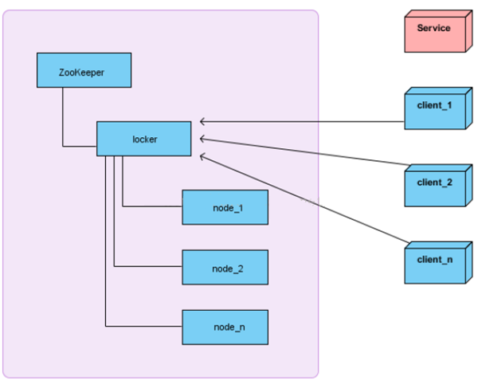

#### **题目**：zookeeper 分布式锁

#### **参考答案**：

有了 zookeeper 的一致性文件系统，锁的问题变得容易。锁服务可以分为两类，一个是保持独占，另一个是控制时序。
对于第一类，我们将 zookeeper 上的一个 znode 看作是一把锁，通过 createznode 的方式来实现。所有客户端都去创建 /distribute_lock 节点，最终成功创建的那个客户端也即拥有了这把锁。用完删除掉自己创建的 distribute_lock 节点就释放出锁。
对于第二类， /distribute_lock 已经预先存在，所有客户端在它下面创建临时顺序编号目录节点，和选 master 一样，编号最小的获得锁，用完删除，依次方便。

**获取分布式锁的流程**

在获取分布式锁的时候在 locker 节点下创建临时顺序节点，释放锁的时候删除该临时节点。客户端调用 createNode 方法在 locker 下创建临时顺序节点，
然后调用 getChildren(“locker”)来获取 locker 下面的所有子节点，注意此时不用设置任何 Watcher。客户端获取到所有的子节点 path 之后，如果发现自己创建的节点在所有创建的子节点序号最小，那么就认为该客户端获取到了锁。如果发现自己创建的节点并非 locker 所有子节点中最小的，说明自己还没有获取到锁，此时客户端需要找到比自己小的那个节点，然后对其调用 exist()方法，同时对其注册事件监听器。之后，让这个被关注的节点删除，则客户端的 Watcher 会收到相应通知，此时再次判断自己创建的节点是否是 locker 子节点中序号最小的，如果是则获取到了锁，如果不是则重复以上步骤继续获取到比自己小的一个节点并注册监听。当前这个过程中还需要许多的逻辑判断。

代码的实现主要是基于互斥锁，获取分布式锁的重点逻辑在于 BaseDistributedLock，实现了基于 Zookeeper 实现分布式锁的细节。
