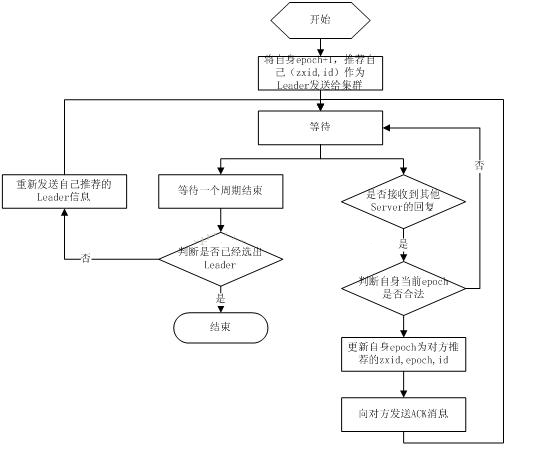

#### **题目**：zookeeper 是如何选举 Leader 的?

#### **参考答案**：

当 leader 崩溃或者 leader 失去大多数的 follower，这时 zk 进入恢复模式，恢复模式需要重新选举出一个新的 leader，让所有的 Server 都恢复到一个正确的状态。Zk 的选举算法有两种：一种是基于 basic paxos 实现的，另外一种是基于 fast paxos 算法实现的。系统默认的选举算法为 fast paxos。

1、Zookeeper 选主流程(basic paxos)
（1）选举线程由当前 Server 发起选举的线程担任，其主要功能是对投票结果进行统计，并选出推荐的 Server；
（2）选举线程首先向所有 Server 发起一次询问(包括自己)；
（3）选举线程收到回复后，验证是否是自己发起的询问(验证 zxid 是否一致)，然后获取对方的 id(myid)，并存储到当前询问对象列表中，最后获取对方提议的 leader 相关信息(id,zxid)，并将这些信息存储到当次选举的投票记录表中；
（4）收到所有 Server 回复以后，就计算出 zxid 最大的那个 Server，并将这个 Server 相关信息设置成下一次要投票的 Server；
（5）线程将当前 zxid 最大的 Server 设置为当前 Server 要推荐的 Leader，如果此时获胜的 Server 获得 n/2 + 1 的 Server 票数，设置当前推荐的 leader 为获胜的 Server，将根据获胜的 Server 相关信息设置自己的状态，否则，继续这个过程，直到 leader 被选举出来。 通过流程分析我们可以得出：要使 Leader 获得多数 Server 的支持，则 Server 总数必须是奇数 2n+1，且存活的 Server 的数目不得少于 n+1. 每个 Server 启动后都会重复以上流程。在恢复模式下，如果是刚从崩溃状态恢复的或者刚启动的 server 还会从磁盘快照中恢复数据和会话信息，zk 会记录事务日志并定期进行快照，方便在恢复时进行状态恢复。

2、Zookeeper 选主流程(fast paxos)
fast paxos 流程是在选举过程中，某 Server 首先向所有 Server 提议自己要成为 leader，当其它 Server 收到提议以后，解决 epoch 和 zxid 的冲突，并接受对方的提议，然后向对方发送接受提议完成的消息，重复这个流程，最后一定能选举出 Leader。

